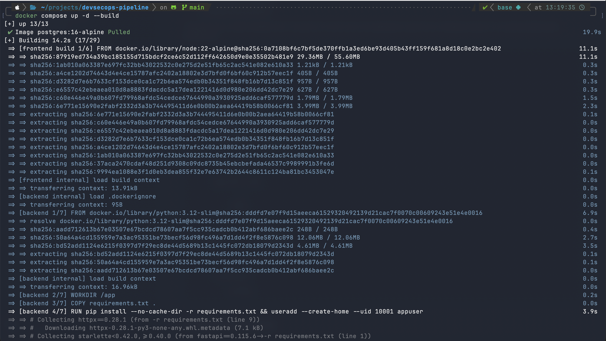
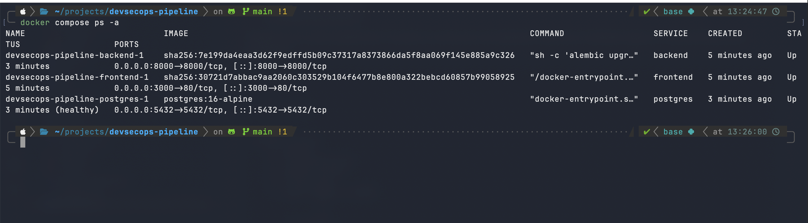
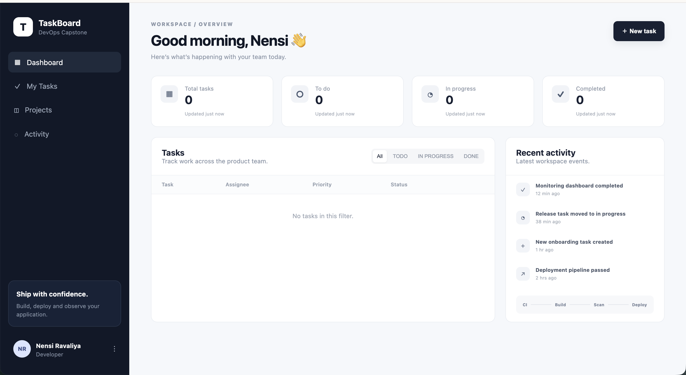
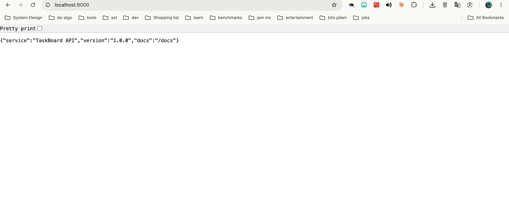
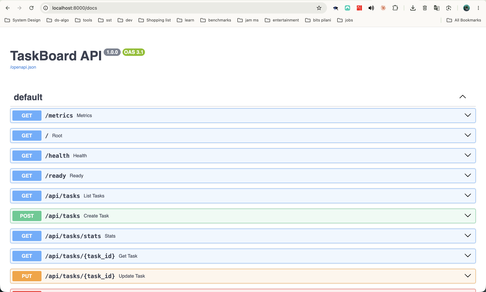
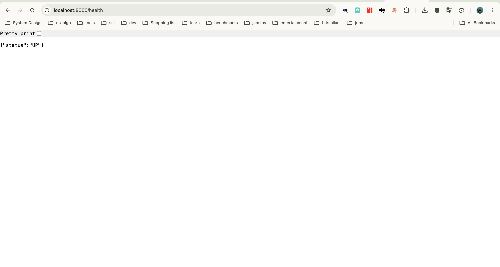
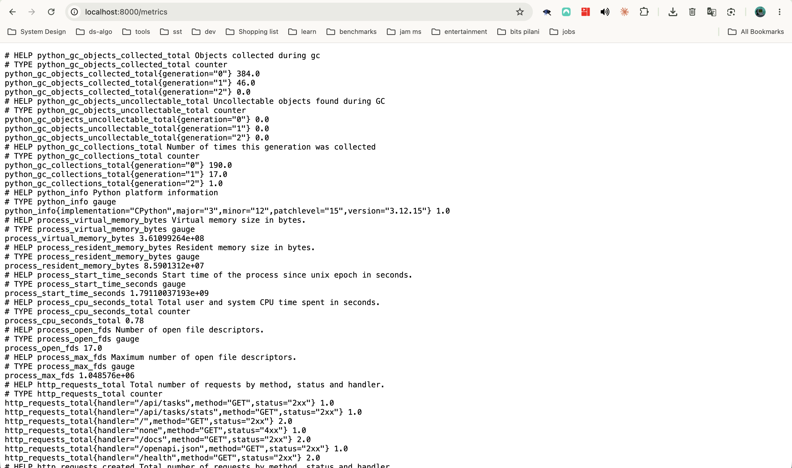

## Running the App

### 1. Build and start all services

```bash
docker compose up -d --build
```

Builds the frontend (Node 22 / nginx) and backend (Python 3.12 / FastAPI) images, pulls `postgres:16-alpine`, and starts all three containers in the background.



### 2. Verify the containers are running

```bash
docker compose ps -a
```

The backend (port 8000), frontend (port 3000) and PostgreSQL (port 5432, healthy) containers are all up.



## Application Screenshots

### 3. Frontend: TaskBoard dashboard (`http://localhost:3000`)



### 4. Backend: API root (`http://localhost:8000`)

Returns the service name, version and docs path.



### 5. Backend: Swagger API docs (`http://localhost:8000/docs`)

Auto-generated OpenAPI docs listing `/metrics`, `/health`, `/ready` and the `/api/tasks` CRUD endpoints.



### 6. Health check (`http://localhost:8000/health`)

Liveness endpoint, returns `{"status":"UP"}`.



### 7. Prometheus metrics (`http://localhost:8000/metrics`)

Exposes Python process metrics and `http_requests_total` for Prometheus scraping.


