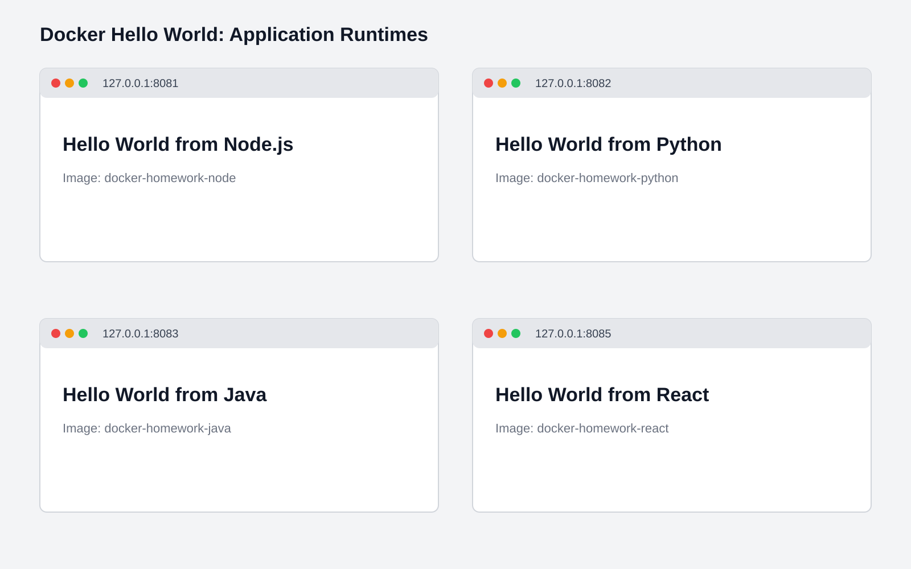
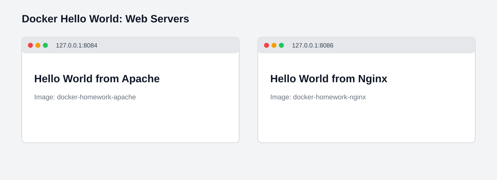

# Docker Fundamentals: Hello World Applications

Each folder contains an application and its Dockerfile. All images were built locally and their pages were opened in a browser.

| Application | Folder | Image | Local URL | Result |
| --- | --- | --- | --- | --- |
| Node.js | `nodejs-app` | `docker-homework-node` | `http://127.0.0.1:8081` | Hello World displayed |
| Python | `python-app` | `docker-homework-python` | `http://127.0.0.1:8082` | Hello World displayed |
| Java | `java-app` | `docker-homework-java` | `http://127.0.0.1:8083` | Hello World displayed |
| Apache | `Apache-app` | `docker-homework-apache` | `http://127.0.0.1:8084` | Hello World displayed |
| React | `React-app` | `docker-homework-react` | `http://127.0.0.1:8085` | Hello World displayed |
| Nginx | `nginx-app` | `docker-homework-nginx` | `http://127.0.0.1:8086` | Hello World displayed |

## Build and run

Run the following commands from `docker-fundamentals`.

```bash
docker build -t docker-homework-node ./nodejs-app
docker run --rm -p 8081:8080 docker-homework-node

docker build -t docker-homework-python ./python-app
docker run --rm -p 8082:8080 docker-homework-python

docker build -t docker-homework-java ./java-app
docker run --rm -p 8083:8080 docker-homework-java

docker build -t docker-homework-apache ./Apache-app
docker run --rm -p 8084:80 docker-homework-apache

docker build -t docker-homework-react ./React-app
docker run --rm -p 8085:80 docker-homework-react

docker build -t docker-homework-nginx ./nginx-app
docker run --rm -p 8086:80 docker-homework-nginx
```

## Screenshots



Explanation: Node.js, Python, Java, and React each serve a separate Hello World page from their own container image.



Explanation: Apache HTTP Server and Nginx serve static Hello World pages from separate containers.
