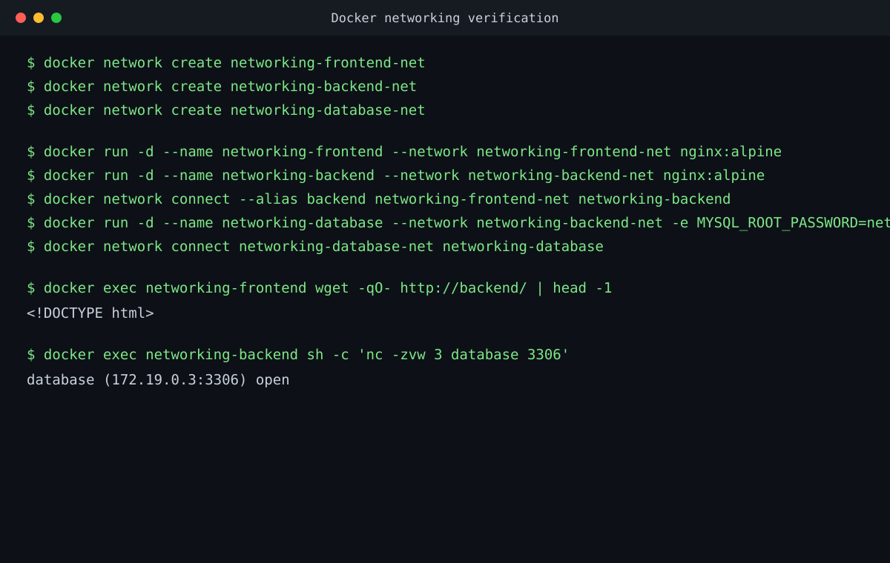
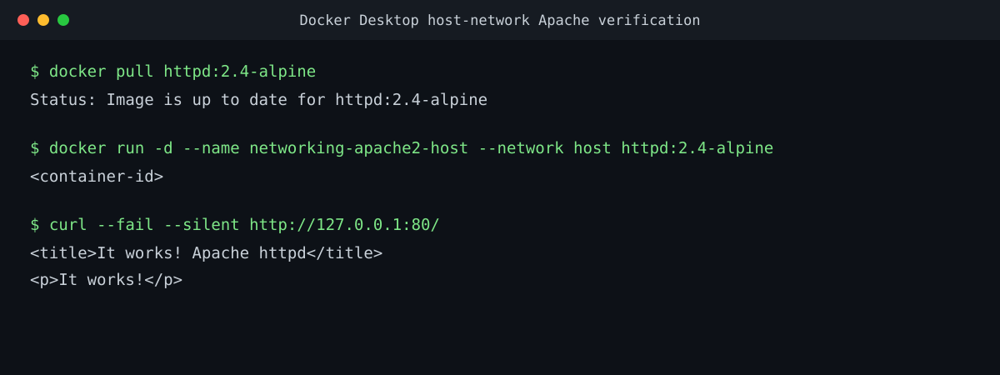
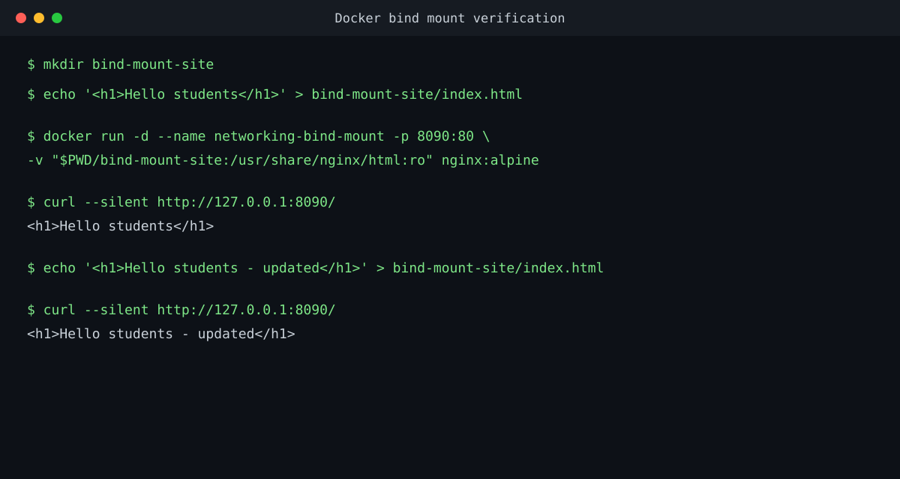

# Docker Networking & Volumes

## Task 1: Container Networking

Explanation: `docker network create` creates isolated bridge networks. `docker run --network` starts a container on a selected network, and `docker network connect` attaches the backend to a second network. The `docker exec` commands verify frontend-to-backend HTTP and backend-to-database TCP connectivity.

## Task 2: Host Network

Explanation: `docker pull` downloads the Apache image. `--network host` lets the container use the host network, and `curl` confirms that Apache is available on port `80`.

## Task 3: Bind Mount

Explanation: `mkdir` creates the local folder and `echo` writes `index.html`. The `-v` option bind mounts that folder into Nginx. Updating the host file changes the page without restarting the container.

## Task 4: Overlay Networks

Overlay networks allow Docker Swarm services on different Docker hosts to communicate over an isolated network. They are used for multi-host application deployments and service discovery.
