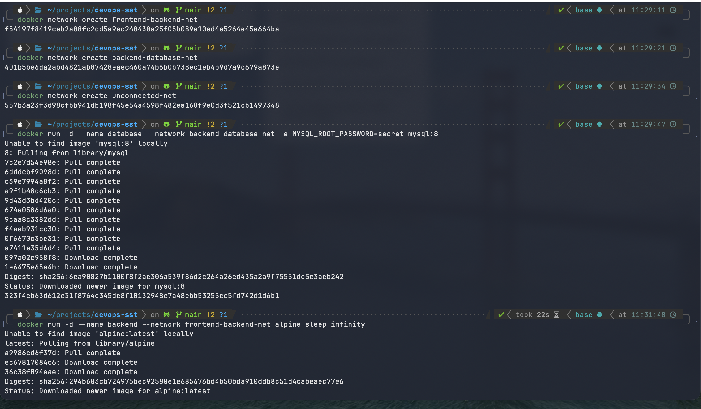
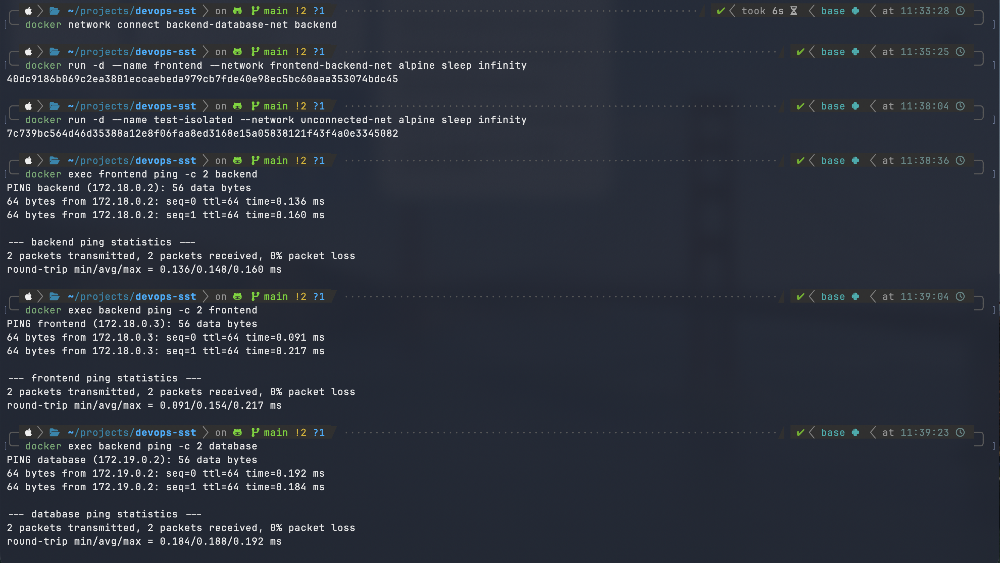
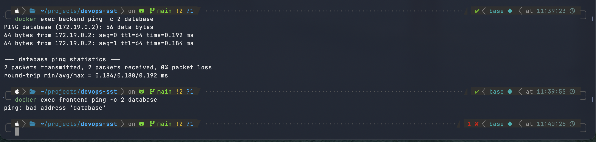
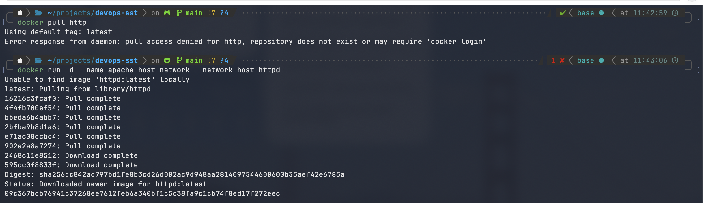
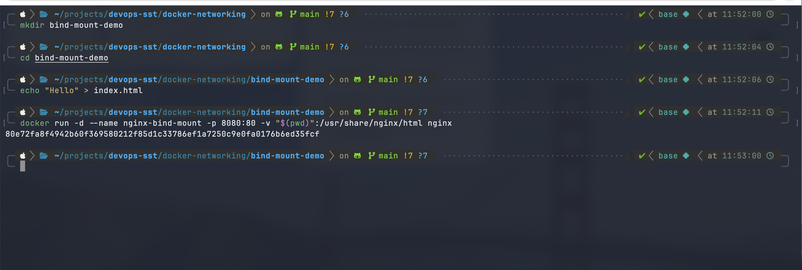

# Docker Networking & Volume Homework

## Task 1: Docker Container Networking

Three containers (`frontend`, `backend`, `database`) on three networks. The backend is attached to two of them.

```
frontend ──[frontend-backend-net]── backend ──[backend-database-net]── database
                                    test-isolated ──[unconnected-net]  (alone)
```

### 1.1 Create the networks and start the database and backend

Creates `frontend-backend-net`, `backend-database-net` and `unconnected-net`. Starts the `database` container (MySQL) on `backend-database-net`, then the `backend` container (Alpine) on `frontend-backend-net`.



### 1.2 Attach the backend to a second network, start the other containers, test connectivity

`docker network connect` adds `backend` to `backend-database-net`, so it now has 2 networks. Then the `frontend` and `test-isolated` containers are started. `frontend` can ping `backend`, `backend` can ping `frontend`, and `backend` can ping `database`, because each pair shares a network.



### 1.3 Connectivity result: `frontend` cannot reach `database`

`backend` reaches `database` (shared `backend-database-net`). `frontend` fails with `ping: bad address 'database'`, because the two share no network. This shows that the networks isolate containers from each other and that only the backend bridges both sides.



---

## Task 2: Host Network

### 2.1 Pull the Apache (httpd) image and run it on the host network

The first command, `docker pull http`, fails because the image name is wrong (`http` does not exist). The correct official Apache image is `httpd`. `docker run --network host httpd` then pulls it and starts the container `apache-host-network` with the host network. No `-p` flag is needed, because the container shares the host's network.



### 2.2 Apache accessed directly on port 80

Opening `http://localhost` (port 80) shows Apache's default "It works!" page, served straight from the container.


---

## Task 3: Bind Mount

### 3.1 Create the folder, `index.html`, and run Nginx with the bind mount

Creates the `bind-mount-demo` folder and an `index.html` file in it. Starts the Nginx container `nginx-bind-mount` with `-v "$(pwd)":/usr/share/nginx/html`, which mounts the current host folder over Nginx's web root. Port 8080 on the host maps to port 80 in the container.



### 3.2 Nginx serves the content from the host folder

`http://localhost:8080` shows the content of the host's `index.html`, which confirms the bind mount works.


---

## Task 4: Overlay Network

### What it is

A Docker overlay network is a virtual network that spans multiple Docker hosts. Containers on different machines can talk to each other as if they were on the same local network, using container or service names. By contrast, a bridge network works on a single host only.

### How it works

Overlay networks use VXLAN. Container traffic is encapsulated inside UDP packets (port 4789) and sent over the normal network between hosts. The receiving host unwraps the packet and delivers it to the right container. The hosts coordinate through Docker Swarm, so an overlay needs swarm mode:

```bash
docker swarm init
docker network create -d overlay --attachable my-overlay
docker service create --name web --network my-overlay --replicas 3 nginx
```

Swarm uses these ports: 2377/tcp (cluster management), 7946/tcp and udp (node discovery), 4789/udp (VXLAN traffic). `--attachable` allows standalone containers to join the overlay, not just swarm services.

### Use cases

- **Multi-host applications:** replicas of a service run on different nodes and still communicate privately.
- **Microservices across machines:** services find each other by name through Docker's built-in DNS, with no hard-coded IPs.
- **Network isolation:** separate overlay networks can isolate application tiers (for example frontend and backend) even when containers share the same hosts.
- **Encrypted traffic:** `--opt encrypted` encrypts traffic between hosts (IPsec), which is useful when nodes communicate over an untrusted network.
- **Scaling and failover:** Swarm can move or add containers on any node, and the network follows them.

### Comparison with other network drivers

| Driver | Scope | Isolation | Typical use |
|---|---|---|---|
| bridge | Single host | Yes | Default for containers on one machine |
| host | Single host | No (shares host network) | Max performance, simple port exposure |
| overlay | Multiple hosts | Yes | Swarm / multi-host clusters |
| macvlan | Single host | Container gets its own LAN IP | Legacy apps that need a real network address |
