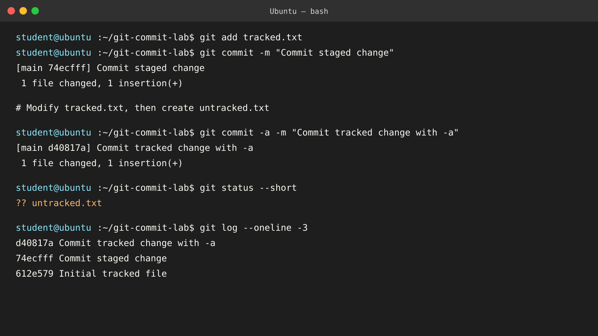
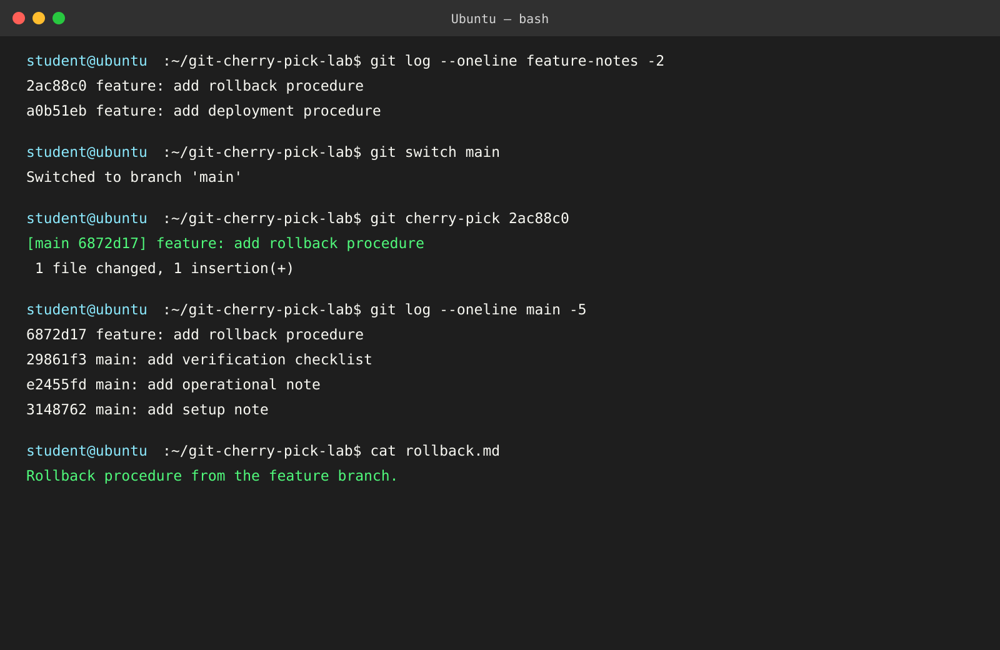

# Git Homework

The commands below were practiced in temporary local Git repositories so the project repository and its `main` branch were not modified.

## Task 1: `git commit -a -m` and `git commit -m`

| Command | Behavior |
| --- | --- |
| `git commit -m "message"` | Creates a commit from changes already staged with `git add`. |
| `git commit -a -m "message"` | Stages modified and deleted tracked files, then commits them. It does not include untracked files. |

The test committed a staged change with `git commit -m "Commit staged change"`. A later modification to the tracked file was committed with `git commit -a -m "Commit tracked change with -a"`. The untracked file remained visible in `git status --short`.



Explanation: `git commit -m` uses the index, so changes must first be staged. The `-a` flag stages only modifications and deletions of files already tracked by Git; `untracked.txt` was not included.

## Task 2: Git Cherry-Pick

### Main branch commits

```text
29861f3 main: add verification checklist
e2455fd main: add operational note
3148762 main: add setup note
```

### Feature branch commits

```text
2ac88c0 feature: add rollback procedure
a0b51eb feature: add deployment procedure
```

After identifying `2ac88c0` with `git log --oneline`, the following command was run on `main`:

```bash
git cherry-pick 2ac88c0
```

Git created a new commit, `6872d17 feature: add rollback procedure`, on `main`. The selected change was verified by confirming that `rollback.md` exists on `main` and contains the feature-branch rollback procedure.



Explanation: cherry-pick copies the change introduced by a selected commit onto the current branch and creates a new commit with a different hash.
