# Session 15: Helm

Helm is the package manager for Kubernetes. A **chart** is a bundle of templated Kubernetes manifests plus a `values.yaml` of defaults. Installing a chart creates a **release**, and every install, upgrade or rollback adds a numbered **revision** to that release's history.

All screenshots are in [`images/`](images/). Environment: minikube, namespace `default`.

## Contents

- [Task 1: Helm commands](#task-1-helm-commands)
- [Task 2: Helm rollback workflow](#task-2-helm-rollback-workflow)
- [Task 3: Mini project (notes-chart)](#task-3-mini-project-notes-chart)
- [Command cheat sheet](#command-cheat-sheet)

---

## Task 1: Helm commands

Chart used: `demo-chart` (generated by `helm create`, nginx `1.16.0`), release name `demo-release`.

### 1. `helm create`: scaffold a new chart

```bash
helm create demo-chart
ls demo-chart/
ls demo-chart/templates/
```

Creates a chart directory with:

| Path | Purpose |
|---|---|
| `Chart.yaml` | Chart metadata (name, version, appVersion) |
| `values.yaml` | Default configuration values |
| `templates/` | Templated Kubernetes manifests (`deployment.yaml`, `service.yaml`, `ingress.yaml`, `hpa.yaml`, `serviceaccount.yaml`, `_helpers.tpl`, `NOTES.txt`, `tests/`) |
| `charts/` | Sub-chart dependencies |

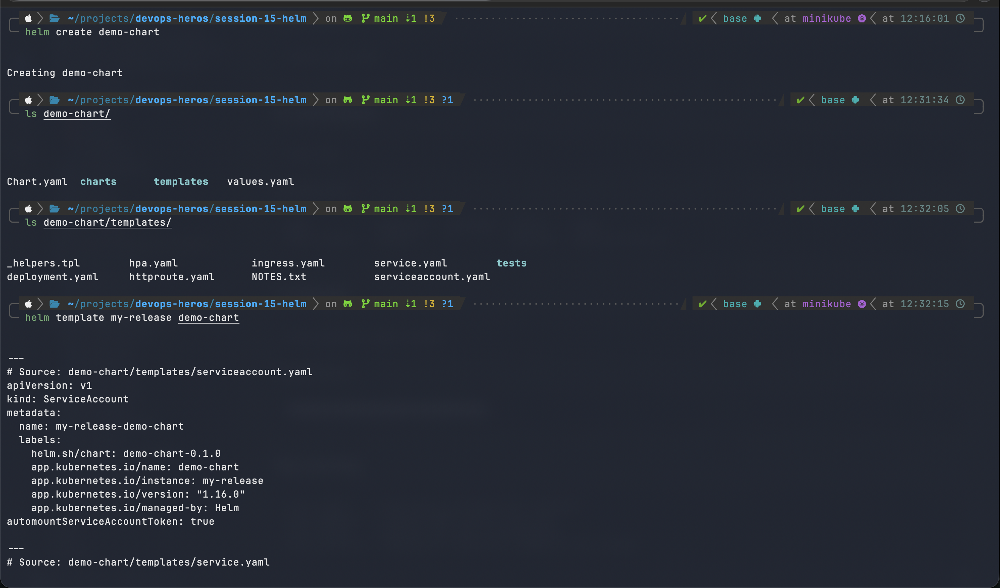

### 2. `helm template`: render manifests locally

```bash
helm template my-release demo-chart
```

Renders the templates with the values and prints the final YAML without touching the cluster. This is useful for checking what will be deployed. The output shows the ServiceAccount, Service (ClusterIP, port 80), Deployment (`nginx:1.16.0`, 1 replica, liveness and readiness probes) and the test Pod.


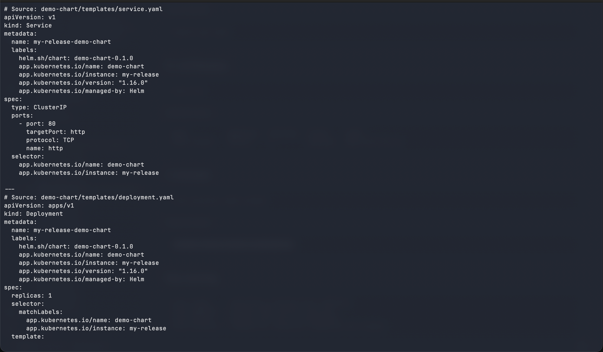
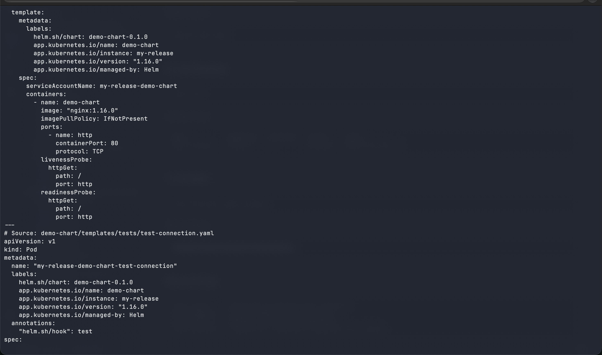

### 3. `helm install`: deploy a release

```bash
helm install demo-release demo-chart
```

Creates release `demo-release` from the chart. The output shows `STATUS: deployed`, `REVISION: 1`, and the NOTES from `NOTES.txt` (how to port-forward to the app).

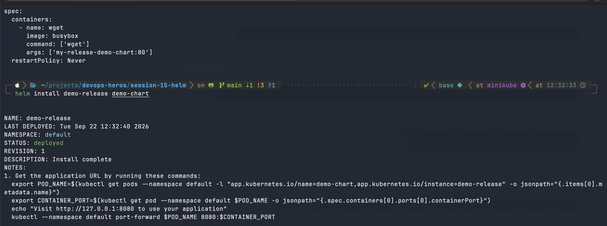

### 4. Verify with `kubectl get pods`

```bash
kubectl get pods
```

The pod `demo-release-demo-chart-84d8f47875-n9dw5` is `1/1 Running`, so the release created real workloads.

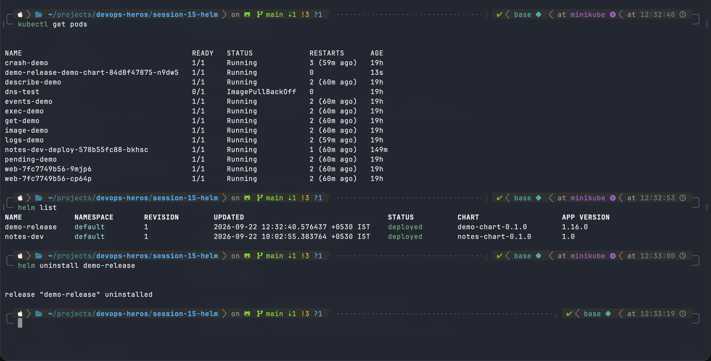

### 5. `helm list`: list releases

```bash
helm list
```

Shows each release's name, namespace, revision, last updated time, status, chart and app version. Here it lists `demo-release` (`demo-chart-0.1.0`, app `1.16.0`) and `notes-dev` (from the mini project).


### 6. `helm uninstall`: remove a release

```bash
helm uninstall demo-release
```

Deletes the release and all the Kubernetes resources it created. Output: `release "demo-release" uninstalled`.


### Remaining commands (reference)

Reference descriptions of the remaining commands.

| Command | What it does |
|---|---|
| `helm status <release>` | Shows current status, revision, namespace and the chart NOTES for a release |
| `helm get all <release>` | Shows everything about a release. Subcommands: `get values` (user-supplied values), `get manifest` (rendered YAML), `get notes`, `get hooks` |
| `helm upgrade <release> <chart>` | Applies a changed chart or values to an existing release, creating a new revision (demonstrated in Tasks 2 and 3) |
| `helm history <release>` | Lists every revision of a release with status and description (demonstrated in Task 3) |
| `helm rollback <release> <rev>` | Restores a previous revision, creating a new revision (demonstrated in Task 2) |
| `helm repo add/list/update/remove` | Manages chart repositories, e.g. `helm repo add bitnami https://charts.bitnami.com/bitnami` |
| `helm search repo <keyword>` | Searches added repos for charts (`helm search hub <keyword>` searches Artifact Hub) |

---

## Task 2: Helm rollback workflow

Release `notes-dev`, chart `notes-chart`.

```
Install → Upgrade → Verify → Upgrade again (broken) → Verify → Rollback → Verify
```

| Step | Command | Result |
|---|---|---|
| Install | `helm install notes-dev notes-chart` | Revision 1, nginx image, 1 replica |
| Upgrade | `helm upgrade notes-dev notes-chart -f notes-chart/values-prod.yaml` | Revision 2, scaled to 3 replicas |
| Verify | `kubectl get pods`, `helm history notes-dev` | 3 pods `Running`. History: rev 1 `superseded`, rev 2 `deployed` |
| Upgrade again | `helm upgrade notes-dev notes-chart --set image.tag=broken-tag-does-not-exist` | Revision 3 deployed (Helm reports success even though the image is bad) |
| Verify | `kubectl get pods` | New pod `ErrImagePull`; the old pod keeps running (rolling update protects availability) |
| Rollback | `helm rollback notes-dev 2` | `Rollback was a success!` (creates revision 4 with revision 2's config) |
| Verify | `kubectl get pods` | Broken pods are replaced and a healthy pod is `ContainerCreating` and then `Running` |

### Install, upgrade and history

Install (revision 1):

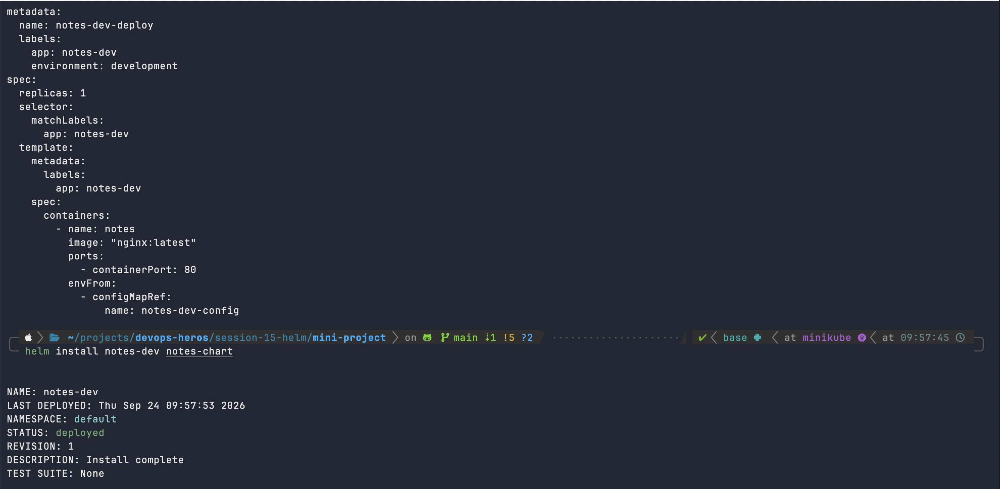

Upgrade with `values-prod.yaml` (revision 2), 3 pods running, and `helm history`:

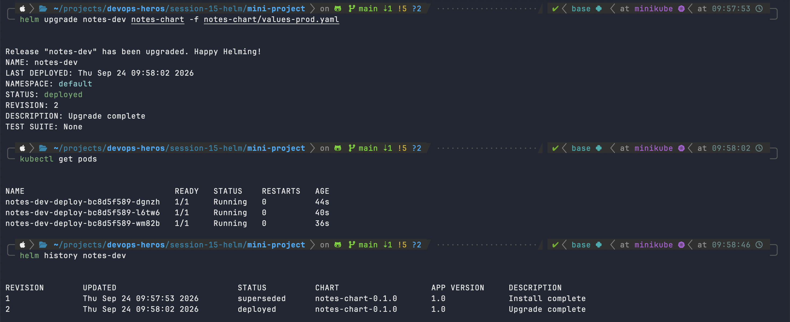

### Broken upgrade and rollback

Upgrade with a non-existent image tag (revision 3), pods show `ErrImagePull`, then `helm rollback notes-dev 2`:

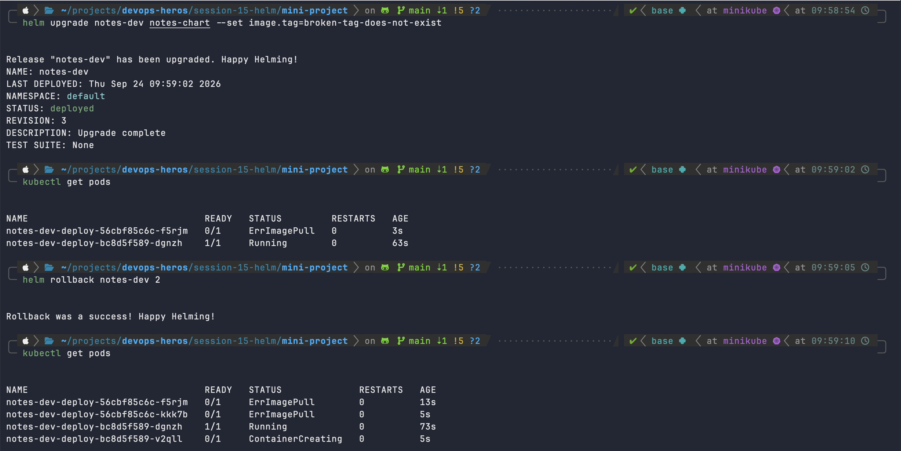

**Takeaways**

- `helm upgrade` succeeds when the manifests are applied, not when the pods are healthy. Use `--wait` or `--atomic` to make Helm wait and auto-rollback.
- `helm rollback` does not delete history. It creates a new revision that copies the old one.

---

## Task 3: Mini project (notes-chart)

A custom chart, `notes-chart`, deploying an nginx "notes" app with:

- `templates/configmap.yaml`: `notes-dev-config` (`APP_NAME=notes-app`, `ENVIRONMENT=development`)
- `templates/deployment.yaml`: nginx container, config injected through `envFrom.configMapRef`
- `templates/service.yaml`: NodePort service `notes-dev-svc`
- `values.yaml`: dev defaults, `values-prod.yaml`: production overrides (more replicas)

### Lint and template

```bash
helm lint notes-chart
helm template notes-dev notes-chart
```

`helm lint` reports `1 chart(s) linted, 0 chart(s) failed` (only an info message that `icon` is recommended). The template renders a ConfigMap, a NodePort Service and a Deployment.

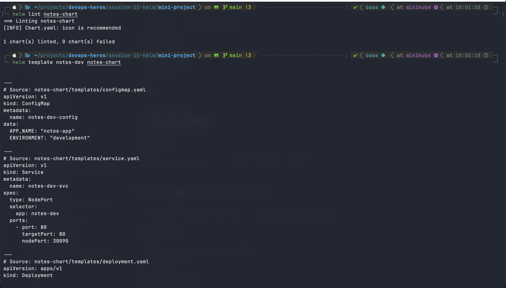
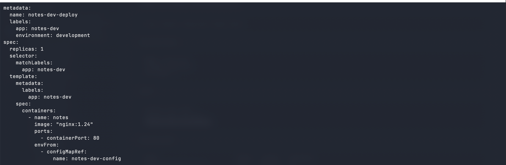

### Install and verify

```bash
helm install notes-dev notes-chart
kubectl get pods
kubectl get services
kubectl get configmaps
```

Release deployed at revision 1. Pod `notes-dev-deploy-...` starts, service `notes-dev-svc` is a NodePort on `80:30090`, and ConfigMap `notes-dev-config` has 2 keys.

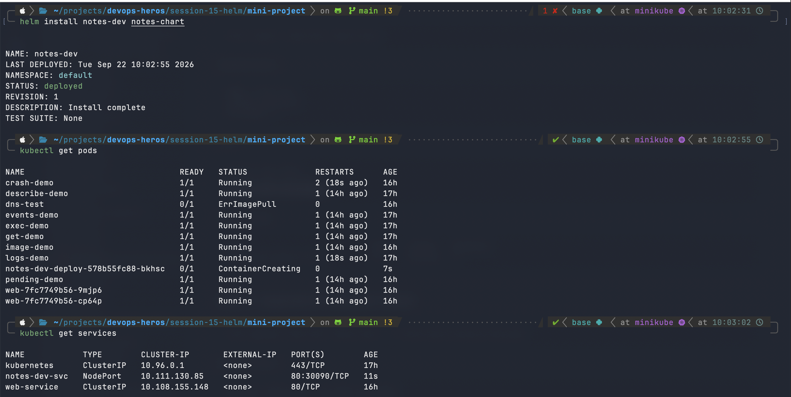
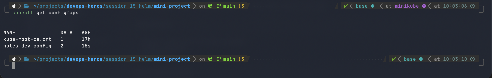

### Upgrade, rollback

Covered step by step in [Task 2](#task-2-helm-rollback-workflow) (same release and chart, different run): lint/template, install, upgrade with `values-prod.yaml`, history, broken upgrade and rollback.

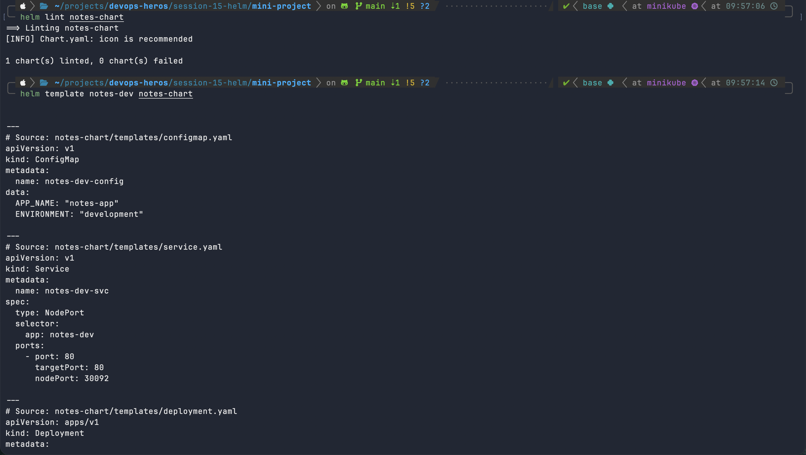

### Deliverables checklist

| Deliverable | Where |
|---|---|
| Helm chart, `values.yaml`, templates | `notes-chart/` |
| Installation | Task 3 and Task 2 |
| Upgrade | Task 2 |
| Rollback | Task 2 |
| Screenshots | `images/` |
| README | this file |

---

## Command cheat sheet

```bash
helm create <name>                       # scaffold chart
helm lint <chart>                        # validate chart
helm template <rel> <chart>              # render locally
helm install <rel> <chart>               # install
helm list                                # list releases
helm status <rel>                        # release status
helm get all|values|manifest <rel>       # inspect release
helm upgrade <rel> <chart> -f vals.yaml  # upgrade
helm history <rel>                       # revisions
helm rollback <rel> <rev>                # roll back
helm uninstall <rel>                     # remove
helm repo add|list|update <...>          # repositories
helm search repo|hub <keyword>           # find charts
```
