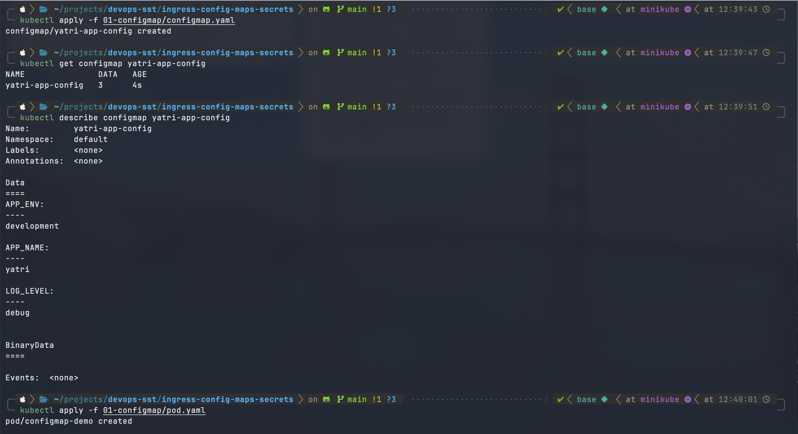
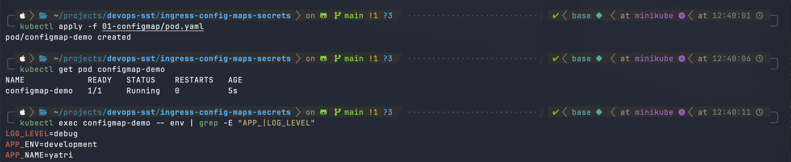
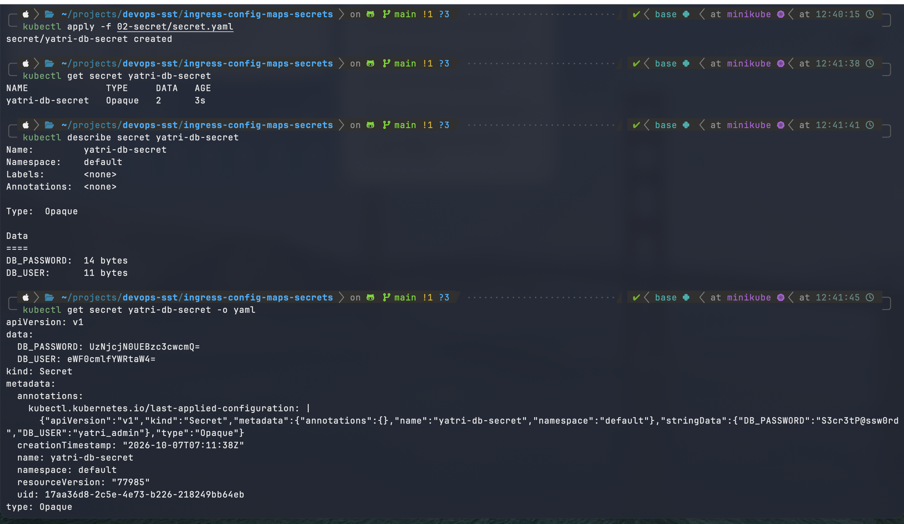
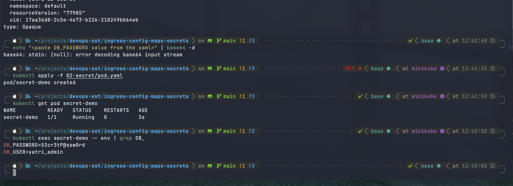
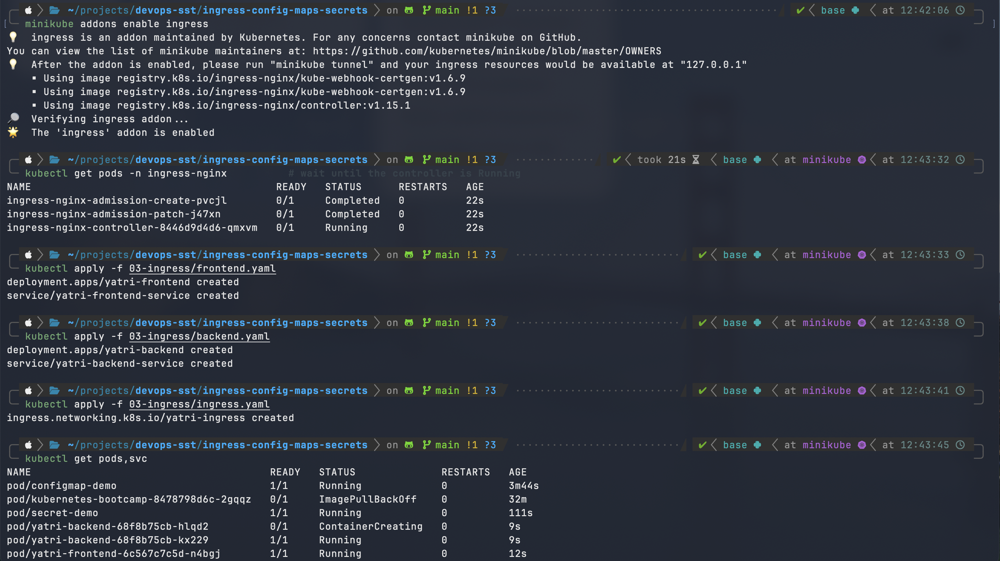
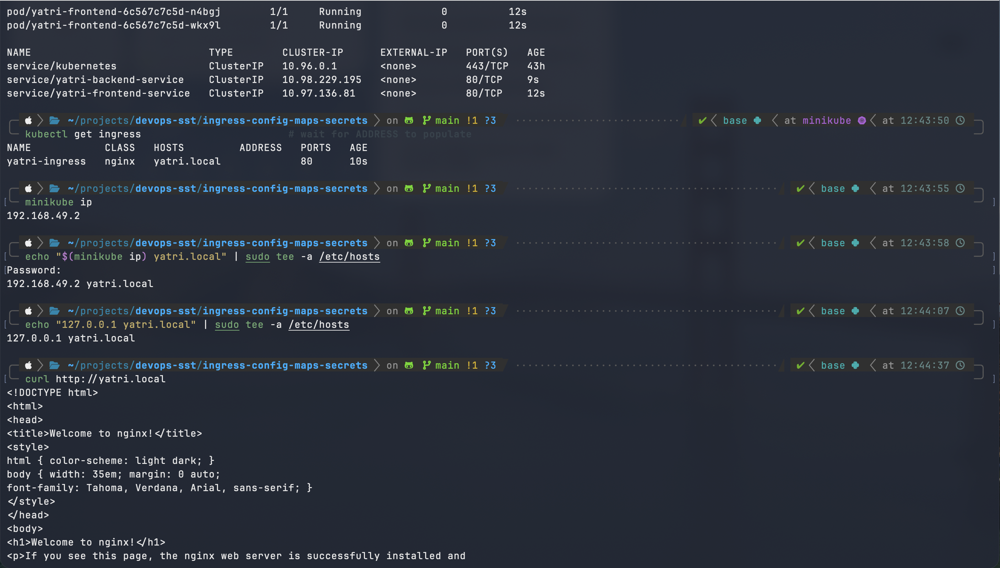
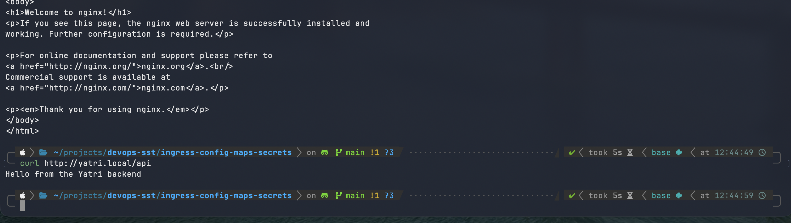

# Session 12: Kubernetes Ingress, ConfigMaps & Secrets

Manifests used in this session:

```
01-configmap/  configmap.yaml, pod.yaml
02-secret/     secret.yaml, pod.yaml
03-ingress/    frontend.yaml, backend.yaml, ingress.yaml
```

## Task 1: ConfigMap

A **ConfigMap** stores non-sensitive configuration (key/value pairs or whole files) separately from the container image. The same image can then run in dev, staging and prod with different settings.

Key points:
- Not encrypted, so never put passwords or tokens in it.
- Env vars are read at container start, so changing the ConfigMap needs a Pod restart. Mounted files update eventually without a restart.

### Figure 1.1: Create the ConfigMap, inspect it, and create the Pod

- `kubectl apply -f 01-configmap/configmap.yaml` creates `yatri-app-config`.
- `kubectl get configmap yatri-app-config` shows 3 data entries.
- `kubectl describe configmap yatri-app-config` shows the stored values: `APP_ENV=development`, `APP_NAME=yatri`, `LOG_LEVEL=debug`.
- `kubectl apply -f 01-configmap/pod.yaml` creates `configmap-demo`, which loads the ConfigMap as environment variables.



### Figure 1.2: Verify the values inside the container

- `kubectl get pod configmap-demo` shows the Pod `1/1 Running`.
- `kubectl exec configmap-demo -- env | grep -E "APP_|LOG_LEVEL"` prints `LOG_LEVEL=debug`, `APP_ENV=development` and `APP_NAME=yatri`, so the ConfigMap values are injected into the container.



## Task 2: Secret

A **Secret** holds sensitive data such as passwords, API keys and tokens. It is similar to a ConfigMap, but Kubernetes treats it more carefully: it can be restricted with RBAC, is not shown in plain text by `kubectl describe`, and can be encrypted at rest in etcd.

### Figure 2.1: Create the Secret and inspect how it is stored

- `kubectl apply -f 02-secret/secret.yaml` creates `yatri-db-secret`.
- `kubectl get secret yatri-db-secret` shows type `Opaque` with 2 data entries.
- `kubectl describe secret yatri-db-secret` hides the values and shows only their sizes (`DB_PASSWORD: 14 bytes`, `DB_USER: 11 bytes`).
- `kubectl get secret yatri-db-secret -o yaml` shows the values stored as base64 (`DB_PASSWORD: UzNjcjN0UEBzc3cwcmQ=`). This is encoding, not encryption.



### Figure 2.2: Inject the Secret into a Pod and verify

- `kubectl apply -f 02-secret/pod.yaml` creates `secret-demo`, which loads the Secret as environment variables.
- `kubectl get pod secret-demo` shows the Pod `1/1 Running`.
- `kubectl exec secret-demo -- env | grep DB_` prints `DB_PASSWORD` and `DB_USER` in plain text inside the container, because Kubernetes decodes the Secret before injecting it.



### Why Secrets must not be committed to Git

- **base64 is encoding, not encryption.** Anyone can reverse it with `echo <value> | base64 -d`, as the `-o yaml` output in Figure 2.1 shows.
- **Git history is permanent.** Even if you delete the file later, the value stays in old commits, forks and clones.
- **Repositories are widely shared.** Teammates, CI systems and sometimes the public can read them, and leaked credentials are scanned for and abused quickly.
- **Rotation is the only fix after a leak.** Every exposed credential must be changed.

Better practice:
- Add secret manifests to `.gitignore` and commit only a placeholder such as `secret.example.yaml`.
- Create secrets imperatively: `kubectl create secret generic yatri-db-secret --from-literal=DB_PASSWORD=...`.
- For GitOps, use Sealed Secrets, SOPS, External Secrets Operator, or a vault (HashiCorp Vault, AWS Secrets Manager).

## Task 3: Ingress

Flow of the demo:

1. Enable the Ingress Controller (NGINX) in minikube.
2. Deploy the frontend and backend applications (Deployments).
3. Create a Service for each (ClusterIP), which gives the Pods a stable internal address.
4. Create an Ingress that routes `yatri.local/` to the frontend and `yatri.local/api` to the backend.
5. Map `yatri.local` in `/etc/hosts` and access the application.

### Figure 3.1: Enable the controller, deploy the applications and create the Ingress

- `minikube addons enable ingress` installs the NGINX Ingress Controller.
- `kubectl get pods -n ingress-nginx` shows `ingress-nginx-controller` Running (the two admission jobs are Completed).
- `kubectl apply -f 03-ingress/frontend.yaml`, `backend.yaml` and `ingress.yaml` create the Deployments, Services and `yatri-ingress`.
- `kubectl get pods,svc` shows the frontend and backend Pods starting, and the `yatri-frontend-service` and `yatri-backend-service` ClusterIP Services.



### Figure 3.2: Configure the hostname and access the application through Ingress

- `kubectl get ingress` shows `yatri-ingress` with class `nginx`, host `yatri.local` and port 80.
- `minikube ip` returns the cluster IP, and `yatri.local` is mapped in `/etc/hosts` with `echo ... | sudo tee -a /etc/hosts`.
- `curl http://yatri.local` returns the nginx welcome page, served by the frontend Service.



### Figure 3.3: Verify path-based routing

- The rest of the `curl http://yatri.local` response confirms the frontend page was returned.
- `curl http://yatri.local/api` returns `Hello from the Yatri backend`, so the `/api` path is routed to the backend Service while `/` goes to the frontend.



## Task 4: Ingress vs Ingress Controller

### What is Ingress?

An **Ingress** is a Kubernetes API object (`kind: Ingress`) that holds a set of HTTP/HTTPS routing rules: which host and path should go to which Service. It can also declare TLS settings. It is only configuration. By itself it does nothing and opens no ports.

### What is an Ingress Controller?

An **Ingress Controller** is a running program, usually a reverse proxy deployed as Pods in the cluster (for example NGINX, Traefik, HAProxy or an AWS ALB controller). It watches the API server for Ingress objects, turns the rules into its own proxy configuration, and receives the real traffic from outside the cluster.

### Difference

| | Ingress | Ingress Controller |
|---|---|---|
| What it is | Kubernetes resource (YAML) | Running Pods (software) |
| Role | Declares routing rules | Enforces the rules and handles traffic |
| Analogy | The road signs and the routing plan | The traffic officer who follows the plan |
| Installed by | You apply a manifest | Installed separately (Helm, manifests, `minikube addons enable ingress`) |
| Works alone? | No | Not meaningfully: with no Ingress objects it has nothing to route |
| Examples | `yatri-ingress` | `ingress-nginx`, Traefik, HAProxy |

### Why both are required

- Kubernetes ships the Ingress API but **no built-in controller**. Without one, Ingress objects are accepted and stored but never acted on.
- The split lets you choose any controller implementation and keep the same Ingress YAML format.
- Together they replace one `LoadBalancer` or `NodePort` Service per application with **a single entry point** that does host-based and path-based routing, TLS termination and virtual hosting. That saves cost and IP addresses.

```
Client -> Ingress Controller (nginx Pod) -> reads Ingress rules -> Service -> Pods
```

### Examples

- **Path-based:** `yatri.local/` goes to the frontend Service and `yatri.local/api` goes to the backend Service.
- **Host-based:** `app.example.com` goes to Service A and `api.example.com` goes to Service B.
- **TLS:** the controller terminates HTTPS using a certificate stored in a Secret referenced by the Ingress (`spec.tls`).

## Task 5: Troubleshooting

### Problem

If the Ingress is created without an Ingress Controller, `curl http://yatri.local` fails with `Couldn't connect to server` and `kubectl get ingress` shows an empty ADDRESS.

### Why the error occurs

The Ingress (`yatri-ingress`) uses `ingressClassName: nginx`, but an Ingress is only a set of rules. If **no NGINX Ingress Controller is running in the cluster**, nothing watches the Ingress, no address is assigned and nothing listens on port 80.

A separate error, `Could not resolve host: yatri.local`, appears when `yatri.local` has no entry in `/etc/hosts`.

### Fix

Enable the Ingress Controller first (Figure 3.1), then add the hostname mapping (Figure 3.2):

```bash
minikube addons enable ingress
kubectl get pods -n ingress-nginx
kubectl get ingress
echo "$(minikube ip) yatri.local" | sudo tee -a /etc/hosts
curl http://yatri.local
```

On macOS with the Docker driver, also run `minikube tunnel` and map `yatri.local` to `127.0.0.1` in `/etc/hosts`.
