# Session 10: Kubernetes Pods, ReplicaSets & Deployments

# Task 1: Deployment Strategies

## Rolling Update
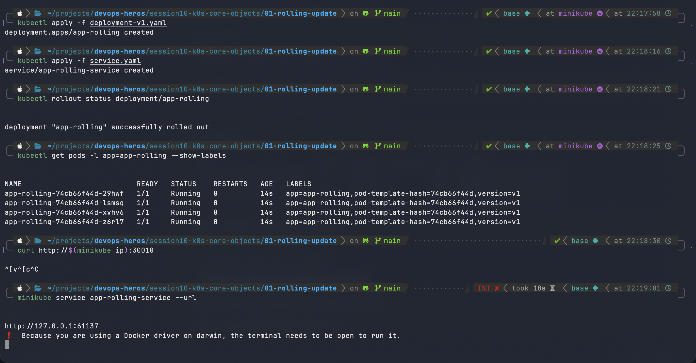
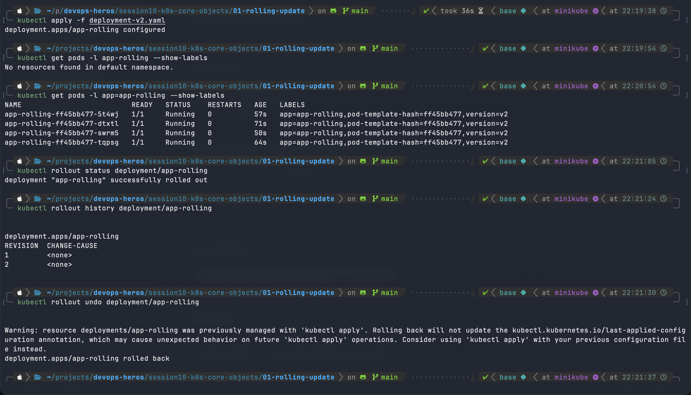

## Blue Green 
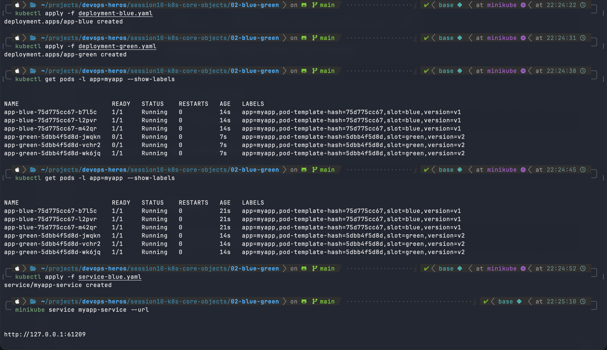
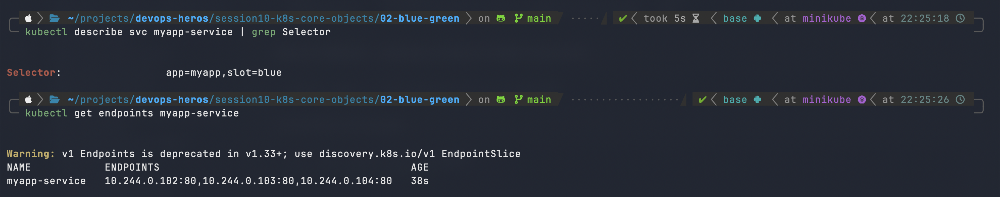
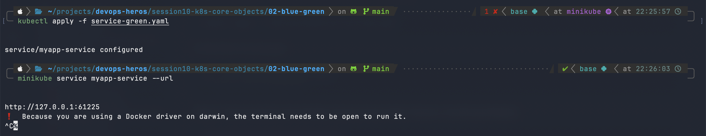 
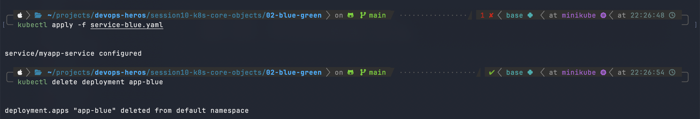

## Canary 
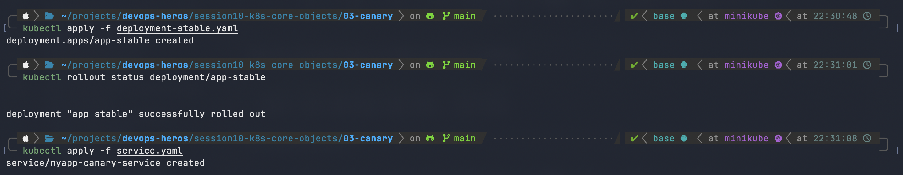
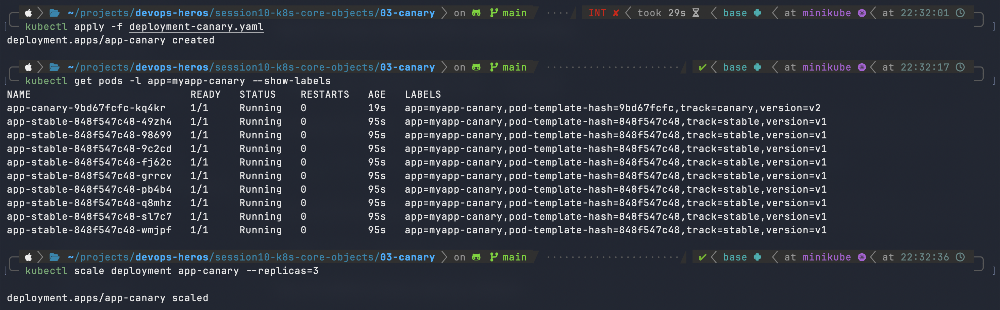
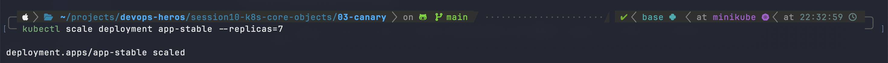

## Recreate 
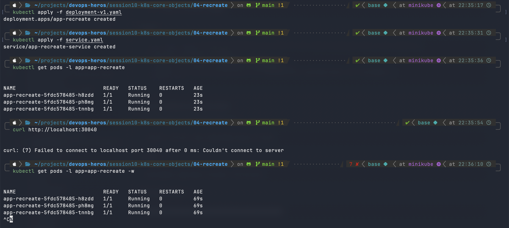
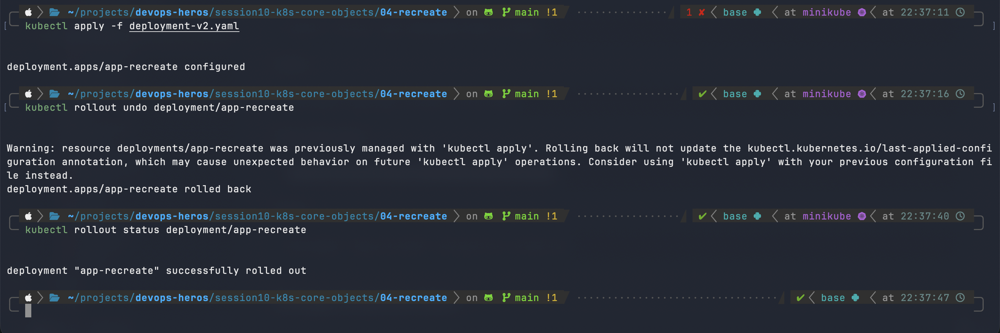

---

# Task 2: Pod Lifecycle

Each manifest (`01-running.yaml` ... `12-termination.yaml`, all in this folder) was applied on a local minikube cluster and then inspected with `kubectl get pod`, `kubectl describe pod` and `kubectl logs`. Screenshots appear in the order the commands were run. Long outputs (`describe`, `get -o yaml`) span several screenshots because they scroll past one screen.

## STATUS vs. Pod phase

`kubectl get pods` shows a STATUS column that is not always an official Pod phase. Values such as `Completed`, `Error`, `CrashLoopBackOff`, `ImagePullBackOff`, `ContainerCreating` and `Terminating` are display values derived from the Pod and container state.

- Official Pod phases: `Pending`, `Running`, `Succeeded`, `Failed`, `Unknown`.
- Container states: `Waiting`, `Running`, `Terminated`.

## 01 - Running (`01-running.yaml`)

```bash
kubectl apply -f 01-running.yaml
kubectl get pods -w
kubectl describe pod lifecycle-running
kubectl logs lifecycle-running
kubectl get pod lifecycle-running -o jsonpath='{.status.containerStatuses[0].state}'
kubectl get pod lifecycle-running -o yaml
kubectl delete pod lifecycle-running
```

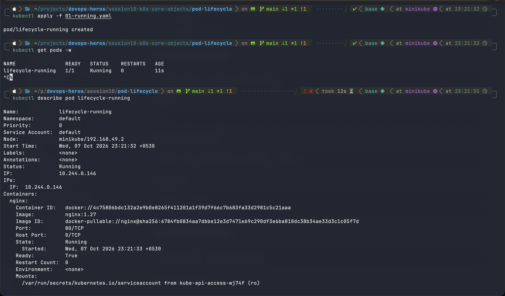
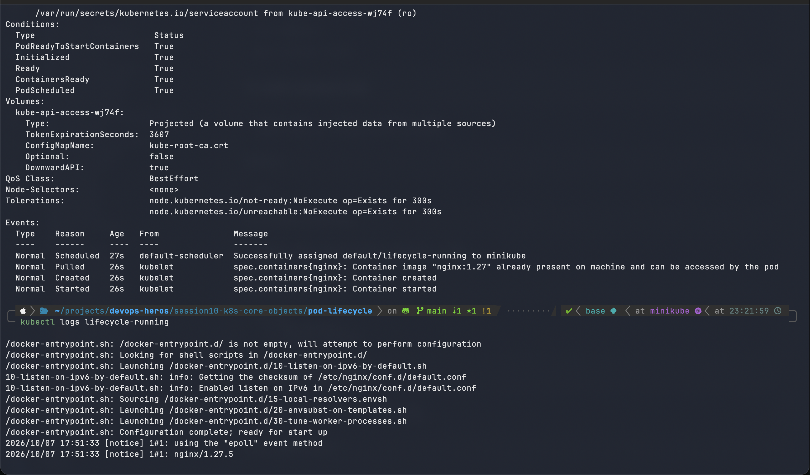
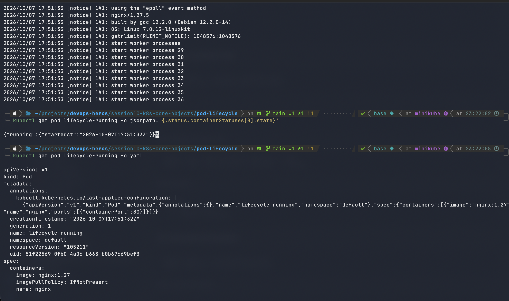
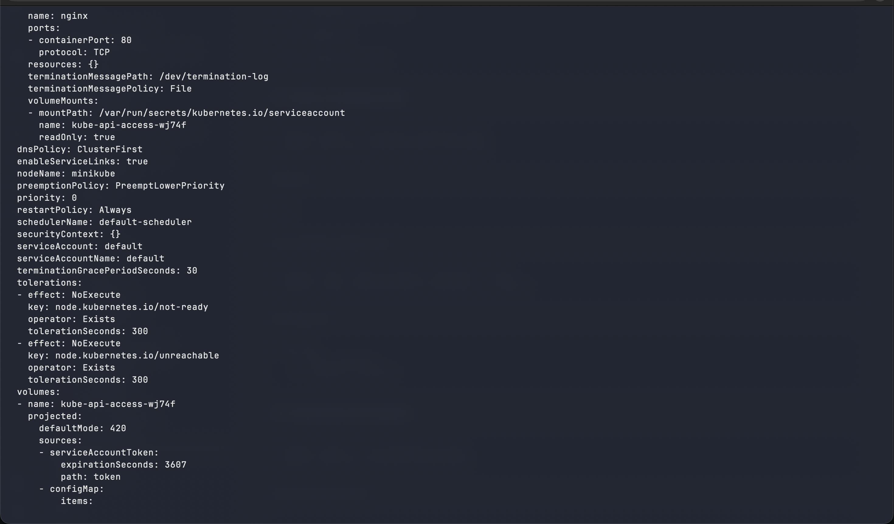
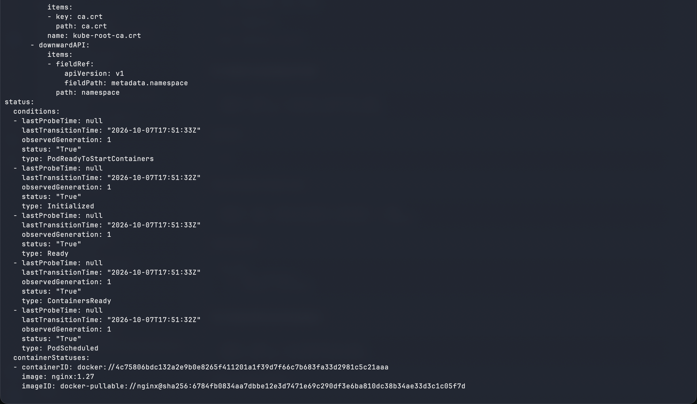
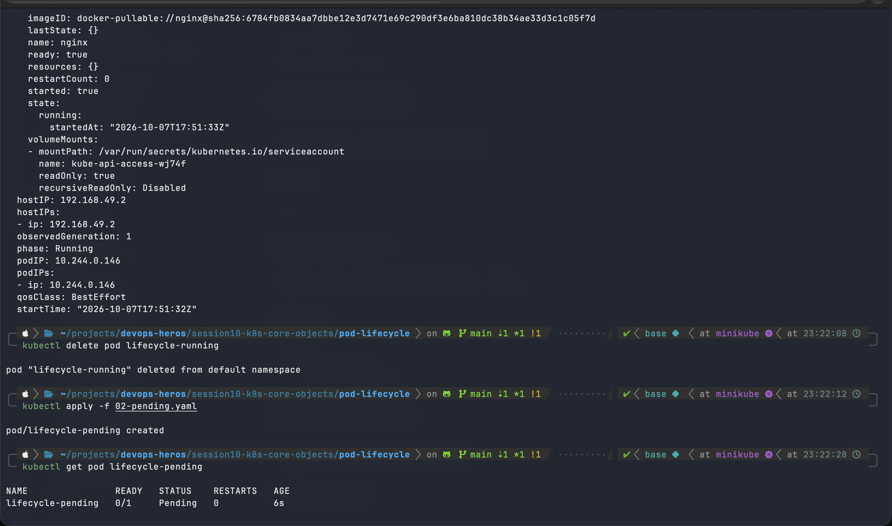

**Observed:**
- The Pod went straight to `1/1 Running` with `0` restarts (11s old when first listed).
- `describe` shows the lifecycle in its Events: `Scheduled` (default-scheduler assigned it to `minikube`) → `Pulled` (image `nginx:1.27` was already on the node) → `Created` → `Started`.
- All five conditions are `True`: `PodReadyToStartContainers`, `Initialized`, `Ready`, `ContainersReady`, `PodScheduled`.
- The container state is `Running` with a `startedAt` timestamp. The YAML output confirms `status.phase: Running`, `restartPolicy: Always`, `terminationGracePeriodSeconds: 30` and `qosClass: BestEffort` (no resource requests or limits).
- `kubectl logs` shows the nginx entrypoint scripts and the worker processes starting.

## 02 - Pending (`02-pending.yaml`)

The container requests `cpu: 1` and `memory: 9Gi`, which the node cannot provide, so the scheduler cannot place the Pod.

```bash
kubectl apply -f 02-pending.yaml
kubectl get pod lifecycle-pending
kubectl describe pod lifecycle-pending
```


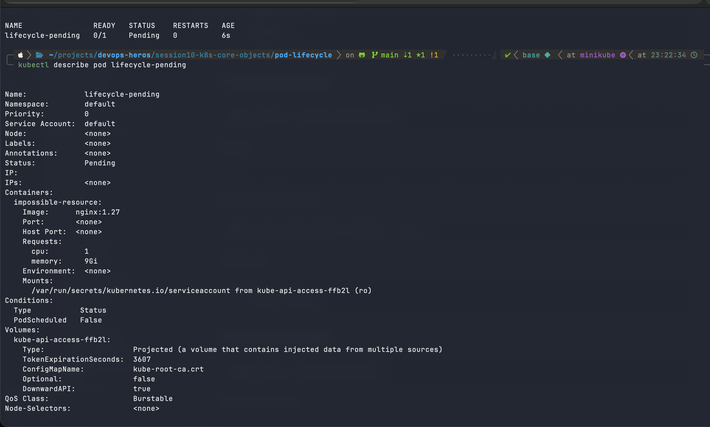

**Observed:**
- Status stays `Pending`, `READY 0/1`, `0` restarts.
- `describe` shows `Node: <none>` and no IP: the Pod was never assigned to a node, so no container was created.
- The only condition is `PodScheduled: False`. The requests (`cpu: 1`, `memory: 9Gi`) explain why. The QoS class is `Burstable` because requests are set.
- The Events section (which would carry the scheduler's `FailedScheduling` reason) is below the captured area of the screenshot.

## 03 - Succeeded (`03-succeeded.yaml`)

```bash
kubectl apply -f 03-succeeded.yaml
kubectl get pod lifecycle-succeeded
kubectl logs lifecycle-succeeded
```

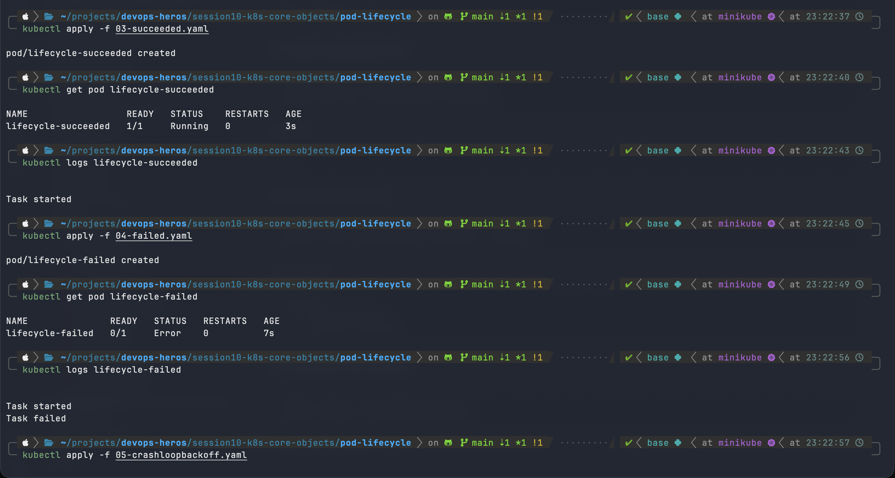

**Observed:**
- The container prints `Task started`, sleeps 5s, prints `Task completed successfully` and exits 0. With `restartPolicy: Never`, the Pod then moves to the `Succeeded` phase (shown as `Completed` by `kubectl get`).
- The screenshot was taken at 3s (`1/1 Running`, logs show `Task started`), so the final `Completed` state was not captured.

## 04 - Failed (`04-failed.yaml`)

```bash
kubectl apply -f 04-failed.yaml
kubectl get pod lifecycle-failed
kubectl logs lifecycle-failed
```


**Observed:**
- After 7s the Pod is `0/1`, STATUS `Error`, `0` restarts. It is not restarted because of `restartPolicy: Never`.
- The logs show `Task started` followed by `Task failed`: the container sleeps 5s, then runs `exit 1`, which puts the Pod in the `Failed` phase.

## 05 - CrashLoopBackOff (`05-crashloopbackoff.yaml`)

The container runs `echo 'Application started'; sleep 3; echo 'Application crashed'; exit 1`. The default `restartPolicy: Always` makes the kubelet restart it each time.

```bash
kubectl apply -f 05-crashloopbackoff.yaml
kubectl get pod lifecycle-crashloop -w
kubectl describe pod lifecycle-crashloop
kubectl logs lifecycle-crashloop
kubectl logs lifecycle-crashloop --previous
```


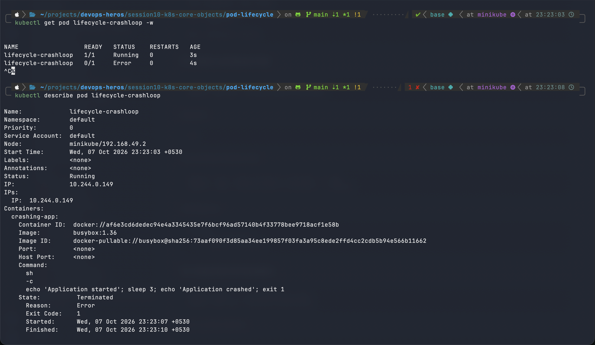
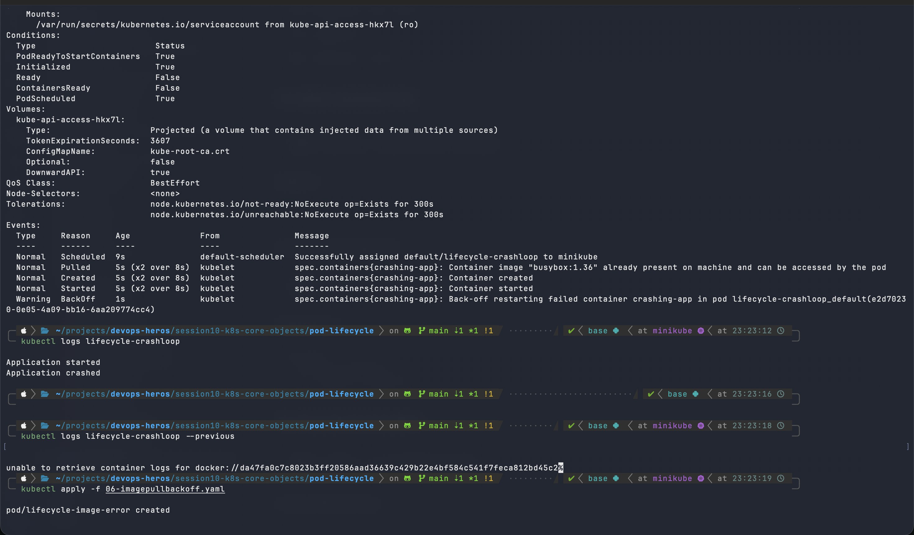

**Observed:**
- The watch shows the Pod go `1/1 Running` (3s) → `0/1 Error` (4s).
- `describe` shows the container `State: Terminated`, `Reason: Error`, `Exit Code: 1`, started 23:23:07 and finished 23:23:10 (the 3s sleep).
- `Ready` and `ContainersReady` are `False`, while `Initialized` and `PodScheduled` stay `True`.
- Events show `Pulled`/`Created`/`Started` repeated (`x2 over 8s`) followed by `Warning BackOff ... Back-off restarting failed container`. This is the kubelet's exponential back-off between restarts, which produces the `CrashLoopBackOff` status.
- `kubectl logs` prints `Application started` / `Application crashed`.
- `kubectl logs --previous` returned `unable to retrieve container logs`, because the previous container instance had already been cleaned up.

## 06 - Image pull error (`06-imagepullbackoff.yaml`)

The image is set to the non-existent `jakwehrgkaejw:kahsdfgkhj`.

```bash
kubectl apply -f 06-imagepullbackoff.yaml
kubectl get pod lifecycle-image-error
kubectl describe pod lifecycle-image-error
```


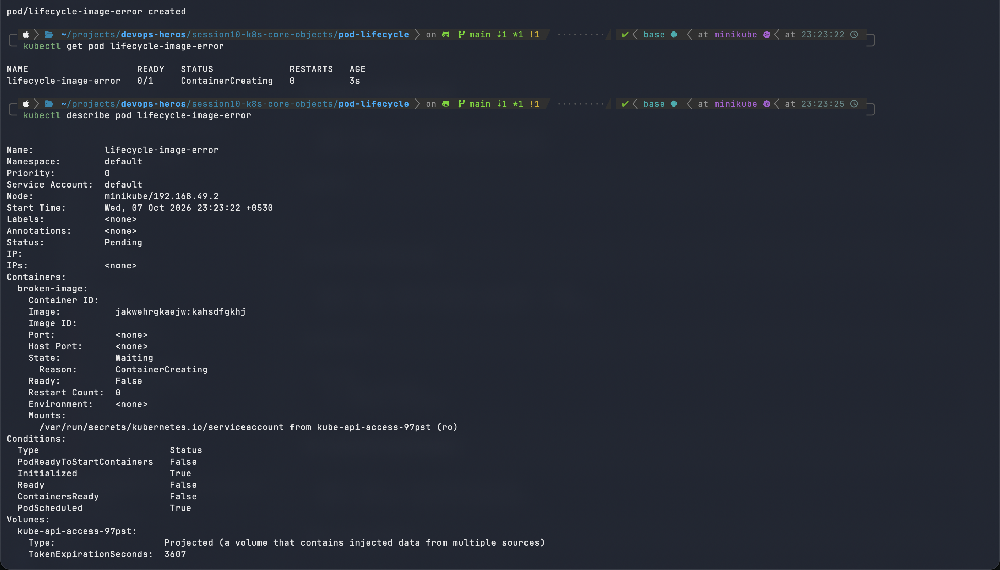
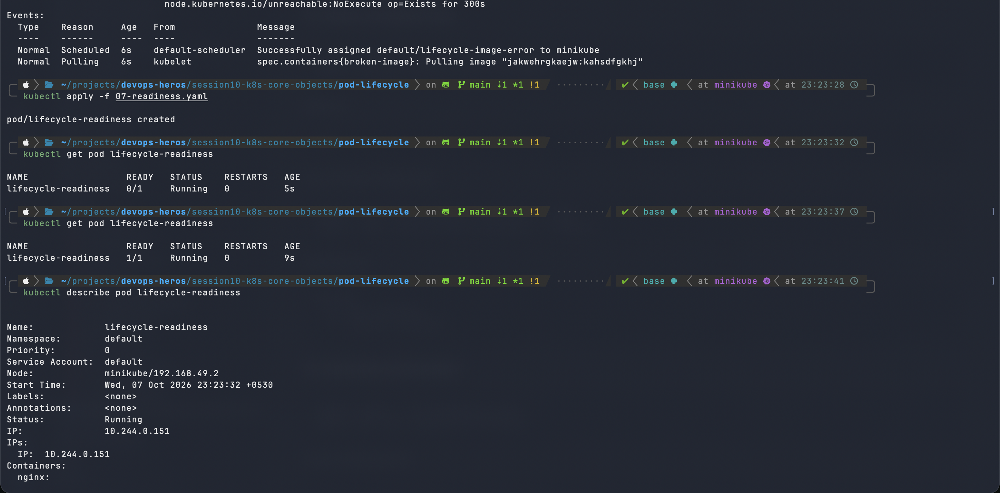

**Observed:**
- The Pod is scheduled to the node but stays `0/1 ContainerCreating` and the phase stays `Pending`, with `Container ID` and `Image ID` empty.
- The container state is `Waiting`, `Reason: ContainerCreating`, `Ready: False`. `PodScheduled` and `Initialized` are `True`, but `Ready`, `ContainersReady` and `PodReadyToStartContainers` are `False`.
- Events show `Scheduled`, then `Pulling image "jakwehrgkaejw:kahsdfgkhj"`. The describe was taken seconds after creation, so the later `ErrImagePull` / `ImagePullBackOff` events had not appeared yet.

## 07 - Readiness probe (`07-readiness.yaml`)

```bash
kubectl apply -f 07-readiness.yaml
kubectl get pod lifecycle-readiness
kubectl describe pod lifecycle-readiness
```


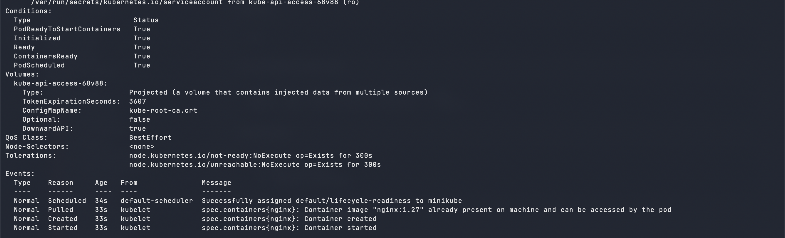
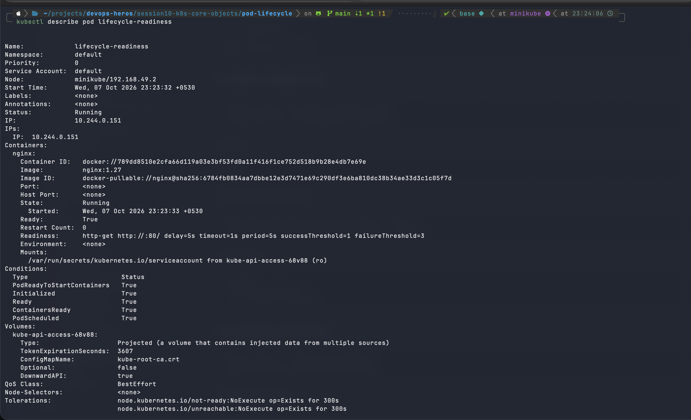
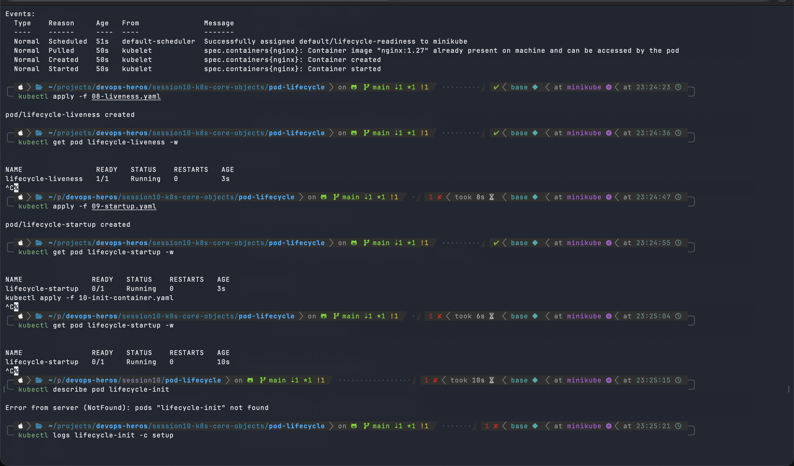

**Observed:**
- 5s after creation the Pod is `0/1 Running`: the container is running but not ready. 4 seconds later it is `1/1 Running`.
- `describe` shows the probe: `Readiness: http-get http://:80/ delay=5s timeout=1s period=5s successThreshold=1 failureThreshold=3`. The 5s initial delay is why the Pod was `Running` but not `Ready` at first (`Running != Ready`).
- Once the probe succeeded, `Ready` and `ContainersReady` became `True`. A Service would only send traffic to the Pod from that moment.

## 08 - Liveness probe (`08-liveness.yaml`)

```bash
kubectl apply -f 08-liveness.yaml
kubectl get pod lifecycle-liveness -w
```


**Observed:**
- The container creates `/tmp/healthy`, and the probe (`test -f /tmp/healthy`, every 5s, `failureThreshold: 2`) passes. After 20s the container deletes the file, the probe starts failing and the kubelet restarts the container, so `RESTARTS` should go to 1 shortly after.
- The screenshot was taken at 3s (`1/1 Running`, `0` restarts), before the file was removed, so the restart itself was not captured.

## 09 - Startup probe (`09-startup.yaml`)

```bash
kubectl apply -f 09-startup.yaml
kubectl get pod lifecycle-startup -w
```


**Observed:**
- The app takes 30s to start (`sleep 30; touch /tmp/started`). The startup probe checks for `/tmp/started` every 5s and allows up to 10 failures (50s).
- The Pod is `0/1 Running` at 3s and still `0/1 Running` at 10s: the container is up but not ready until the startup probe succeeds (about 30s). Liveness and readiness checks are held back until then, which protects slow-starting apps from being killed early.

## 10 - Init container (`10-init-container.yaml`)

```bash
kubectl apply -f 10-init-container.yaml
kubectl get pod lifecycle-init -w
kubectl describe pod lifecycle-init
kubectl logs lifecycle-init -c setup
```


**Observed (not demonstrated yet):**
- The manifest has an init container `setup` (prints `Init container running`, sleeps 10s, prints `Init complete`) that must finish before the `app` (nginx) container starts. The expected status sequence is `Init:0/1` → `PodInitializing` → `Running`.
- In the screenshot, the `kubectl apply -f 10-init-container.yaml` command was typed into a running watch and never executed, so `kubectl describe pod lifecycle-init` returned `Error from server (NotFound)`. The init run itself still needs to be captured.

## 11 - Multi-container Pod (`11-multi-container.yaml`)

```bash
kubectl apply -f 11-multi-container.yaml
kubectl get pod lifecycle-multi-container
kubectl logs lifecycle-multi-container -c app
kubectl logs lifecycle-multi-container -c sidecar
```

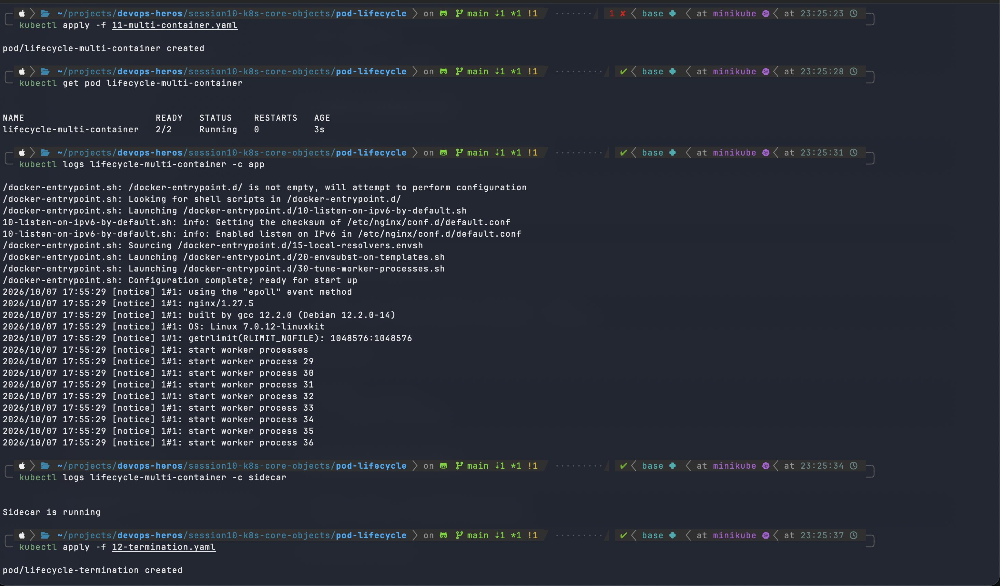

**Observed:**
- `READY 2/2`, `Running`, `0` restarts: both containers (`app`, `sidecar`) share one Pod and started together.
- `-c <name>` selects the container whose logs to read: `app` prints the nginx startup logs and `sidecar` prints `Sidecar is running`.

## 12 - Graceful termination (`12-termination.yaml`)

```bash
kubectl apply -f 12-termination.yaml
kubectl get pod lifecycle-termination
kubectl delete pod lifecycle-termination
kubectl get pod lifecycle-termination -w
kubectl delete -f .
```


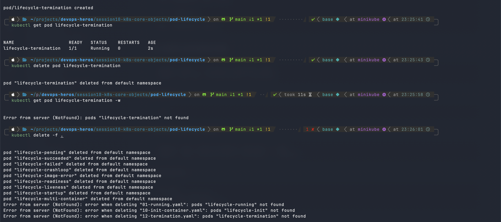

**Observed:**
- The manifest sets `terminationGracePeriodSeconds: 20` and traps `SIGTERM`: on delete the container prints `SIGTERM received; cleaning up...`, sleeps 10s, prints `Cleanup complete` and exits 0.
- The Pod was `1/1 Running`. `kubectl delete pod` blocked for about 11s (the prompt reports `took 11s`), matching the 10s cleanup: the Pod goes to `Terminating`, handles `SIGTERM`, and is removed once the container exits, inside the 20s grace period (not force-killed).
- Afterwards `get pod` returns `NotFound`, so the Pod is gone from the API.
- `kubectl delete -f .` cleaned up the remaining lifecycle Pods. The `NotFound` errors are for Pods that had already been deleted manually (`lifecycle-running`, `lifecycle-init`, `lifecycle-termination`).

## Summary

| Pod | Phase / status seen | Key reason |
|---|---|---|
| lifecycle-running | Running, 1/1 | Healthy container |
| lifecycle-pending | Pending, 0/1 | Unschedulable: requests `cpu: 1`, `memory: 9Gi` |
| lifecycle-succeeded | Running at 3s | One-shot task, exits 0 → Succeeded |
| lifecycle-failed | Error, 0/1 | Task exits 1 → Failed |
| lifecycle-crashloop | Error → BackOff | Exit code 1, kubelet back-off restarts |
| lifecycle-image-error | ContainerCreating, 0/1 | Invalid image name |
| lifecycle-readiness | Running 0/1 → 1/1 | Readiness probe passes after delay |
| lifecycle-liveness | Running, 1/1 | Liveness probe healthy (restart not captured) |
| lifecycle-startup | Running, 0/1 | Startup probe not yet passed |
| lifecycle-init | NotFound | Apply was never executed |
| lifecycle-multi-container | Running, 2/2 | App + sidecar |
| lifecycle-termination | Running → deleted | Graceful shutdown on SIGTERM |
