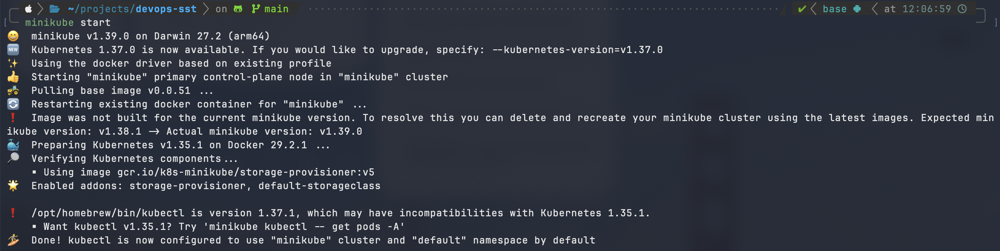
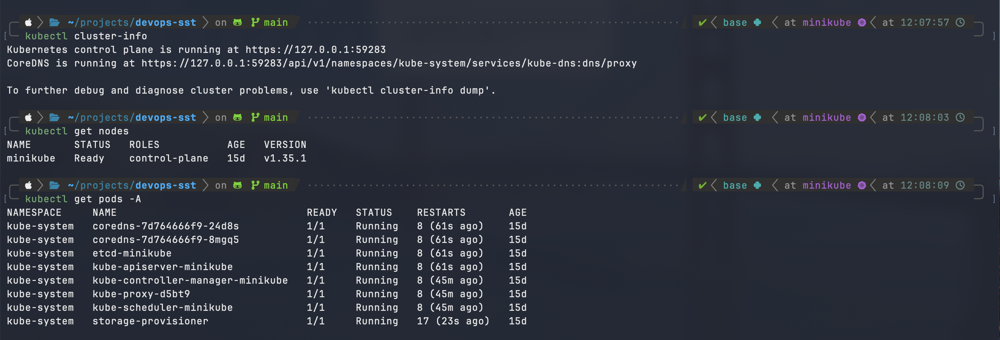
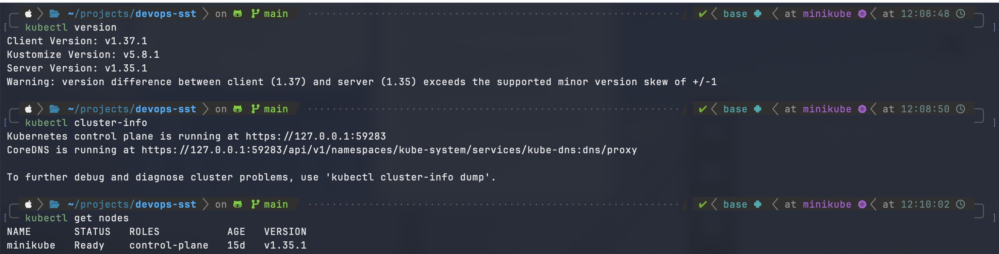

# Kubernetes Fundamentals

Hands-on notes for getting started with Kubernetes using Minikube.

## Contents

1. [Install and configure Minikube](#1-install-and-configure-minikube)
2. [Verify cluster status](#2-verify-cluster-status)
3. [Kubernetes architecture](#3-kubernetes-architecture)
4. [Basic Kubernetes objects](#4-basic-kubernetes-objects)
5. [Kubectl basic commands](#5-kubectl-basic-commands)
6. [Kubernetes Basics tutorial (hands-on)](#6-kubernetes-basics-tutorial-hands-on)

> Screenshots go in a `screenshots/` folder next to this README. Replace each placeholder with your own capture.

---

## 1. Install and configure Minikube

Minikube runs a single-node Kubernetes cluster locally. It needs a driver (Docker, HyperKit, etc.).

```bash
# macOS (Homebrew)
brew install minikube kubectl

# check versions
minikube version
kubectl version --client

# start a cluster using the Docker driver
minikube start --driver=docker

# optional: make docker the default driver
minikube config set driver docker

# optional: allocate resources
minikube start --cpus=2 --memory=4096
```

Useful lifecycle commands:

| Command                    | Purpose                              |
| -------------------------- | ------------------------------------ |
| `minikube start`           | Start the cluster                    |
| `minikube stop`            | Stop the cluster (keeps state)       |
| `minikube delete`          | Delete the cluster                   |
| `minikube dashboard`       | Open the Kubernetes web dashboard    |
| `minikube addons list`     | List available addons                |
| `minikube service <name>`  | Open a NodePort service in a browser |

📸 **Screenshot:** `minikube start` output



---

## 2. Verify cluster status

```bash
minikube status
kubectl cluster-info
kubectl get nodes
kubectl get pods -A          # system pods in kube-system
kubectl config current-context
```

A healthy cluster shows `host`, `kubelet` and `apiserver` as `Running`/`Configured`, and the node as `Ready`.

📸 **Screenshot:** `minikube status`, `kubectl cluster-info`, `kubectl get nodes`



---

## 3. Kubernetes architecture

Kubernetes has a **control plane** (the brain) and **worker nodes** (where workloads run).

```
            ┌─────────────────── Control Plane ───────────────────┐
 kubectl ──►│ kube-apiserver ◄──► etcd                            │
            │      ▲                                              │
            │      ├── kube-scheduler                             │
            │      └── kube-controller-manager                    │
            └──────┬──────────────────────────────────────────────┘
                   │
        ┌──────────▼─────────── Worker Node ──────────┐
        │ kubelet   kube-proxy   container runtime     │
        │  ┌─────┐  ┌─────┐                            │
        │  │ Pod │  │ Pod │ ...                        │
        │  └─────┘  └─────┘                            │
        └──────────────────────────────────────────────┘
```

**Control plane components**

- **kube-apiserver**: front door of the cluster. Every request (kubectl, controllers, kubelets) goes through it.
- **etcd**: consistent key-value store holding all cluster state.
- **kube-scheduler**: assigns newly created pods to a suitable node based on resources and constraints.
- **kube-controller-manager**: runs controllers (Deployment, ReplicaSet, Node, etc.) that continuously drive actual state toward desired state.

**Node components**

- **kubelet**: agent on each node; makes sure the containers described in PodSpecs are running and healthy.
- **kube-proxy**: maintains network rules so Services can route traffic to pods.
- **Container runtime**: runs the containers (containerd, CRI-O, Docker).

**Key idea:** Kubernetes is declarative. You describe the desired state in YAML, and the controllers reconcile the cluster to match it.

In Minikube, the control plane and the worker run together on one node.

---

## 4. Basic Kubernetes objects

| Object         | Description                                                                 |
| -------------- | --------------------------------------------------------------------------- |
| **Pod**        | Smallest deployable unit; one or more containers sharing network/storage    |
| **ReplicaSet** | Keeps a specified number of identical pod replicas running                  |
| **Deployment** | Manages ReplicaSets; provides rolling updates and rollbacks                 |
| **Service**    | Stable IP/DNS and load balancing for a set of pods (ClusterIP, NodePort, LoadBalancer) |
| **Namespace**  | Virtual cluster used to isolate and organize resources                      |
| **ConfigMap**  | Non-secret configuration data injected into pods                            |
| **Secret**     | Sensitive data (passwords, tokens) injected into pods                       |
| **Node**       | A worker machine (VM or physical) in the cluster                            |

Example Deployment manifest:

```yaml
apiVersion: apps/v1
kind: Deployment
metadata:
  name: nginx-deploy
spec:
  replicas: 2
  selector:
    matchLabels:
      app: nginx
  template:
    metadata:
      labels:
        app: nginx
    spec:
      containers:
        - name: nginx
          image: nginx:1.27
          ports:
            - containerPort: 80
```

---

## 5. Kubectl basic commands 

> `kubectl` is the command-line interface to interact with the Kubernetes cluster via the `kube-apiserver`.

---

### Get Cluster Resources

| Command                 | Purpose                      |
| ----------------------- | ---------------------------- |
| `kubectl get pods`      | Show all pods                |
| `kubectl get svc`       | Show services                |
| `kubectl get deploy`    | Show deployments             |
| `kubectl get all`       | Show pods, services, deploys |
| `kubectl get events`    | Cluster-level event logs     |
| `kubectl get namespace` | Show namespaces              |

---

### Describe Resources 

| Command                          | Purpose                 |
| -------------------------------- | ----------------------- |
| `kubectl describe pod <pod>`     | Detailed info + events  |
| `kubectl describe deploy <name>` | View deployment rollout |
| `kubectl describe node <node>`   | Node-level detail       |

---

### Create / Apply / Delete Resources

| Command                         | Purpose                        |
| ------------------------------- | ------------------------------ |
| `kubectl apply -f <file.yaml>`  | Create/update from YAML        |
| `kubectl create -f <file.yaml>` | Create (fails if exists)       |
| `kubectl delete -f <file.yaml>` | Delete from file               |
| `kubectl delete pod <name>`     | Delete specific pod            |
| `kubectl delete all --all`      | Delete everything in namespace |


---

### Exec & Logs

| Command                               | Purpose                |
| ------------------------------------- | ---------------------- |
| `kubectl logs <pod>`                  | View logs              |
| `kubectl logs -f <pod>`               | Tail logs              |
| `kubectl exec <pod> -- <cmd>`         | Run command inside pod |
| `kubectl exec -it <pod> -- /bin/bash` | Get shell inside pod   |

---

### Port Forwarding

| Command                                              | Purpose                 |
| ---------------------------------------------------- | ----------------------- |
| `kubectl port-forward pod/<pod> <local>:<container>` | Access services locally |

---

### Rollout & Scaling

| Command                                    | Purpose                   |
| ------------------------------------------ | ------------------------- |
| `kubectl rollout status deploy/<name>`     | Check rollout status      |
| `kubectl rollout history deploy/<name>`    | View revision history     |
| `kubectl rollout undo deploy/<name>`       | Roll back to last version |
| `kubectl scale deploy <name> --replicas=N` | Change number of pods     |

---

### Namespaces

| Command                                                | Purpose               |
| ------------------------------------------------------ | --------------------- |
| `kubectl get ns`                                       | List namespaces       |
| `kubectl config set-context --current --namespace=dev` | Set default namespace |

---


## 6. Kubernetes Basics tutorial (hands-on)

Based on the official [Kubernetes Basics tutorial](https://kubernetes.io/docs/tutorials/kubernetes-basics/).

### Module 1: Create a cluster

```bash
minikube start
kubectl version
kubectl cluster-info
kubectl get nodes
```

📸 

### Module 2: Deploy an app

```bash
kubectl create deployment kubernetes-bootcamp --image=gcr.io/k8s-minikube/kubernetes-bootcamp:v1
kubectl get deployments

# proxy to reach the API from outside the cluster (run in a second terminal)
kubectl proxy

export POD_NAME=$(kubectl get pods -o go-template --template '{{range .items}}{{.metadata.name}}{{"\n"}}{{end}}')
curl http://localhost:8001/api/v1/namespaces/default/pods/$POD_NAME:8080/proxy/
```

📸 

### Module 3: Explore your app

```bash
kubectl get pods
kubectl describe pods
kubectl logs $POD_NAME
kubectl exec $POD_NAME -- env
kubectl exec -ti $POD_NAME -- bash
```

📸 

### Module 4: Expose your app publicly

```bash
kubectl expose deployment/kubernetes-bootcamp --type="NodePort" --port 8080
kubectl get services
kubectl describe services/kubernetes-bootcamp

minikube service kubernetes-bootcamp --url
curl $(minikube service kubernetes-bootcamp --url)

# labels
kubectl describe deployment
kubectl get pods -l app=kubernetes-bootcamp
kubectl label pods $POD_NAME version=v1
kubectl get pods -l version=v1

# cleanup service
kubectl delete service -l app=kubernetes-bootcamp
```

📸 

### Module 5: Scale your app

```bash
kubectl scale deployments/kubernetes-bootcamp --replicas=4
kubectl get deployments
kubectl get pods -o wide
kubectl scale deployments/kubernetes-bootcamp --replicas=2
```

📸 

### Module 6: Update your app (rolling update)

```bash
kubectl set image deployments/kubernetes-bootcamp kubernetes-bootcamp=jocatalin/kubernetes-bootcamp:v2
kubectl rollout status deployments/kubernetes-bootcamp

# simulate a bad update and roll back
kubectl set image deployments/kubernetes-bootcamp kubernetes-bootcamp=gcr.io/google-samples/kubernetes-bootcamp:v10
kubectl get pods
kubectl rollout undo deployments/kubernetes-bootcamp
```

📸 

### Cleanup

```bash
kubectl delete deployment kubernetes-bootcamp
minikube stop
```

---

## Key takeaways

- Kubernetes is declarative; controllers reconcile actual state to the desired state.
- Deployments manage pods through ReplicaSets and give you scaling, rolling updates and rollbacks.
- Services give pods a stable endpoint; labels and selectors connect them.
