# Session 14: Kubernetes Troubleshooting

## Task 1: Kubernetes Commands

### 1. `kubectl get`

**Screenshot 1:** `kubectl get pods`, `kubectl get pods -o wide`, `kubectl get services`, `kubectl get deployments`, `kubectl get nodes` and `kubectl get all`. The `-o wide` output adds the pod IP and node.

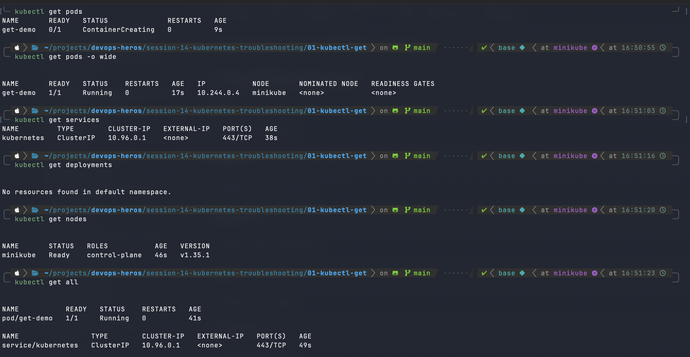

### 2. `kubectl describe`

**Screenshot 2:** `kubectl describe pod describe-demo`. It shows the node, IP, container image, conditions and the Events section (Scheduled, Pulled, Created, Started).

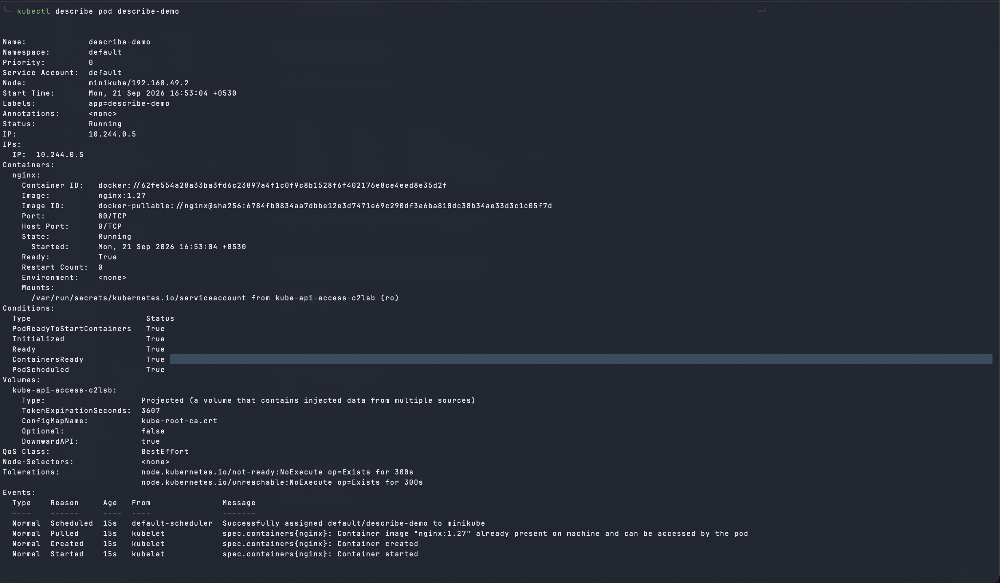

### 3. `kubectl logs`

**Screenshot 3:** `kubectl logs logs-demo` prints the container logs. `kubectl logs -f logs-demo` streams them live.

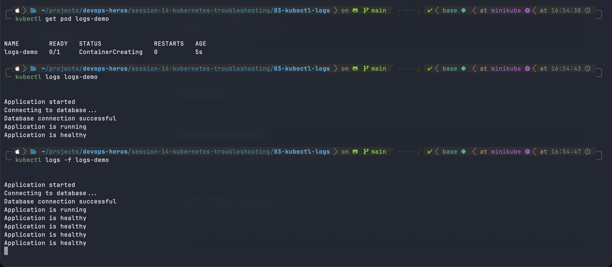

### 4. `kubectl exec`

**Screenshot 4:** `kubectl exec -it exec-demo -- bash` opens a shell inside the pod. `ls` lists the container filesystem and `curl localhost` returns the nginx welcome page.

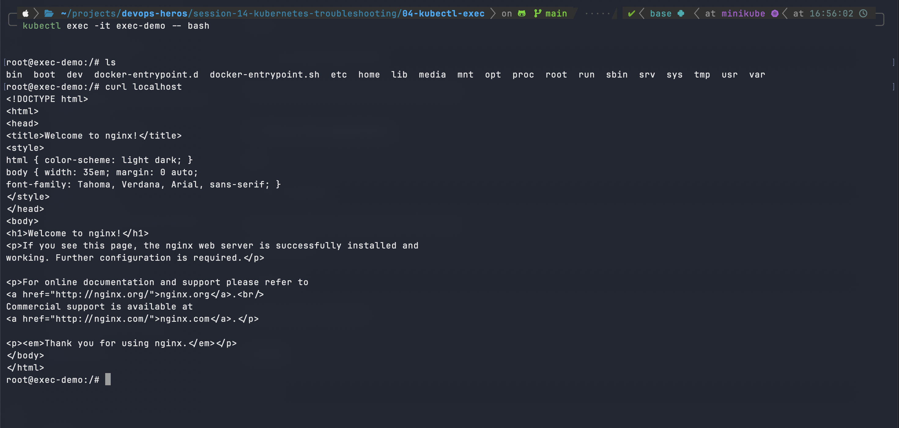

### 5. `kubectl events`

**Screenshot 5.1:** `kubectl get events` lists cluster events for all pods and the node.

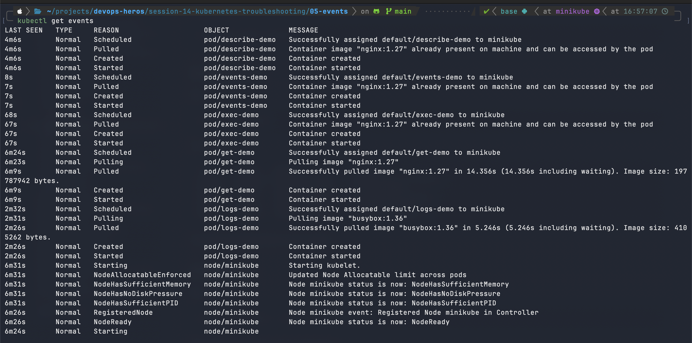

**Screenshot 5.2:** `kubectl get events --sort-by=.lastTimestamp` sorts the events in chronological order.

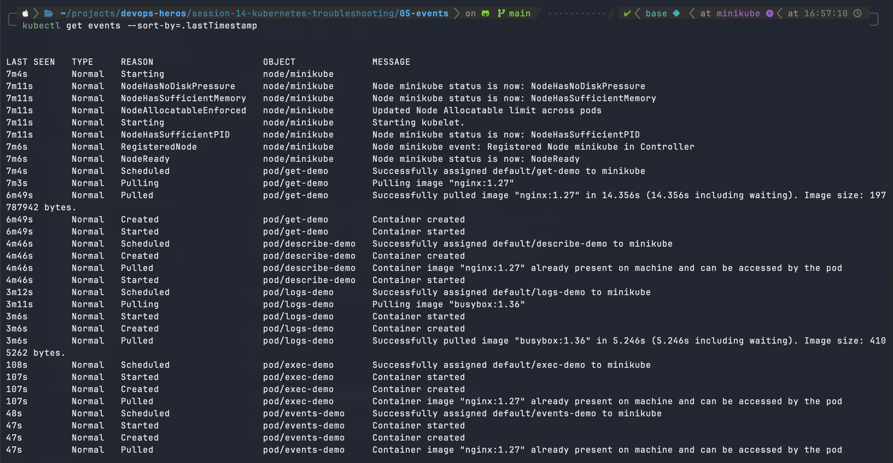

**Screenshot 5.3:** `kubectl events --watch` streams new events as they happen.

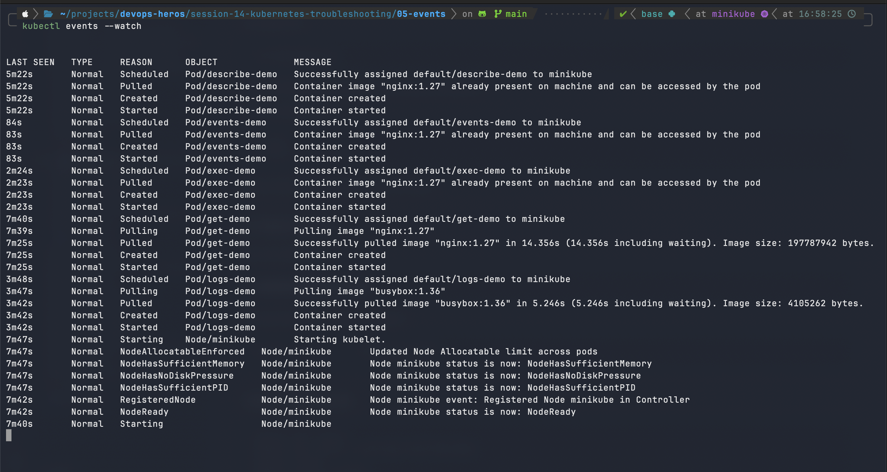

---

## Task 2: Troubleshoot Common Issues

### CrashLoopBackOff

**Screenshot 6.1 - Problem and investigation (`get`, `describe`):** `broken-pod.yaml` is applied and `crash-demo` shows `Error` with restarts. `describe` shows the container command ends with `exit 1`.

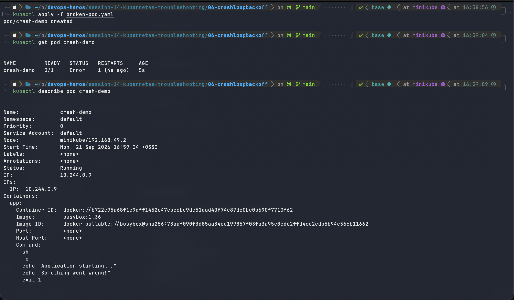

**Screenshot 6.2 - Root cause (events and logs):** The Events section shows `BackOff: Back-off restarting failed container`. `kubectl logs` shows "Something went wrong!", so the app exits with code 1 on startup. `logs --previous` was also tried.

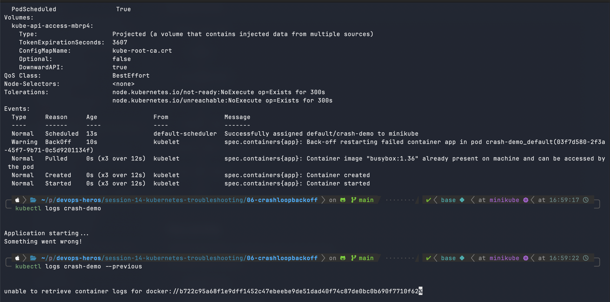

**Screenshot 6.3 - Fix and verification:** `fixed-pod.yaml` is applied. The pod is now `1/1 Running` with 0 restarts, and the logs show "Application is healthy".

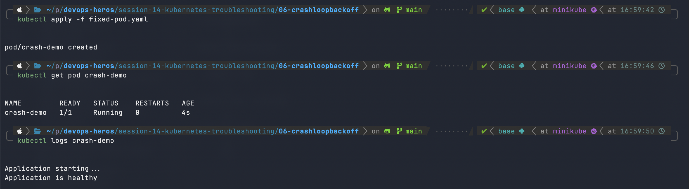

### ImagePullBackOff / ErrImagePull

**Screenshot 7.1 - Problem and investigation (`get`, `describe`):** `image-demo` is stuck at `ContainerCreating`. `describe` shows the image is `nginx:this-image-does-not-exist` and the state is `Waiting` with reason `ErrImagePull`.

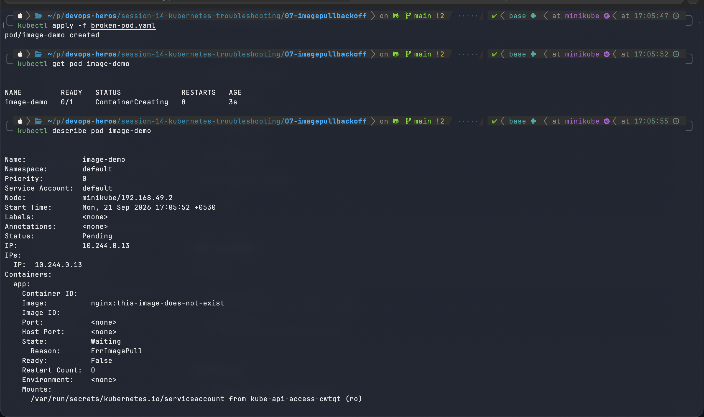

**Screenshot 7.2 - Root cause (events) and fix:** Events show `manifest for nginx:this-image-does-not-exist not found`, then `ErrImagePull` and `ImagePullBackOff`. The tag does not exist in the registry. The broken pod is deleted and `fixed-pod.yaml` is applied.

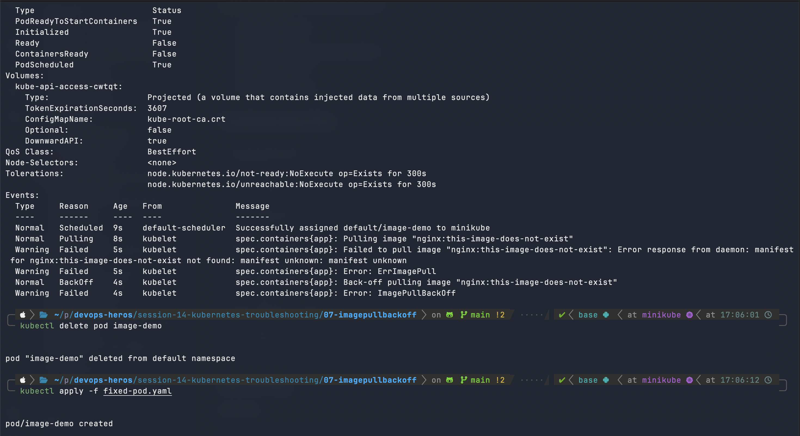

**Screenshot 7.3 - Fix applied:** The `fixed-pod.yaml` apply finishes and `pod/image-demo` is created.

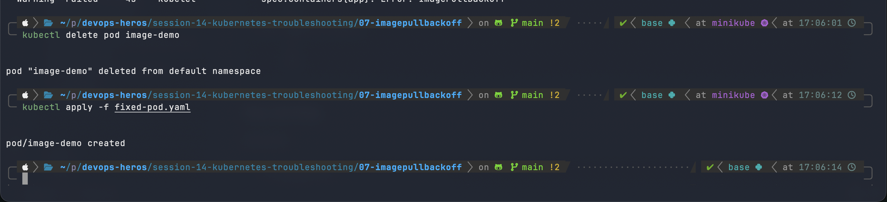

### Pending

**Screenshot 8.1 - Problem and investigation (`get`, `describe`):** `pending-demo` stays `Pending` (0/1, no node, no IP). `describe` shows `PodScheduled: False`.

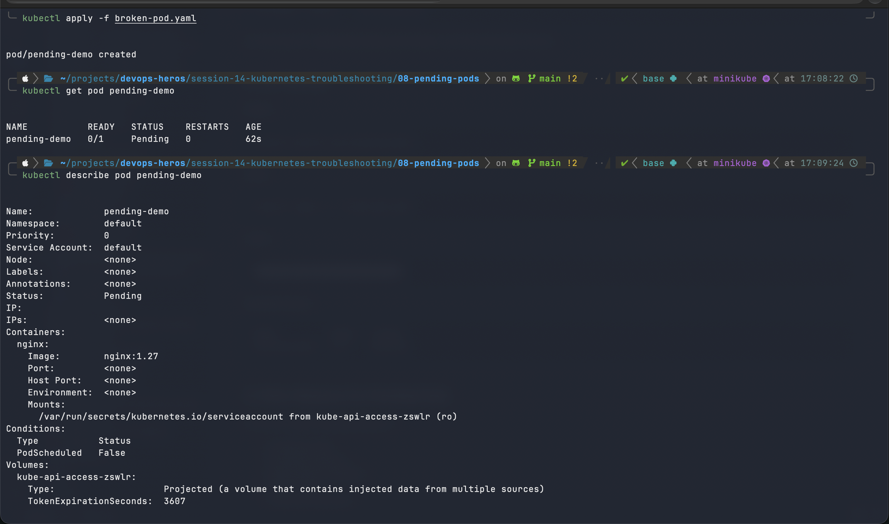

**Screenshot 8.2 - Root cause, fix and verification:** Node-Selectors is `kubernetes.io/hostname=node-that-does-not-exist`. The event is `FailedScheduling: 0/1 nodes are available: 1 node(s) didn't match Pod's node affinity/selector`. `kubectl get nodes` shows only `minikube`. After the broken pod is deleted and `fixed-pod.yaml` is applied, the pod is `1/1 Running`.

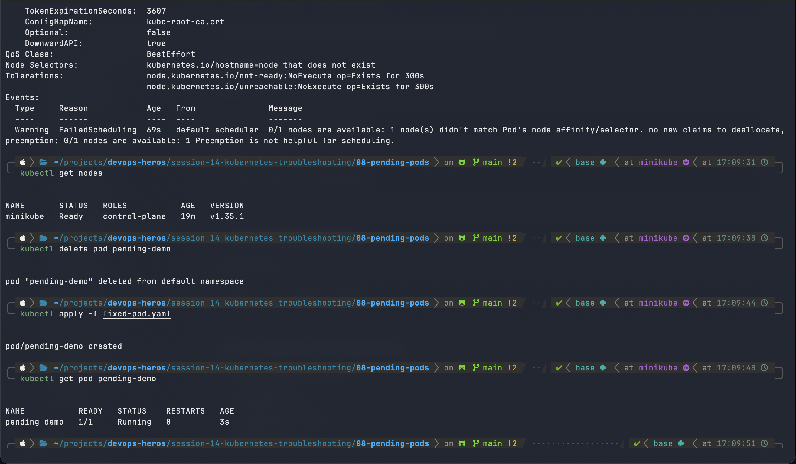

### Service Connectivity, DNS and Pod Networking

**Screenshot 9.1 - Service inspection:** `service.yaml` is applied. `kubectl get service` and `kubectl describe service web-service` show the ClusterIP (`10.108.155.148`), selector `app=web`, port 80 and endpoints.

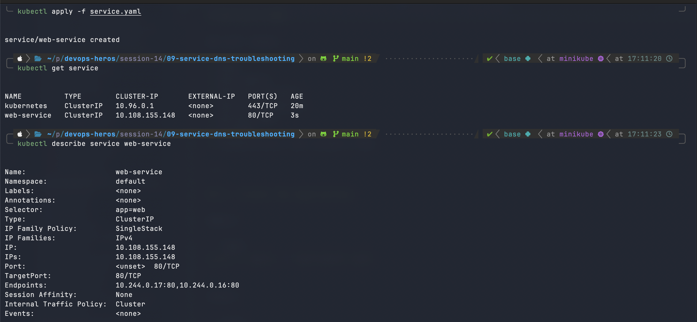

**Screenshot 9.2 - Endpoints check:** `kubectl get endpoints web-service` shows the service is backed by two pod IPs (`10.244.0.16:80` and `10.244.0.17:80`), so the selector matches.

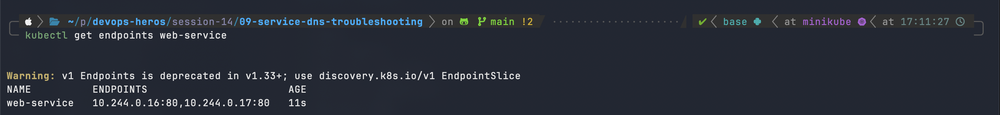

**Screenshot 9.3 - DNS and connectivity test:** `exec` into `crash-demo` with `/bin/bash` fails with exit code 127 because the busybox image has no bash. `exec` into `pending-demo` works, and `curl web-service` resolves the service name through cluster DNS and returns the nginx page.

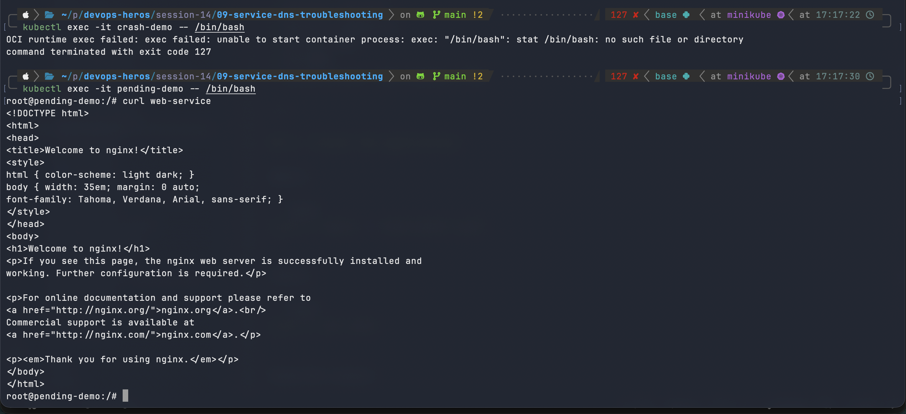
