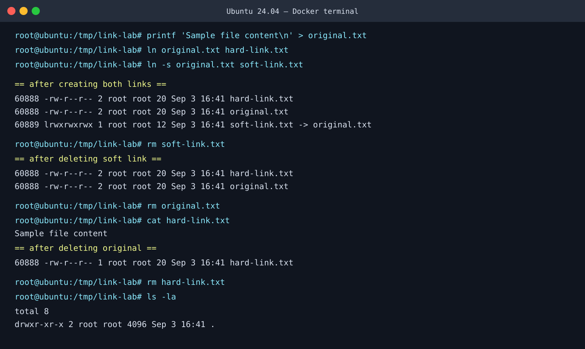
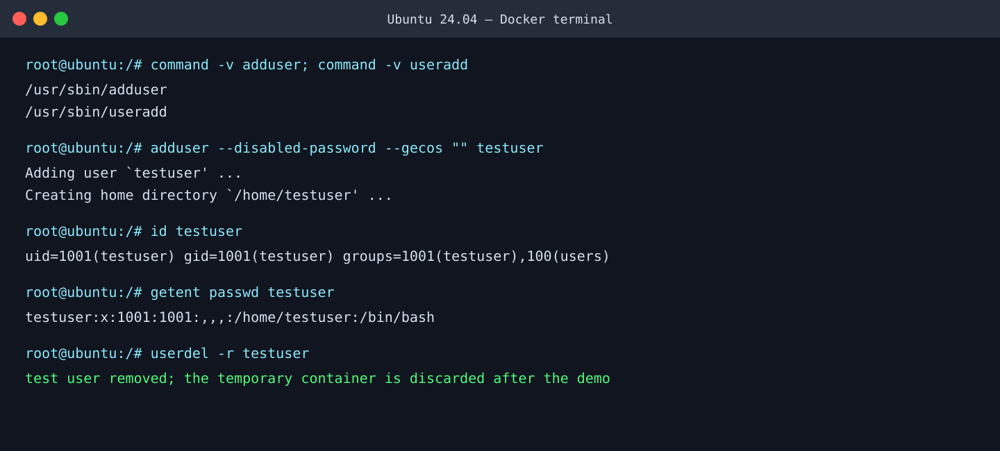
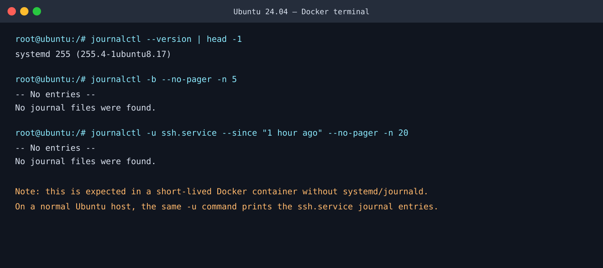
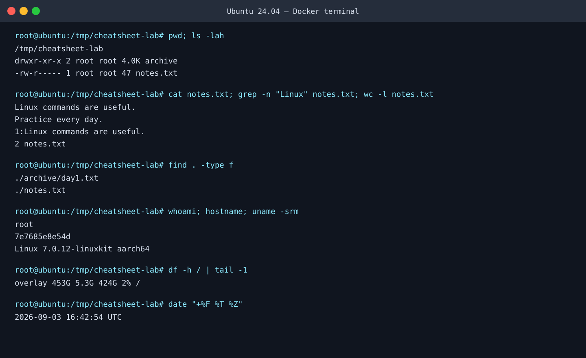

# Linux Fundamentals Homework

## Task 1 — Soft Link and Hard Link

A **hard link** is another directory entry for the *same inode* (the same underlying file data). A **soft link** (symbolic link) is a small special file that stores a path to another file.

| Feature | Hard link | Soft (symbolic) link |
| --- | --- | --- |
| Create | `ln source hard-link` | `ln -s source soft-link` |
| Inode | Same inode as source | Different inode; `l` at start of permissions |
| If source filename is deleted | Data remains while another hard link exists | Link becomes dangling/broken |
| Across filesystems | No | Yes |
| Link to a directory | Normally no | Yes |

### Commands practised

```bash
mkdir -p /tmp/link-lab && cd /tmp/link-lab
printf 'Sample file content\n' > original.txt
ln original.txt hard-link.txt
ln -s original.txt soft-link.txt
ls -li                         # -i displays inode numbers
rm soft-link.txt               # deletes only the symbolic link
rm original.txt
cat hard-link.txt              # still works: same underlying inode
rm hard-link.txt               # removes final directory entry and data
```



Explanation: `original.txt` and `hard-link.txt` have the same inode and a link count of `2`, proving they are two names for the same data. `soft-link.txt` has a different inode and points to `original.txt`. After deleting the original filename, the hard link still prints the content; deleting the soft link does not affect the source.

## Task 2 — `adduser` vs `useradd`

`useradd` is the low-level program. Its defaults come from files such as `/etc/default/useradd`, and it may not create a home directory, group, or password setup unless options are supplied. It is available across many Linux distributions and is useful in controlled scripts.

On Ubuntu/Debian, **`adduser` is normally preferred for an interactive human-created account**. It is a friendly Perl front end to `useradd`: it prompts for details and, by default, creates a home directory and a matching group. For a non-interactive exercise, provide `--disabled-password --gecos ""` to avoid the prompts.

```bash
sudo adduser --disabled-password --gecos "" testuser
id testuser
getent passwd testuser
sudo deluser --remove-home testuser    # cleanup on an Ubuntu host
```



Explanation: the screenshot confirms that both utilities are available, then shows `adduser` creating `testuser`. `id` verifies the account and primary group; `getent passwd` confirms its home directory is `/home/testuser`. The test account was removed at the end of the disposable container session.

## Task 3 — `journalctl`

`journalctl` reads logs collected by **systemd-journald**. It is used to investigate boot problems, failed services, authentication events, kernel messages, and application service output.

### Useful log queries

```bash
journalctl -b                            # current boot
journalctl -b -p warning                 # current boot, warning or higher
journalctl -u ssh.service                # one systemd service/unit
journalctl -u ssh.service -f             # follow new SSH service logs live
journalctl -u ssh.service --since "1 hour ago" --no-pager -n 20
sudo journalctl -k                       # kernel-only messages
```

Use the exact unit name shown by `systemctl list-units --type=service`; it may be `ssh.service`, `nginx.service`, or another service on your computer.



Explanation: `journalctl` version `255` is installed and the boot and `ssh.service` queries ran successfully. The “No journal files were found” result is expected because this temporary Docker container is not running `systemd-journald` as PID 1 and has no persisted system journal. On a regular Ubuntu VM or server, the `-u ssh.service` command prints actual service entries.

## Task 4 — Linux Command Cheat Sheet

The following commands are the core set practised for navigation, files, text, search, permissions, and system inspection.

| Command | Purpose and basic usage |
| --- | --- |
| `pwd` | Print the current working directory. |
| `ls -lah` | List files, including hidden files, in a readable long format. |
| `cd directory` | Change directory; `cd ..` moves up one level. |
| `mkdir name` / `rmdir name` | Create an empty directory / remove an empty directory. |
| `touch file` | Create an empty file or update its timestamp. |
| `cp source destination` | Copy a file; use `cp -r` for a directory. |
| `mv source destination` | Move or rename a file. |
| `rm file` | Remove a file. Double-check the path before using `rm -r`. |
| `cat file` | Print a small text file. |
| `less file` | Read a large file page by page; press `q` to exit. |
| `head -n 10 file` / `tail -n 10 file` | Show the beginning / end of a file. |
| `grep -n 'text' file` | Search for text and show matching line numbers. |
| `find . -type f` | Find files below the current directory. |
| `wc -l file` | Count lines in a file. |
| `chmod 640 file` | Set permissions: owner `rw`, group `r`, others no access. |
| `whoami` / `id` | Show current username / user and group IDs. |
| `uname -srm` | Show kernel name, release, and architecture. |
| `hostname` / `date` | Show system hostname / current date and time. |
| `df -h` / `du -sh directory` | Show free disk space / directory size. |
| `ps aux` / `top` | View processes / interactively monitor processes. |

### Commands used

```bash
mkdir -p /tmp/cheatsheet-lab/archive && cd /tmp/cheatsheet-lab
printf 'Linux commands are useful.\nPractice every day.\n' > notes.txt
cp notes.txt archive/notes-copy.txt
mv archive/notes-copy.txt archive/day1.txt
chmod 640 notes.txt
pwd; ls -lah
cat notes.txt; grep -n 'Linux' notes.txt; wc -l notes.txt
find . -type f
whoami; hostname; uname -srm; df -h /; date
```



Explanation: this sequence creates a text file, copies and renames it, sets its permissions, displays it, searches it, counts its lines, and finds the created files. The final commands inspect the running Linux environment.
