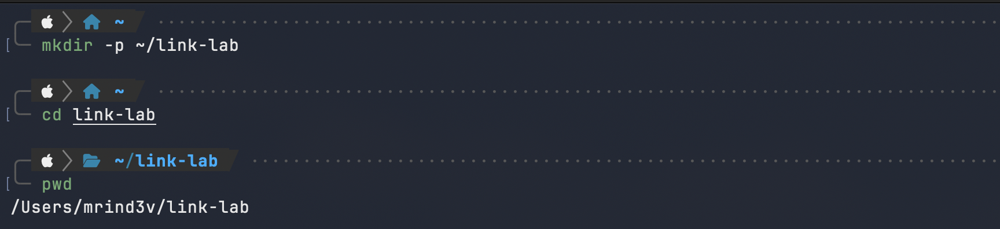
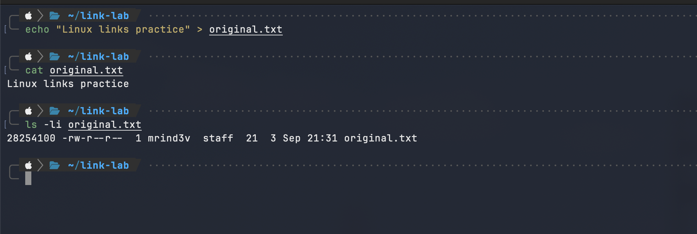
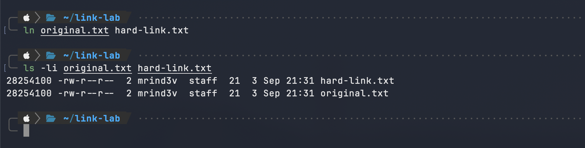
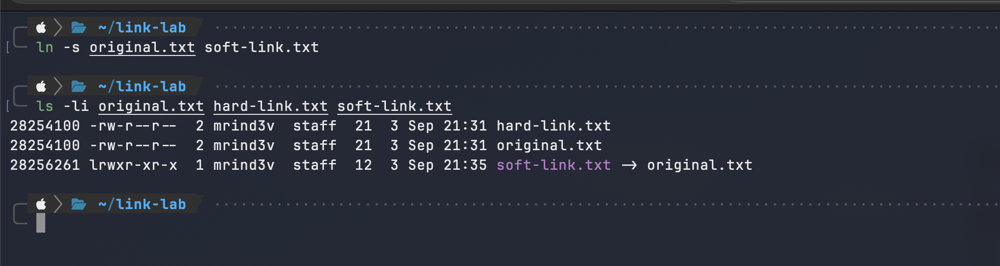
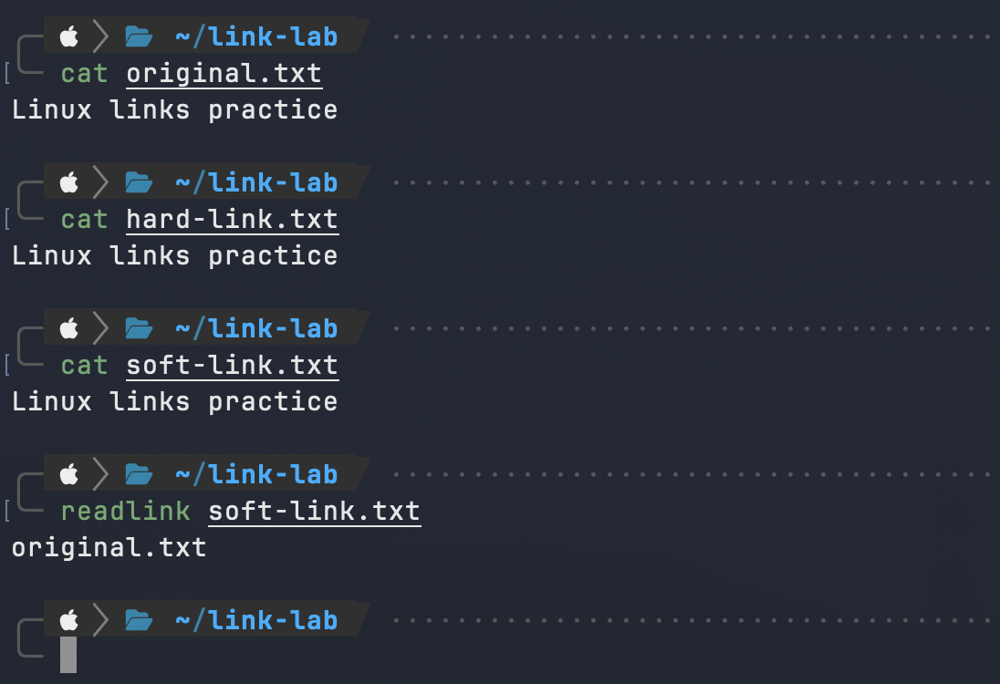
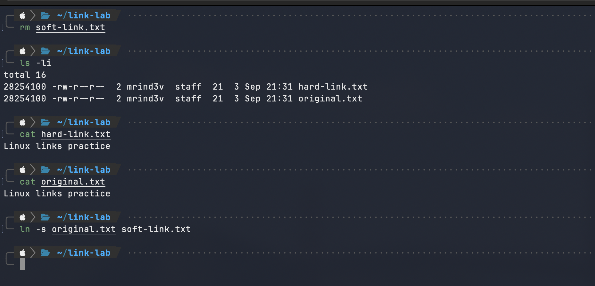
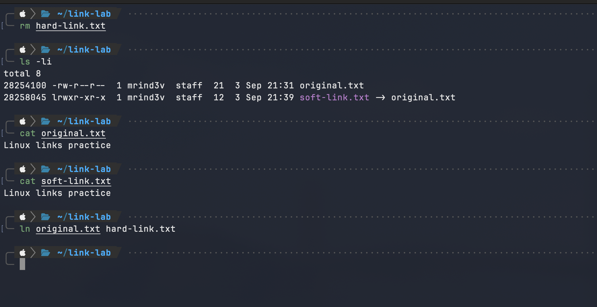
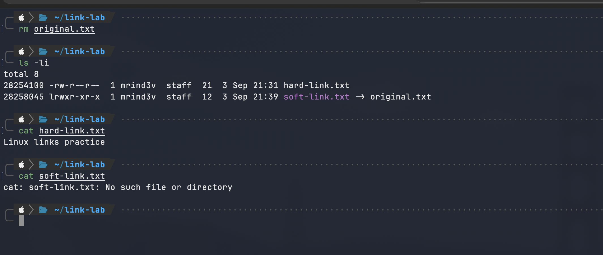

# Soft Links and Hard Links in Linux

## Objective

This assignment demonstrates the difference between hard links and soft links (symbolic links) in Linux. It includes creating, verifying, deleting, and observing the behaviour of both link types.

## Difference Between Hard Links and Soft Links

| Feature | Hard link | Soft link (symbolic link) |
| --- | --- | --- |
| Create command | `ln source hard-link` | `ln -s source soft-link` |
| Inode number | Same as the original file | Different from the original file |
| Stores | Another name for the same file data | The path to the target file |
| If original filename is deleted | Continues to work | Becomes a broken link |
| Can cross filesystems | No | Yes |
| Can link directories | Normally no | Yes |

An **inode** stores file metadata and points to its data on disk. A hard link points to the same inode as the original file. A soft link has its own inode and stores the path of its target.

---

## 1. Create a Practice Directory

### Command

```bash
mkdir -p ~/link-lab
cd ~/link-lab
pwd
```

### Explanation

`mkdir -p ~/link-lab` creates a directory named `link-lab` in the home directory. `cd` enters that directory, and `pwd` prints the current working directory. The link experiments will be performed safely inside this directory.

### Screenshot



---

## 2. Create the Original File

### Command

```bash
echo "Linux links practice" > original.txt
cat original.txt
ls -li original.txt
```

### Explanation

The `echo "Linux links practice" > original.txt` command creates `original.txt` and writes "Linux links practice" to it. `cat` displays the file contents. `ls -li` lists the file and includes its inode number; this number will be used to compare the original file with its links.

### Screenshot



---

## 3. Create a Hard Link

### Command

```bash
ln original.txt hard-link.txt
ls -li original.txt hard-link.txt
```

### Explanation

The command format for a hard link is `ln SOURCE HARD_LINK_NAME`. This command creates `hard-link.txt` as another name for the same file data as `original.txt`.

In the `ls -li` output, `original.txt` and `hard-link.txt` have the **same inode number**. Their link count becomes `2`, confirming that two filenames refer to the same inode.

### Screenshot



---

## 4. Create a Soft Link

### Command

```bash
ln -s original.txt soft-link.txt
ls -li original.txt hard-link.txt soft-link.txt
```

### Explanation

The command format for a soft link is `ln -s TARGET SOFT_LINK_NAME`. The `-s` option creates a symbolic link.

Unlike the hard link, `soft-link.txt` has a **different inode number**. The output displays `soft-link.txt -> original.txt`, which shows that the soft link stores the path to `original.txt`.

### Screenshot




---

## 5. Verify the Links

### Command

```bash
cat original.txt
cat hard-link.txt
cat soft-link.txt
readlink soft-link.txt
```

### Explanation

At this point, all three `cat` commands display the same content. `hard-link.txt` reads the same inode and data as `original.txt`. `soft-link.txt` follows its stored path to reach `original.txt`.

`readlink soft-link.txt` displays the target path stored by the symbolic link, which is `original.txt`.

### Screenshot



---

## 6. Delete and Recreate the Soft Link

### Command

```bash
rm soft-link.txt
ls -li
cat original.txt
cat hard-link.txt
ln -s original.txt soft-link.txt
```

### Explanation

`rm soft-link.txt` removes only the symbolic link, not the original file. Therefore, both `original.txt` and `hard-link.txt` still work. The last command recreates the soft link for the next experiment.

### Screenshot



---

## 7. Delete and Recreate the Hard Link

### Command

```bash
rm hard-link.txt
ls -li
cat original.txt
cat soft-link.txt
ln original.txt hard-link.txt
```

### Explanation

`rm hard-link.txt` removes that hard-link filename only. The data is not deleted because `original.txt` still points to the same inode. The soft link also continues to work because its target, `original.txt`, still exists.

The final `ln` command recreates the hard link for the final comparison.

### Screenshot



---

## 8. Delete the Original File and Compare the Results

### Command

```bash
rm original.txt
ls -li
cat hard-link.txt
cat soft-link.txt
```

### Explanation

After deleting `original.txt`, `hard-link.txt` still displays the file content. This is because it still refers to the inode and file data that were previously shared with `original.txt`.

`soft-link.txt` fails with a `No such file or directory` error because it only stores the path `original.txt`, and that target path no longer exists. It is now a **broken link**, also called a **dangling symbolic link**.

This is the main practical difference between hard links and soft links.

### Screenshot



