# Session 20: Monitoring, Observability & GitOps

Hands-on demos for monitoring (Kubernetes + Prometheus + Grafana), notes on observability, and an introduction to GitOps.

## Contents

1. [Task 1: Monitoring](#task-1-monitoring)
   - [1.1 Metrics, logs and application health on Kubernetes (kind)](#11-logs-and-application-health-on-kubernetes-kind)
   - [1.2 Prometheus (metrics)](#12-prometheus-metrics)
   - [1.3 Grafana (dashboards)](#13-grafana-dashboards)
2. [Task 2: Observability](#task-2-observability)
3. [Task 3: GitOps](#task-3-gitops)

---

## Task 1: Monitoring

Monitoring is collecting and watching predefined signals (metrics, logs, health checks) so you know when something is wrong. This task covers:

| Topic | Where it is shown |
|---|---|
| Metrics | Prometheus `/metrics` endpoint and queries (1.2) |
| Logs | `kubectl logs` (1.1) |
| Alerts | Prometheus **Alerts** tab / Grafana **Alerting** menu (1.2, 1.3) |
| CPU utilization | Metric type to graph in Grafana (see notes below) |
| Memory utilization | Metric type to graph in Grafana (see notes below) |
| Application health | `up` metric, pod `READY`/`STATUS`, health-check log lines |

### 1.1 Logs and application health on Kubernetes (kind)

A demo deployment (`busybox`) prints `Request received` / `Health check OK` every 10 seconds.

**Create a local kind cluster**
`kind create cluster --name session20`, then deploy the app with `kubectl apply -f k8s-demo/`. The first `kubectl get pods` shows `ContainerCreating` (0/1 ready), so `kubectl logs` returns an error until the container starts.

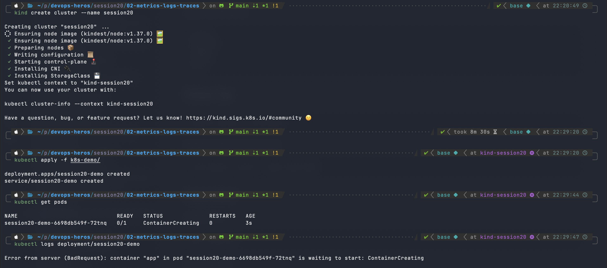

**View application logs and describe the deployment**
Once the pod is running, `kubectl logs deployment/session20-demo` shows the application's log stream. `kubectl describe deployment session20-demo` shows replica status (1 desired / 1 available), rollout strategy and conditions (`Available=True`).

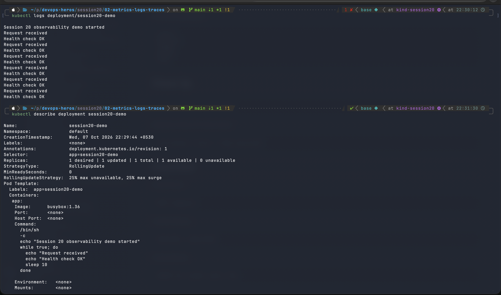

**Deployment events and cleanup**
Events show the deployment controller scaling the replica set from 0 to 1. Afterwards the resources and the cluster are removed (`kubectl delete -f k8s-demo/`, `kind delete cluster --name session20`).

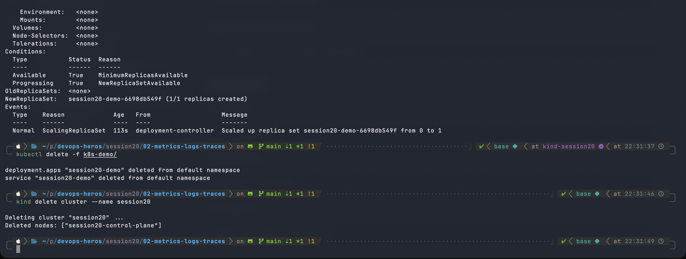

### 1.2 Prometheus (metrics)

Prometheus scrapes metrics over HTTP and stores them as time series. It was run with Docker Compose.

**Start Prometheus**
`docker compose up -d` pulls `prom/prometheus:v3.5.0`; `docker compose ps` shows it running on port 9090.

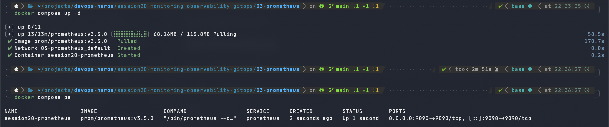

**Prometheus UI**
The web UI at `localhost:9090` has the Query, Alerts and Status pages.


**Raw metrics endpoint**
`localhost:9090/metrics` exposes Prometheus' own metrics in text format (`# HELP`, `# TYPE`, then samples), e.g. Go GC and memory metrics.

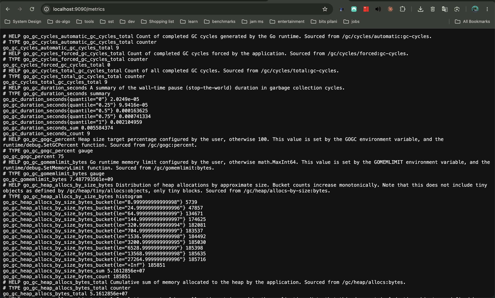

**Health query: `up`**
`up` returns `1` for each target that was scraped successfully (`0` means the target is down). This is the basic application-health signal and the basis for most alerts.

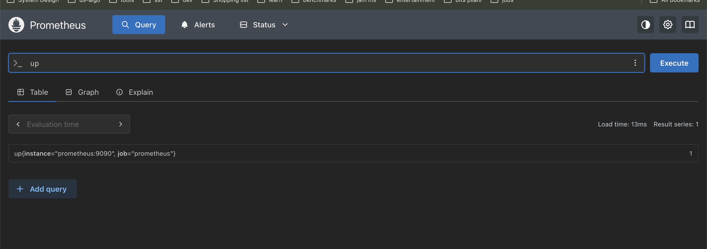

### 1.3 Grafana (dashboards)

Grafana visualises data from Prometheus. Prometheus and Grafana were started together with Docker Compose.

**Start Prometheus + Grafana**
`docker compose ps` shows `grafana/grafana:12.1.1` on port 3000 and Prometheus on 9090.

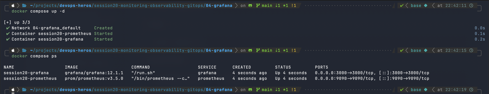

**Prometheus before querying**

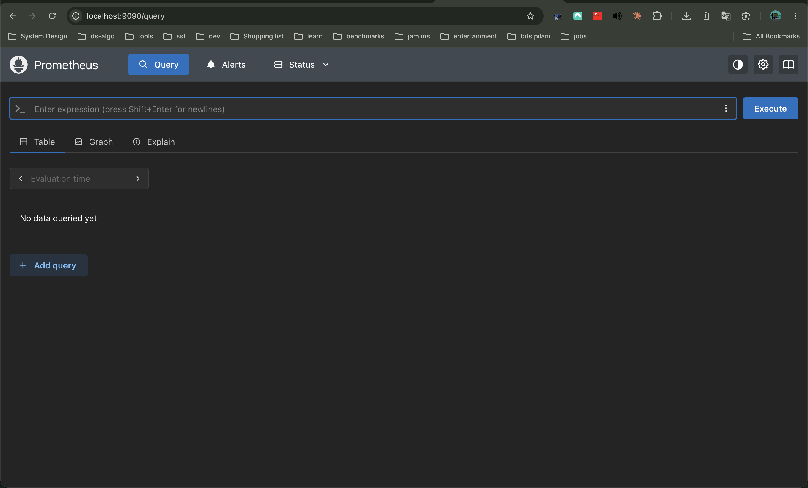

**Grafana login**

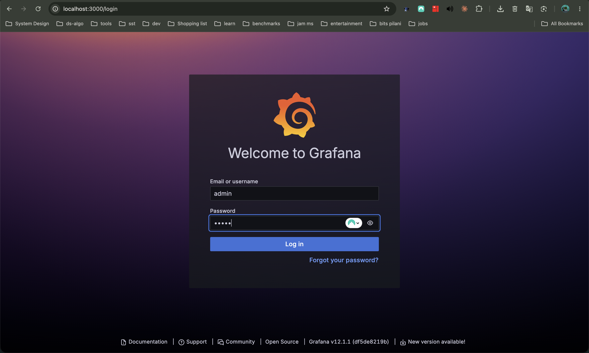

**Grafana home**
The sidebar includes **Explore**, **Dashboards**, **Alerting** and **Connections**.

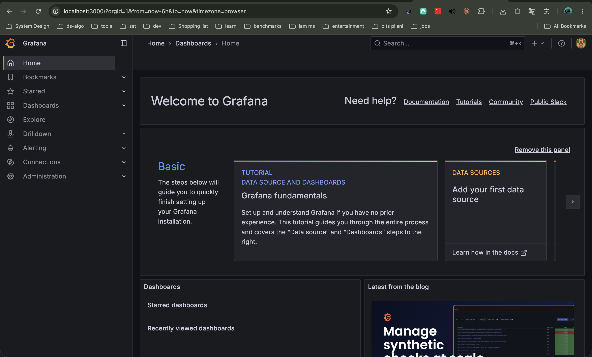

**Prometheus data source**
Under Connections → Data sources, **Save & test** returns "Successfully queried the Prometheus API."

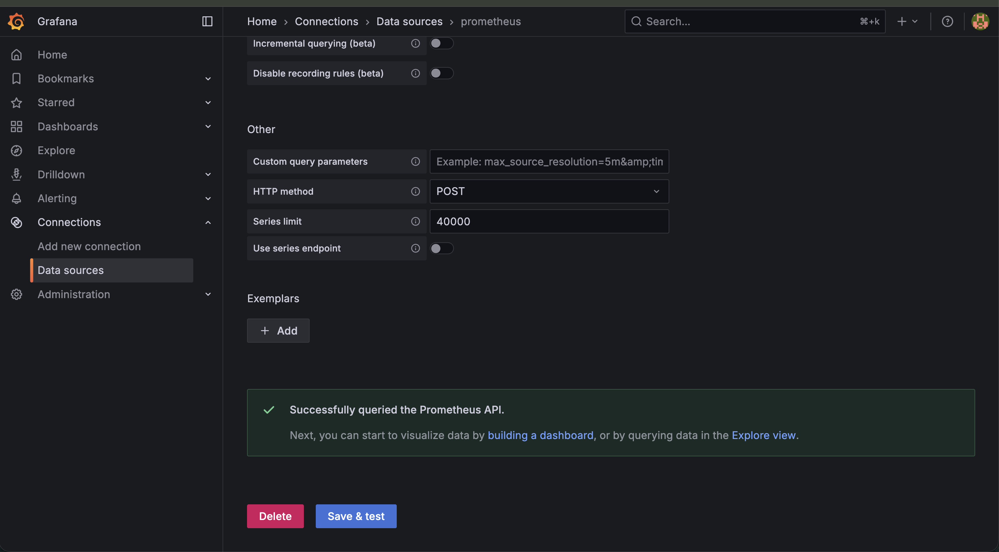

**Dashboard panel**
A new Time series panel using the Prometheus data source and the `go_gc_gogc_percent` metric.

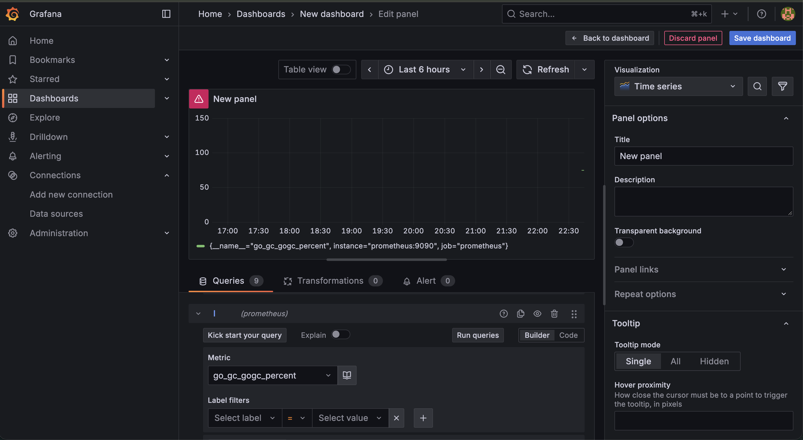

### CPU, memory and alerts

The same panel workflow is used for resource utilization. Typical PromQL (needs node-exporter / cAdvisor / kube-state-metrics targets, which are not part of this demo):

```promql
# CPU utilization per container (cores)
rate(container_cpu_usage_seconds_total[5m])

# Memory utilization per container (bytes)
container_memory_working_set_bytes

# Node CPU % used (node-exporter)
100 - (avg by (instance) (rate(node_cpu_seconds_total{mode="idle"}[5m])) * 100)
```

Example alert rule for application health:

```yaml
groups:
  - name: app-health
    rules:
      - alert: InstanceDown
        expr: up == 0
        for: 1m
        labels:
          severity: critical
        annotations:
          summary: "{{ $labels.instance }} is down"
```

---

## Task 2: Observability

Observability is the ability to understand a system's internal state from the data it emits. Monitoring tells you *that* something is wrong; observability helps you find out *why*.

### The three pillars

| Pillar | What it is | Answers | Example |
|---|---|---|---|
| **Metrics** | Numeric measurements over time (counters, gauges, histograms) | "Is something wrong? How much?" | CPU %, request rate, error rate, latency p99 |
| **Logs** | Timestamped records of discrete events | "What happened?" | `Health check OK`, stack traces |
| **Traces** | The path of a single request across services, made of spans | "Where did the time go / where did it fail?" | A checkout request across API → auth → DB |

### Why observability is required

- Distributed systems and microservices fail in ways that cannot be predicted in advance.
- Faster detection and shorter time to resolution (MTTD / MTTR).
- Finds the root cause across many services instead of guessing.
- Capacity planning and performance tuning.
- Supports SLOs/SLAs and release confidence (see the impact of a deploy immediately).

### Common tools

| Purpose | Tools |
|---|---|
| Metrics | Prometheus, Datadog, CloudWatch |
| Dashboards | Grafana, Kibana |
| Logs | Loki, ELK/EFK (Elasticsearch, Logstash/Fluentd, Kibana), Splunk |
| Traces | Jaeger, Zipkin, Tempo |
| Instrumentation | OpenTelemetry (vendor-neutral metrics/logs/traces) |
| Alerting | Alertmanager, Grafana Alerting, PagerDuty |

### Kubernetes observability

- **Metrics:** `metrics-server` (powers `kubectl top` and HPA), kube-state-metrics (object state), node-exporter (node CPU/memory), cAdvisor (container usage, built into kubelet). Commonly deployed with the `kube-prometheus-stack` Helm chart.
- **Logs:** `kubectl logs`; a log collector (Promtail / Fluent Bit) runs as a DaemonSet and ships logs to Loki or Elasticsearch.
- **Traces:** apps instrumented with OpenTelemetry send spans to Jaeger or Tempo.
- **Health:** liveness / readiness / startup probes, pod status and restart counts, `kubectl describe` events.

---

## Task 3: GitOps

### What is GitOps?

GitOps is an operating model where **Git is the single source of truth** for the desired state of infrastructure and applications. Changes are made by commits and pull requests, and an automated agent applies them to the cluster.

### Core principles

- **Git as the source of truth:** the full desired state lives in a repo, giving history, review and easy rollback (`git revert`).
- **Declarative configuration:** you describe *what* you want (Kubernetes YAML, Helm, Kustomize), not the steps to get there.
- **Continuous reconciliation:** an agent (Argo CD, Flux) continuously compares the live cluster with Git and fixes any drift.
- **Pull-based delivery:** the agent inside the cluster pulls changes, so CI does not need cluster credentials.

### GitOps workflow

1. Developer changes manifests and opens a pull request.
2. Review and CI checks, then merge to `main`.
3. The GitOps agent detects the new commit.
4. It compares desired state (Git) with actual state (cluster).
5. It syncs the cluster to match Git; any manual drift is reverted.

### Kubernetes + GitOps

Kubernetes is itself declarative with a reconciliation loop (controllers), which makes it a natural fit. Argo CD / Flux watch a Git repo path and keep a namespace in sync with the manifests there.

### GitOps demo

The demo applies the declarative manifests in `app/` (a Deployment and Service for `session20-app`, 2 replicas) to a minikube cluster. `kubectl get deployment` shortly after shows `READY 0/2` while the pods are starting.

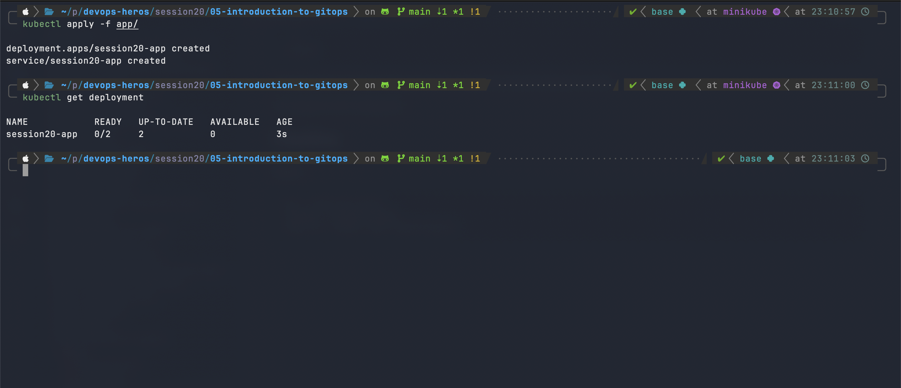

> Note: this demo shows the declarative-manifest step by hand with `kubectl apply`. In a full GitOps setup, an agent such as Argo CD or Flux would perform this sync automatically from a Git repo.
