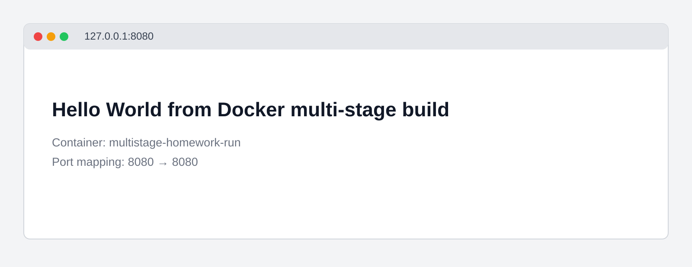
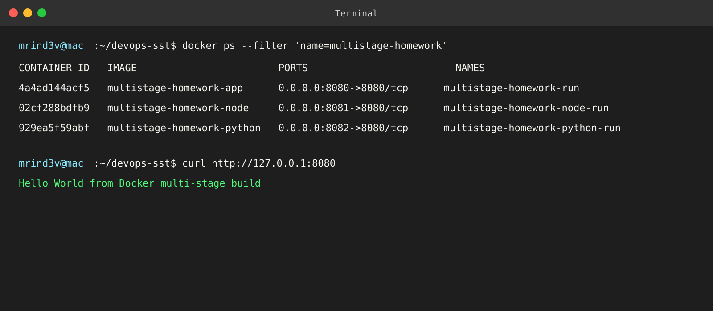

# Docker Multi-Stage Build Homework

## Student details

| Field | Value |
| --- | --- |
| Name | Mrinmay Dev Sarma |
| Roll No. | 24BCS10280 |

## Task 1: Multi-stage Docker application

The assignment did not provide an external source repository URL. The multi-stage application source and Dockerfile are included in [`multi-stage-app`](multi-stage-app). The Dockerfile compiles the Java application in an Eclipse Temurin JDK build stage and copies only `Main.class` into the Eclipse Temurin JRE runtime stage.

```bash
docker build -t multistage-homework-app ./multi-stage-app
docker run -d --rm --name multistage-homework-run -p 8080:8080 multistage-homework-app
curl http://127.0.0.1:8080
docker ps --filter 'name=multistage-homework-run'
```

The application was verified at `http://127.0.0.1:8080` and displayed the required text.



Explanation: the multi-stage Java container serves the required Hello World page on port 8080.



Explanation: `docker ps` shows `multistage-homework-run` forwarding host port 8080 to container port 8080.

## Task 3: Docker application deployment

| Application | Folder | Image | Local URL | Result |
| --- | --- | --- | --- | --- |
| Java multi-stage | `multi-stage-app` | `multistage-homework-app` | `http://127.0.0.1:8080` | Hello World displayed |
| Node.js | `deployments/nodejs-app` | `multistage-homework-node` | `http://127.0.0.1:8081` | Hello World displayed |
| Python | `deployments/python-app` | `multistage-homework-python` | `http://127.0.0.1:8082` | Hello World displayed |

```bash
docker build -t multistage-homework-node ./deployments/nodejs-app
docker run -d --rm --name multistage-homework-node-run -p 8081:8080 multistage-homework-node

docker build -t multistage-homework-python ./deployments/python-app
docker run -d --rm --name multistage-homework-python-run -p 8082:8080 multistage-homework-python
```
