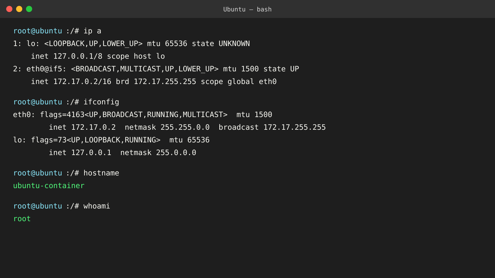
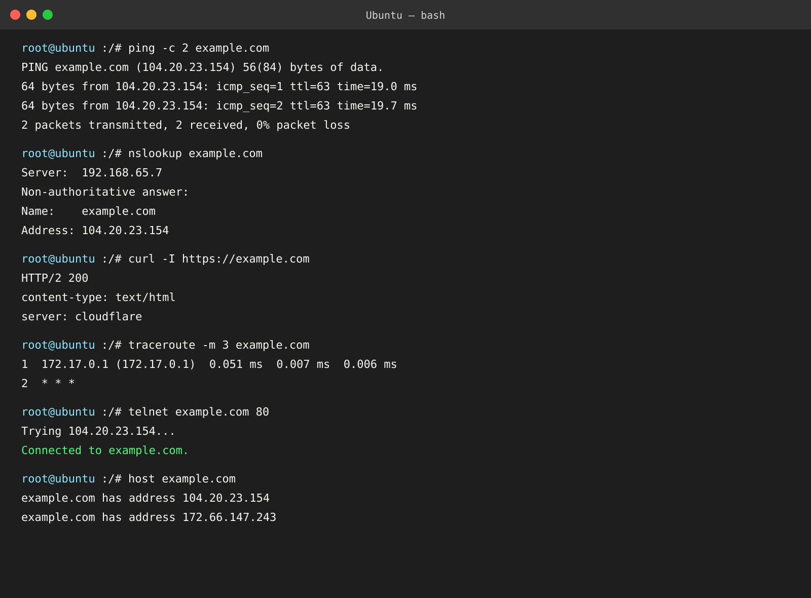
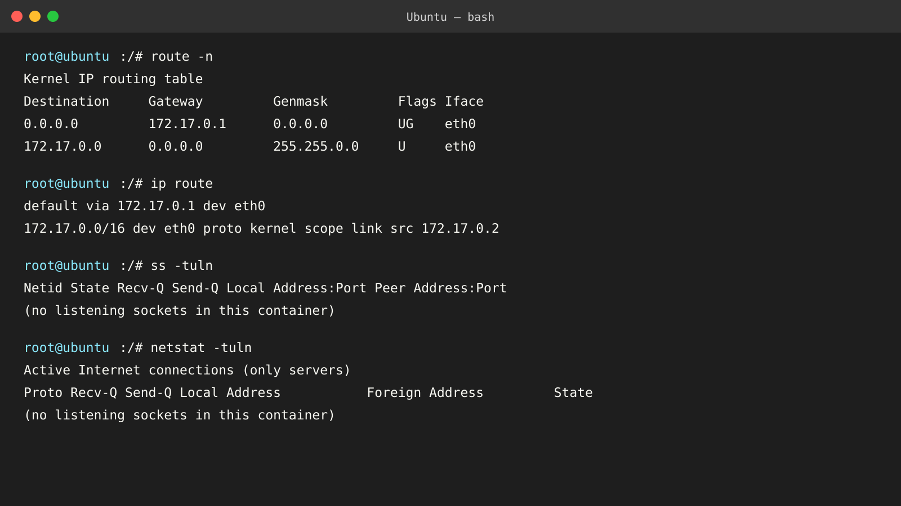

# Linux Networking Commands

This exercise was run in an Ubuntu Docker container. Network addresses, DNS answers, routes, and trace hops vary by environment.

## Commands practiced

| Command | Purpose |
| --- | --- |
| `ip address` / `ip a` | Displays network interfaces, addresses, and link state. |
| `ifconfig` | Displays interface configuration; a legacy alternative to `ip address`. |
| `hostname` | Prints the current system hostname. |
| `ping` | Tests IP connectivity and measures round-trip time. |
| `nslookup` | Queries DNS records using a configured DNS server. |
| `route` | Displays the routing table; a legacy command. |
| `ip route` | Displays the routing table using the current `iproute2` utility. |
| `curl` | Transfers data from a URL; `-I` requests HTTP headers only. |
| `ss` | Inspects socket and listening-port information. |
| `traceroute` | Shows the network hops toward a destination. |
| `telnet` | Tests a TCP connection to a host and port. |
| `netstat` | Displays network connections and listeners; a legacy alternative to `ss`. |
| `host` | Performs DNS lookups. |
| `whoami` | Prints the effective username. |

## Commands executed

```bash
ip a
ifconfig
hostname
ping -c 2 example.com
nslookup example.com
route -n
ip route
curl -I https://example.com
ss -tuln
traceroute -m 3 example.com
telnet example.com 80
netstat -tuln
host example.com
whoami
```

## Screenshots



Explanation: `ip a` and `ifconfig` show interface configuration. `hostname` identifies the container, and `whoami` reports the effective user.



Explanation: `ping` verifies ICMP reachability; `nslookup` and `host` resolve DNS records; `curl` requests HTTP headers; `traceroute` lists hops; and `telnet` verifies TCP port 80 connectivity.



Explanation: `route -n` and `ip route` display the default route and connected network. `ss` and `netstat` inspect listening sockets; no listening sockets were present in this container.
