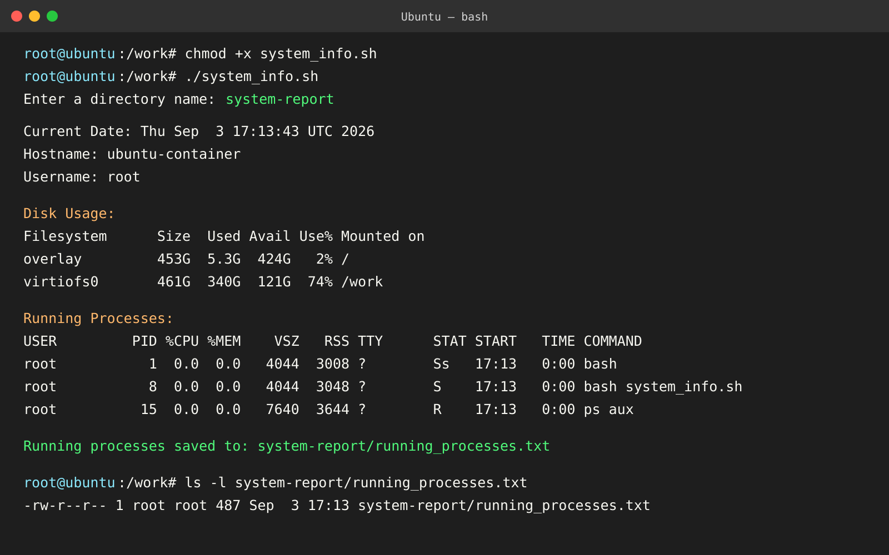

# Shell Scripting Homework

## System Information Script

[`system_info.sh`](system_info.sh) prints system details, accepts a directory name, creates that directory and a process-log file, then saves the running-process list to the file.

### Commands used

| Requirement | Usage in the script |
| --- | --- |
| Variables | Store the date, hostname, username, disk usage, and process-file path. |
| `read -p` | Reads the output directory name. |
| `mkdir` | Creates the selected directory. |
| `touch` | Creates `running_processes.txt`. |
| `echo` | Prints labels and status messages. |
| `df -h` | Displays disk usage in human-readable units. |
| `ps aux` | Displays all running processes. |
| `>` | Redirects `ps aux` output to `running_processes.txt`. |

### Run

```bash
chmod +x system_info.sh
./system_info.sh
```

When prompted, enter a directory name such as `system-report`.

### Screenshot



### Explanation

The script collects system information in variables and displays it. It creates the directory supplied by the user, creates `running_processes.txt` inside it, and writes the output of `ps aux` to that file with output redirection.
