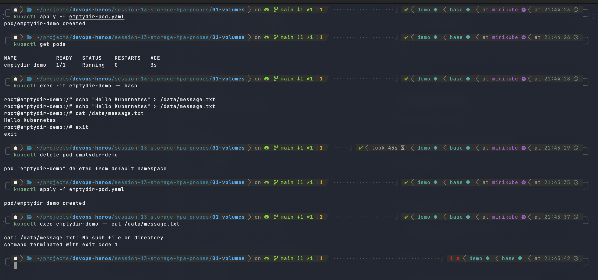
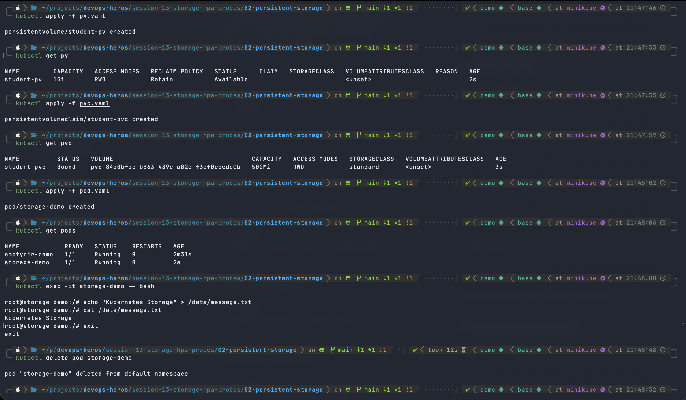
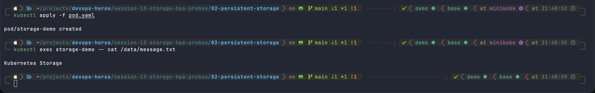
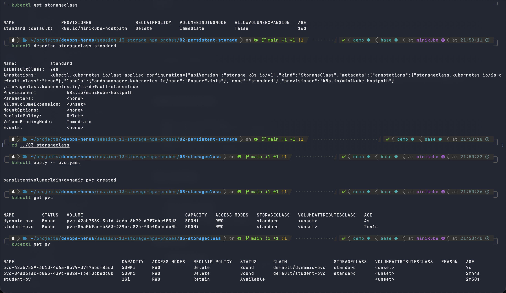

# Task 1: Kubernetes Volumes

Container filesystems are ephemeral: when a container restarts, its data is gone. Kubernetes **volumes** give pods storage that outlives a container (and, depending on the type, the pod itself).

| Volume type | Lifetime | Typical use |
|---|---|---|
| `emptyDir` | Life of the **pod** | Scratch space, sharing files between containers in a pod |
| `hostPath` | Life of the **node** | Node-level access (logs, Docker socket); dev/test only |
| PV + PVC | Independent of the pod | Durable data (databases, uploads) |
| StorageClass | n/a (a provisioner template) | Automatic creation of PVs on demand |

---

## 1. emptyDir

An `emptyDir` is created empty when a pod is scheduled onto a node and **deleted when the pod is removed**. It survives container restarts within the pod. All containers in the pod can mount it, which makes it good for scratch data and sidecar file sharing.

```yaml
# emptydir-pod.yaml
apiVersion: v1
kind: Pod
metadata:
  name: emptydir-demo
spec:
  containers:
    - name: app
      image: ubuntu
      command: ["sleep", "3600"]
      volumeMounts:
        - name: cache
          mountPath: /data
  volumes:
    - name: cache
      emptyDir: {}
```

**Demo:** write a file to `/data`, delete the pod, recreate it, and the file is gone.



*What the screenshot shows:* `Hello Kubernetes` was written to `/data/message.txt` and read back. After `kubectl delete pod` and re-apply, `cat /data/message.txt` fails with `No such file or directory`, so emptyDir data does not outlive the pod.

---

## 2. hostPath

A `hostPath` volume mounts a file or directory **from the node's filesystem** into the pod. Data survives pod deletion, but it is tied to one node. If the pod is rescheduled onto another node, it sees different data. It also exposes the node to the pod, which is a security risk, so use it for development or node-level agents only.

```yaml
apiVersion: v1
kind: Pod
metadata:
  name: hostpath-demo
spec:
  containers:
    - name: app
      image: ubuntu
      command: ["sleep", "3600"]
      volumeMounts:
        - name: host-data
          mountPath: /data
  volumes:
    - name: host-data
      hostPath:
        path: /mnt/data
        type: DirectoryOrCreate
```

`type` values include `Directory`, `DirectoryOrCreate`, `File`, `FileOrCreate`, `Socket`.

---

## 3. PersistentVolume (PV)

A **PersistentVolume** is a piece of cluster-level storage, provisioned by an admin or dynamically by a StorageClass. It is a cluster resource, like a node, and is not namespaced. Its lifecycle is independent of any pod.

```yaml
# pv.yaml
apiVersion: v1
kind: PersistentVolume
metadata:
  name: student-pv
spec:
  capacity:
    storage: 1Gi
  accessModes:
    - ReadWriteOnce
  persistentVolumeReclaimPolicy: Retain
  hostPath:
    path: /mnt/data/student
```

Key fields:
- **accessModes**: `ReadWriteOnce` (RWO, one node), `ReadOnlyMany` (ROX), `ReadWriteMany` (RWX), `ReadWriteOncePod` (RWOP).
- **persistentVolumeReclaimPolicy**: `Retain` (keep data after the claim is released), `Delete` (delete the volume with the claim).

---

## 4. PersistentVolumeClaim (PVC)

A **PersistentVolumeClaim** is a user's *request* for storage (size and access mode). Kubernetes binds it to a matching PV. Pods reference the PVC and never the PV directly, which decouples apps from storage details.

```yaml
# pvc.yaml
apiVersion: v1
kind: PersistentVolumeClaim
metadata:
  name: student-pvc
spec:
  accessModes:
    - ReadWriteOnce
  resources:
    requests:
      storage: 500Mi
```

```yaml
# pod.yaml
apiVersion: v1
kind: Pod
metadata:
  name: storage-demo
spec:
  containers:
    - name: app
      image: ubuntu
      command: ["sleep", "3600"]
      volumeMounts:
        - name: data
          mountPath: /data
  volumes:
    - name: data
      persistentVolumeClaim:
        claimName: student-pvc
```

**Demo:** create the PV and PVC, run a pod, write a file, delete the pod, recreate it, and the data is still there.



*What the screenshot shows:*
- `kubectl get pv` shows `student-pv` (1Gi, RWO, `Retain`, `Available`).
- `kubectl get pvc` shows `student-pvc` as `Bound` with 500Mi on the `standard` StorageClass.
- The pod `storage-demo` writes `Kubernetes Storage` to `/data/message.txt`, then is deleted.



*What the screenshot shows:* After the pod is re-created, `cat /data/message.txt` still prints `Kubernetes Storage`, so the data persisted across pod deletion.

> **Note:** In this run `student-pvc` did not bind to the manually created `student-pv`. The PVC had no `storageClassName: ""`, so the default `standard` class provisioned a new 500Mi PV (the `pvc-84a0bfac-...` one) and `student-pv` stayed `Available`. To bind a PVC to a pre-created PV, set `storageClassName` to the same value on both (or `""` on both).

---

## 5. StorageClass

A **StorageClass** describes a "class" of storage (provisioner, parameters, reclaim policy, binding mode). When a PVC names a class, the class's provisioner creates the PV automatically.

```bash
kubectl get storageclass
kubectl describe storageclass standard
```



*What the screenshot shows:* Minikube ships a default class `standard`:

| Field | Value |
|---|---|
| Provisioner | `k8s.io/minikube-hostpath` |
| ReclaimPolicy | `Delete` |
| VolumeBindingMode | `Immediate` |
| AllowVolumeExpansion | false / unset |
| IsDefaultClass | Yes |

A custom class would look like:

```yaml
apiVersion: storage.k8s.io/v1
kind: StorageClass
metadata:
  name: fast
provisioner: k8s.io/minikube-hostpath
reclaimPolicy: Delete
volumeBindingMode: WaitForFirstConsumer
allowVolumeExpansion: true
```

`WaitForFirstConsumer` delays provisioning until a pod using the PVC is scheduled, which is useful for zone-aware storage.

---

## 6. Dynamic Provisioning

With **dynamic provisioning** no admin pre-creates PVs. Creating a PVC that references a StorageClass (or uses the default) makes the provisioner create a matching PV and bind it automatically.

```yaml
# 03-storageclass/pvc.yaml
apiVersion: v1
kind: PersistentVolumeClaim
metadata:
  name: dynamic-pvc
spec:
  accessModes:
    - ReadWriteOnce
  storageClassName: standard
  resources:
    requests:
      storage: 500Mi
```

```bash
kubectl apply -f pvc.yaml
kubectl get pvc
kubectl get pv
```

*What the earlier screenshot (`storage-class.png`) shows:* applying `pvc.yaml` created `dynamic-pvc`, which became `Bound` within seconds. `kubectl get pv` now lists a new auto-created PV `pvc-42ab7559-...` (500Mi, reclaim `Delete`, claim `default/dynamic-pvc`), with no manual PV created.

### Flow

```
PVC (request) --> StorageClass --> Provisioner --> PV (auto-created) --> bound to PVC --> mounted in Pod
```

### Summary

- **emptyDir**: temporary, tied to the pod.
- **hostPath**: node directory; persistent on that node only.
- **PV**: the storage resource.
- **PVC**: the request/claim for storage.
- **StorageClass**: defines how storage is provisioned.
- **Dynamic provisioning**: PV is created automatically from a PVC.
