# Session 13: Kubernetes Storage, HPA & Probes

All commands were run on a local **minikube** cluster. Screenshots are in this directory.

| Task | Where |
|---|---|
| Task 1: Kubernetes Volumes | [01-kubernetes-volumes/README.md](01-kubernetes-volumes/README.md) |
| Task 2: HPA hands-on | [below](#task-2-hpa-hands-on) |
| Probes (liveness, readiness, startup) | [below](#probes) |
| Task 3: Mini project | [below](#task-3-mini-project) |

---

## Task 2: HPA Hands-on

The **Horizontal Pod Autoscaler** adjusts a Deployment's replica count based on observed metrics (here CPU utilisation vs. the pods' CPU *requests*). It needs **metrics-server** and CPU requests on the target pods.

### Step 1: Deploy the application

```bash
kubectl apply -f deployment.yaml
kubectl get deployment
kubectl get pods
kubectl apply -f service.yaml
kubectl get svc
```

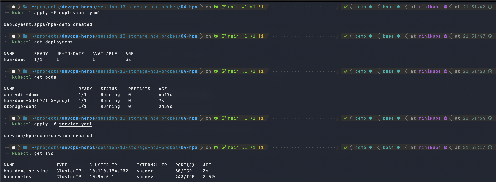

*Deployment `hpa-demo` is 1/1 ready, and the ClusterIP service `hpa-demo-service` is exposed on port 80.*

### Step 2: Enable metrics-server and configure HPA

```bash
minikube addons enable metrics-server
kubectl top pods
kubectl apply -f hpa.yaml
kubectl get hpa
```

```yaml
# hpa.yaml
apiVersion: autoscaling/v2
kind: HorizontalPodAutoscaler
metadata:
  name: hpa-demo
spec:
  scaleTargetRef:
    apiVersion: apps/v1
    kind: Deployment
    name: hpa-demo
  minReplicas: 1
  maxReplicas: 5
  metrics:
    - type: Resource
      resource:
        name: cpu
        target:
          type: Utilization
          averageUtilization: 50
```

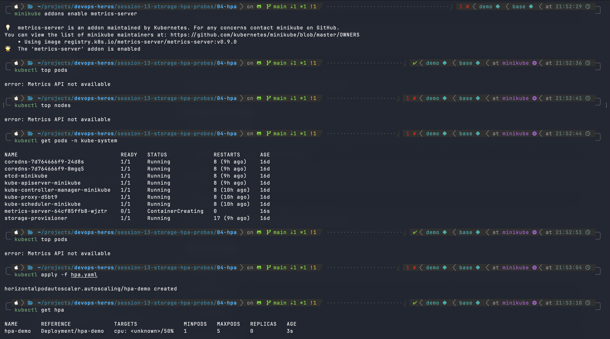

*metrics-server was just enabled (pod still `ContainerCreating`), so `kubectl top pods` returned `Metrics API not available`. The HPA `hpa-demo` was created with min 1 / max 5 and a 50% CPU target. `kubectl get hpa` initially shows `cpu: <unknown>/50%` because metrics weren't available yet.*

### Step 3: Deploy the load generator and observe

```bash
kubectl run load-generator \
  --image=busybox:1.36 \
  --restart=Never \
  -- /bin/sh -c "while true; do wget -q -O- http://hpa-demo-service; done"

kubectl get hpa -w
kubectl delete pod load-generator
```

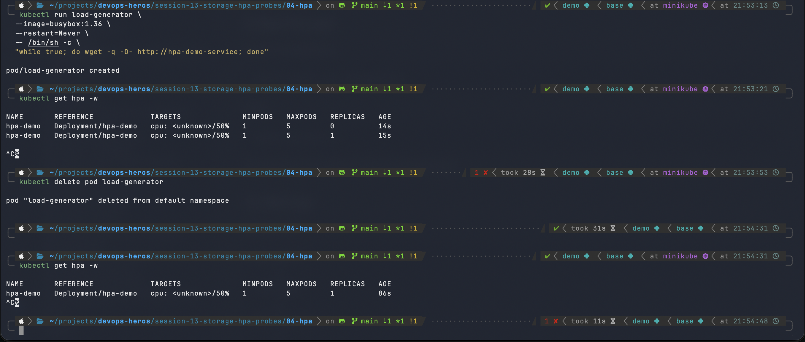

*The `load-generator` pod sends continuous requests to `hpa-demo-service`. `kubectl get hpa -w` shows replicas going 0 → 1 as the HPA took control of the deployment. After deleting the load generator, the HPA stays at 1 replica.*

> **Observation:** In this run the HPA target stayed at `<unknown>/50%`, so no scale-out beyond 1 replica occurred. This happens when metrics-server isn't ready yet or the pod has no `resources.requests.cpu` (HPA computes utilisation as a percentage of the request). The mini project below, which has CPU requests set, shows live CPU percentages.

### Useful commands

```bash
kubectl get hpa
kubectl get pods
kubectl top pods
kubectl describe hpa hpa-demo
kubectl get hpa -w
```

---

## Probes

Probes let the kubelet check container health. 

| Probe | Question it answers | On failure |
|---|---|---|
| **Liveness** | Is the container still working? | Container is restarted |
| **Readiness** | Can it serve traffic yet? | Pod removed from Service endpoints (no restart) |
| **Startup** | Has the app finished starting? | Other probes are held off; restart if it never succeeds |

### Liveness probe

```bash
kubectl apply -f liveness.yaml
kubectl get pod liveness-demo
kubectl describe pod liveness-demo
```

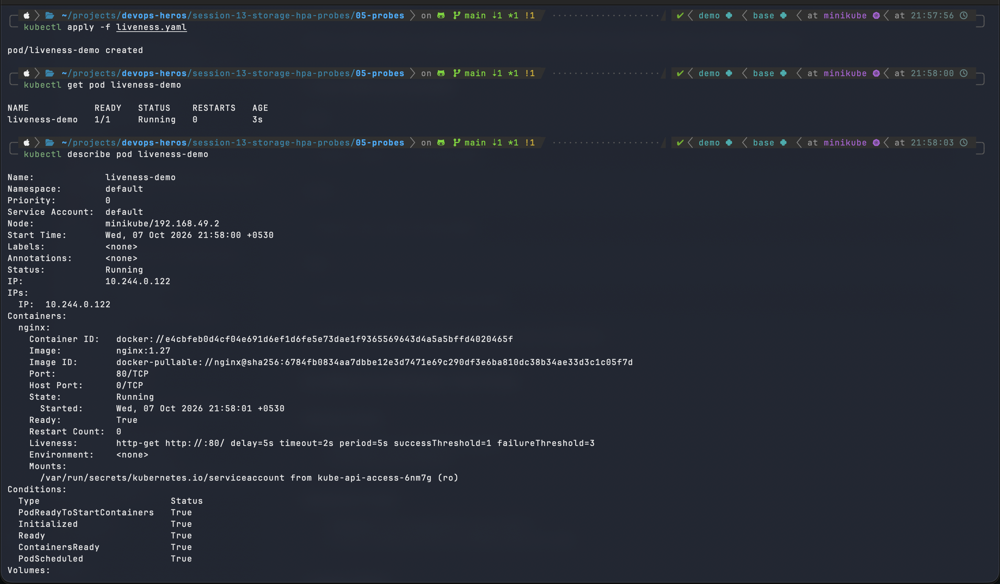

*`describe` shows `Liveness: http-get http://:80/ delay=5s timeout=2s period=5s #success=1 #failure=3`, with 0 restarts.*

### Readiness probe

```bash
kubectl apply -f readiness.yaml
kubectl get pod readiness-demo
kubectl expose pod readiness-demo --name=readiness-service --port=80
kubectl get endpoints readiness-service
```

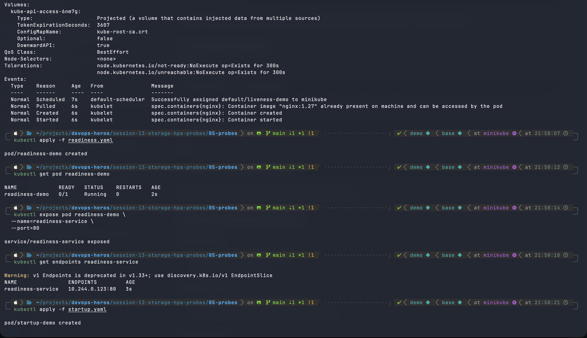

*`readiness-demo` is `0/1` right after creation (not yet ready) and then gets an endpoint (`10.244.0.123:80`) in `readiness-service` once ready.*

### Startup probe

```bash
kubectl apply -f startup.yaml
kubectl get pod startup-demo
kubectl describe pod startup-demo
```

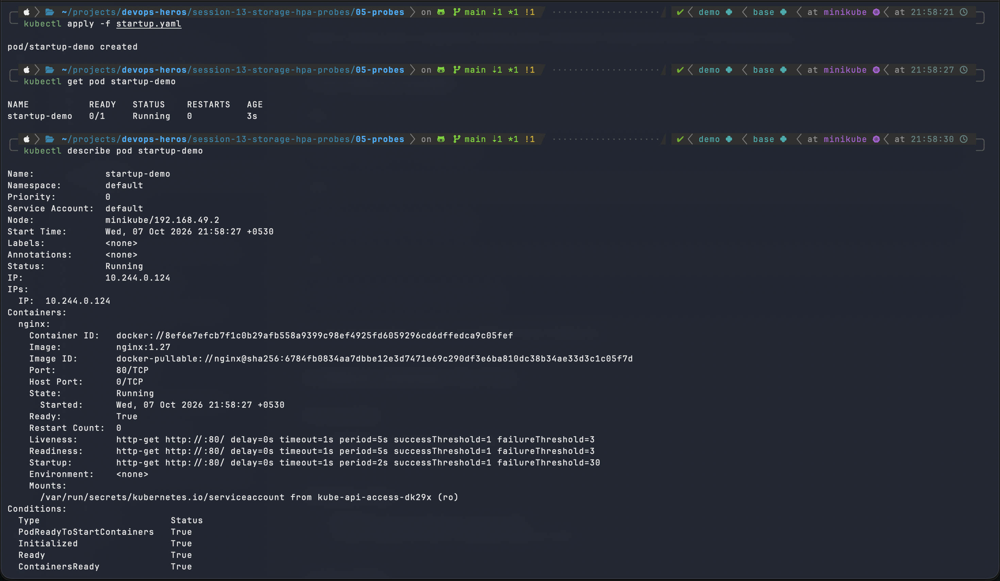

*`Startup: http-get http://:80/ delay=0s timeout=1s period=2s #success=1 #failure=30` allows up to about 60s for startup. Liveness and readiness are also configured.*

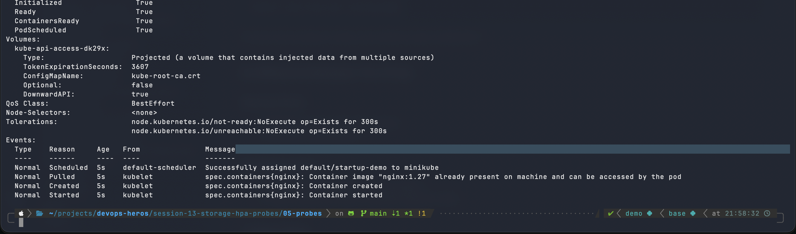

*Events show the pod scheduled, container created and started with no failures.*

---

## Task 3: Mini Project

A production-style web app in its own namespace: **Namespace + PVC + Deployment (2 replicas) + Service + HPA**.

```
production-webapp (namespace)
├── PVC  web-data       (500Mi, standard StorageClass, mounted at /data)
├── Deployment web-app  (nginx, 2 replicas)
├── Service web-service (port 80)
└── HPA  web-app-hpa    (min 2, max 5, CPU target 50%)
```

### Deploy

```bash
kubectl apply -f namespace.yaml
kubectl apply -f pvc.yaml
kubectl get pvc -n production-webapp
kubectl apply -f deployment.yaml
kubectl apply -f service.yaml
kubectl get pods -n production-webapp
kubectl apply -f hpa.yaml
kubectl get hpa -n production-webapp
```

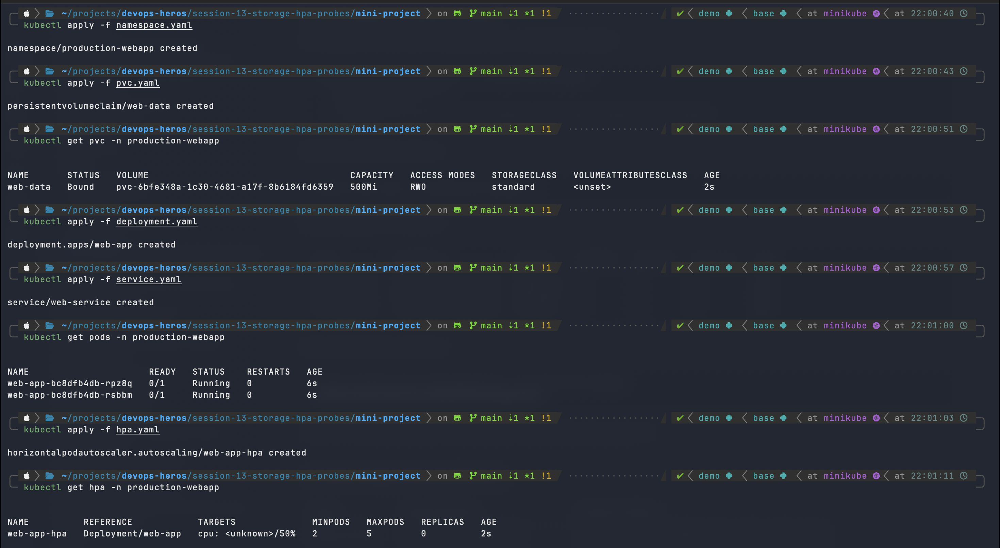

*Namespace `production-webapp` created. PVC `web-data` is `Bound` (500Mi, RWO, `standard`). Two `web-app` pods started, the Service was created, and the HPA `web-app-hpa` (min 2 / max 5, 50% target) was applied.*

### Verify persistent storage

```bash
POD_NAME=$(kubectl get pods -n production-webapp -l app=web-app -o jsonpath='{.items[0].metadata.name}')
kubectl exec -n production-webapp "$POD_NAME" -- sh -c 'echo "Student: Jane Doe" > /data/student.txt'
kubectl exec -n production-webapp "$POD_NAME" -- cat /data/student.txt
kubectl delete pod -n production-webapp "$POD_NAME"
NEW_POD=$(kubectl get pods -n production-webapp -l app=web-app -o jsonpath='{.items[0].metadata.name}')
kubectl exec -n production-webapp "$NEW_POD" -- cat /data/student.txt
```

### Access the application

```bash
kubectl port-forward -n production-webapp svc/web-service 8080:80
curl http://localhost:8080
```

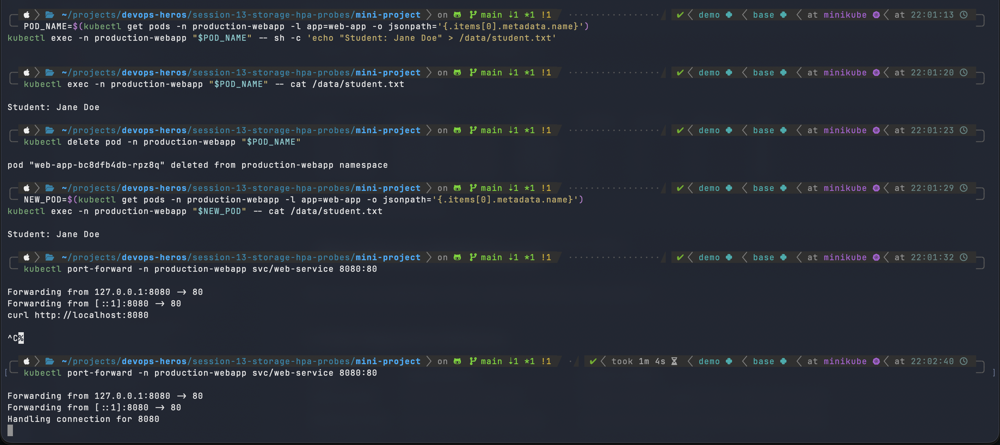

*The file written in one pod is still readable after that pod is deleted and replaced, confirming the PVC persists data. `port-forward` then serves the app on `localhost:8080`.*

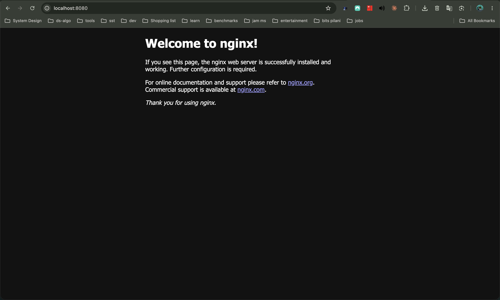

*The app responds with the nginx welcome page in the browser.*

### Load test and HPA observation

```bash
kubectl run load-generator -n production-webapp \
  --image=busybox:1.36 \
  --restart=Never \
  -- /bin/sh -c "while true; do wget -q -O- http://web-service; done"

kubectl get hpa -n production-webapp -w
kubectl delete pod load-generator -n production-webapp
```

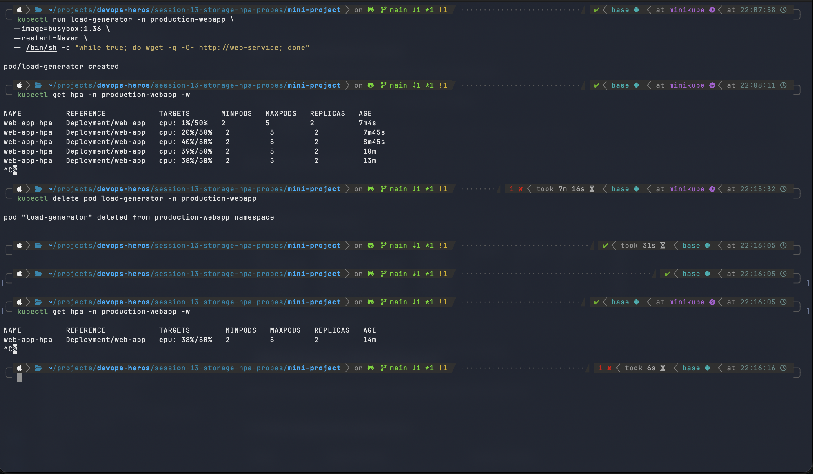

*CPU utilisation rose from 1% → 20% → 40% → 39% → 38% against the 50% target. Because it stayed below the threshold, the HPA held at 2 replicas (the minimum). Deleting the load generator ended the test with the HPA still at 2 replicas. To see scale-out to 3-5 replicas, lower the target (e.g. 20%) or run multiple load generators.*

---

## Deliverables Checklist

- [x] Volume documentation: [01-kubernetes-volumes/README.md](01-kubernetes-volumes/README.md)
- [x] HPA YAML
- [x] Load generator
- [x] HPA output
- [x] Screenshots
- [x] Mini-project implementation
- [x] README documentation
