# Session 18: Terraform S3 Demo

Terraform project that creates an AWS S3 bucket (`yatri1107mrinmay`) in `ap-south-1`.

## Project Structure

```text
terraform-s3-demo/
├── main.tf
├── variables.tf
├── outputs.tf
├── provider.tf
├── terraform.tfvars
└── README.md
```

| File | Purpose |
|---|---|
| `provider.tf` | Terraform version, AWS provider and region |
| `variables.tf` | Input variables (`aws_region`, `bucket_name`) |
| `terraform.tfvars` | Values for the input variables |
| `main.tf` | The `aws_s3_bucket` resource |
| `outputs.tf` | Outputs (`bucket_name`, `bucket_arn`, `bucket_region`) |

## Terraform Workflow

```text
terraform init → fmt → validate → plan → apply → show → output → destroy
```

### 1. terraform init

```bash
terraform init
```

Initializes the working directory. Downloads the `hashicorp/aws` provider and creates the `.terraform/` directory and the `.terraform.lock.hcl` file.

### 2. terraform fmt

```bash
terraform fmt
```

Rewrites the `.tf` files to the canonical Terraform style (indentation and alignment) and prints the names of any files it changed.

### 3. terraform validate

```bash
terraform validate
```

Checks the configuration for syntax errors and internal consistency without contacting AWS.

**Figure 1: `terraform validate` succeeds (top), followed by the start of `terraform plan`**

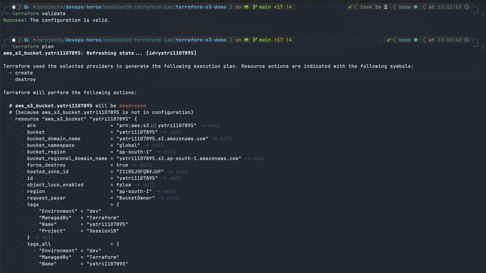

### 4. terraform plan

```bash
terraform plan
```

Compares the configuration with the current state and shows what Terraform will do. Resources marked `+` will be created and resources marked `-` will be destroyed. Nothing is changed in AWS.

**Figure 2: `terraform plan` output, new bucket `yatri1107mrinmay` will be created**

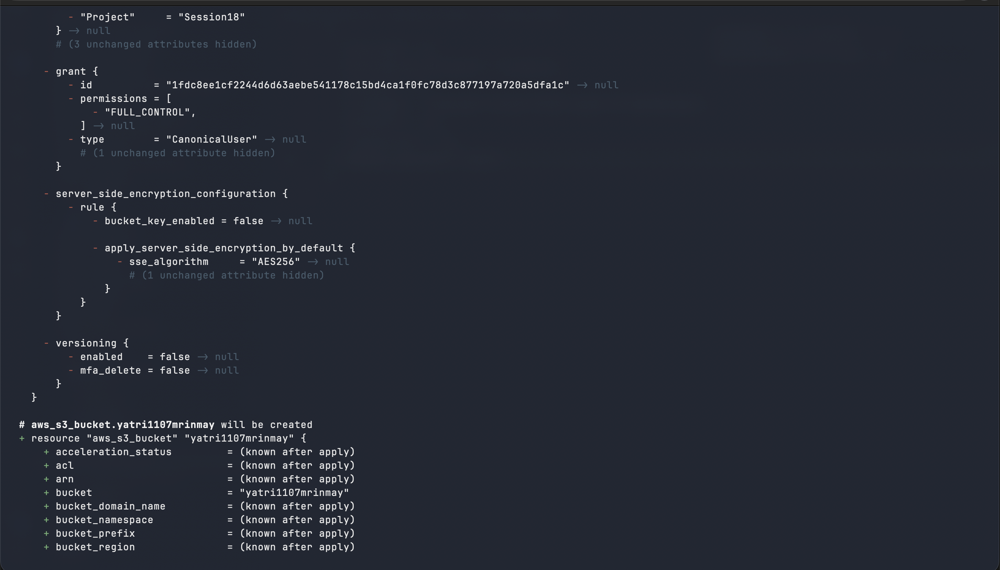

**Figure 3: `terraform plan` output, bucket attributes (known after apply)**

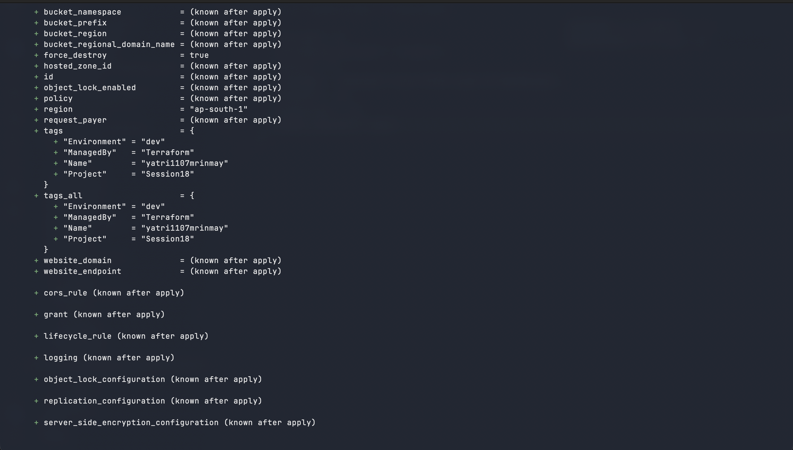

**Figure 4: `terraform plan` summary and changes to outputs**

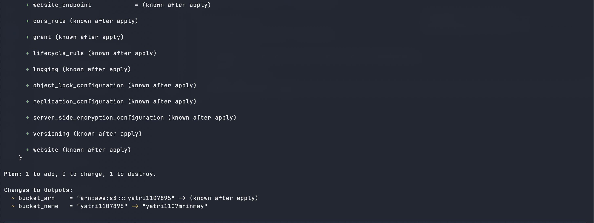

### 5. terraform apply

```bash
terraform apply
```

Shows the execution plan again and, after confirmation with `yes`, creates the bucket in AWS and records it in the state file.

**Figure 5: `terraform apply` execution plan**

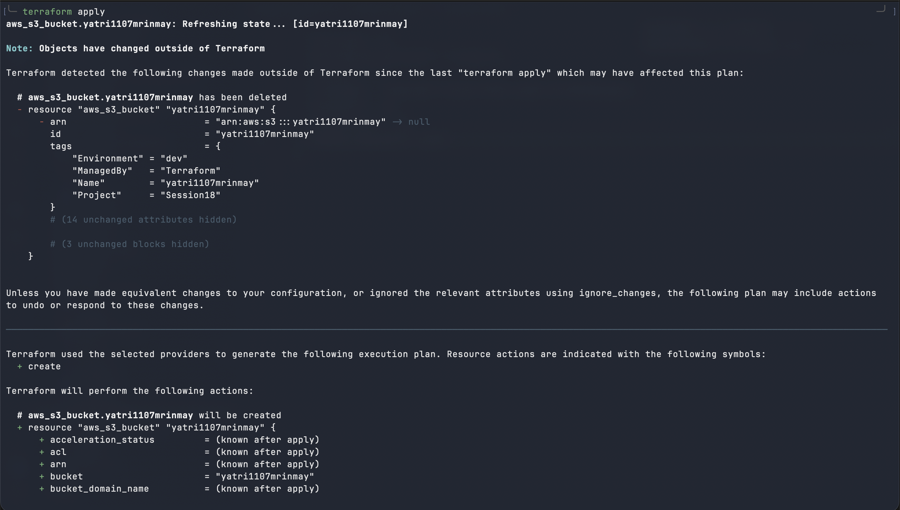

**Figure 6: `terraform apply` execution plan, remaining attributes and plan summary**

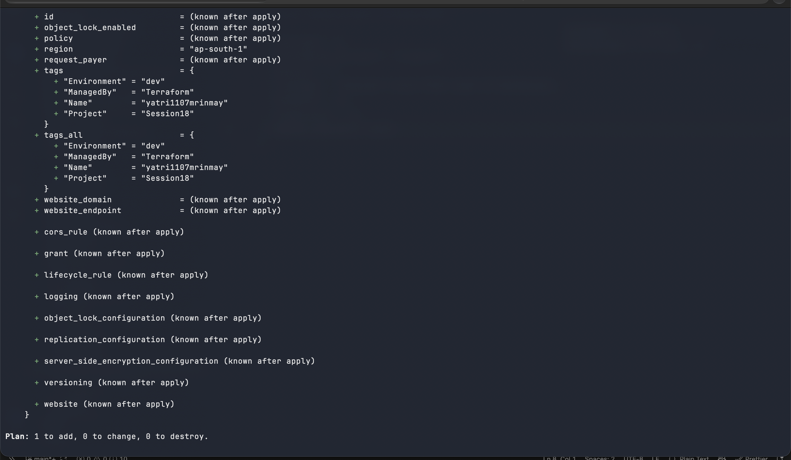

**Figure 7: `terraform apply` confirmation, bucket created and outputs printed**

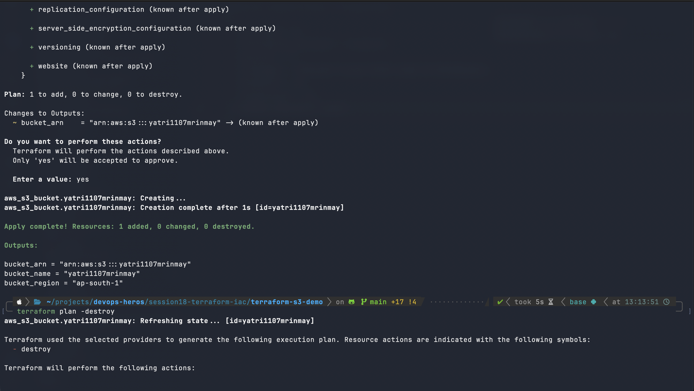

### 6. terraform show

```bash
terraform show
```

Prints the resources and attributes stored in the current state, for example the bucket ARN, region and tags.

### 7. terraform output

```bash
terraform output
```

Prints the output values defined in `outputs.tf` (`bucket_arn`, `bucket_name`, `bucket_region`).

### 8. terraform destroy

Preview what will be removed:

```bash
terraform plan -destroy
```

**Figure 8: `terraform plan -destroy` output, bucket to be destroyed**

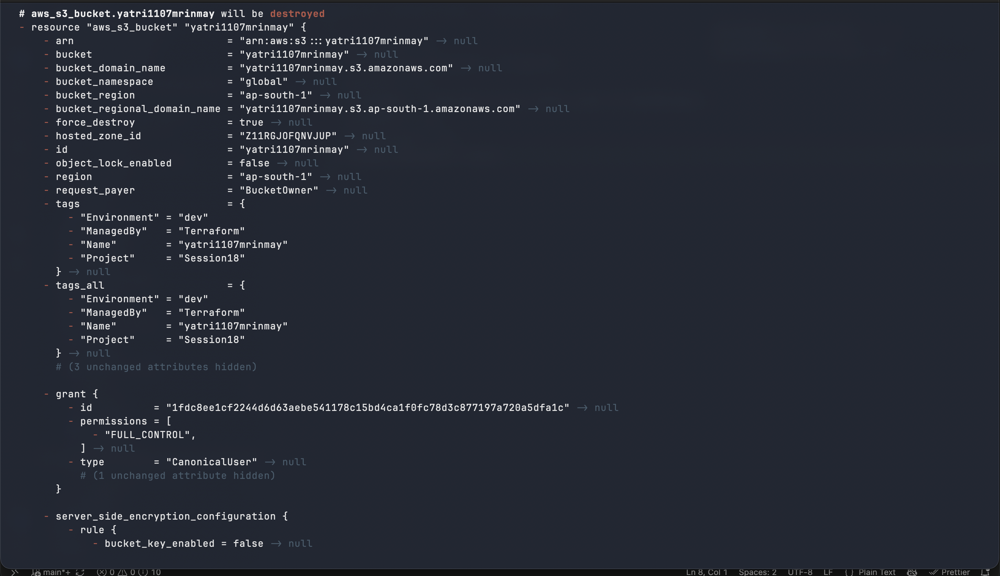

**Figure 9: `terraform plan -destroy` summary and output changes**

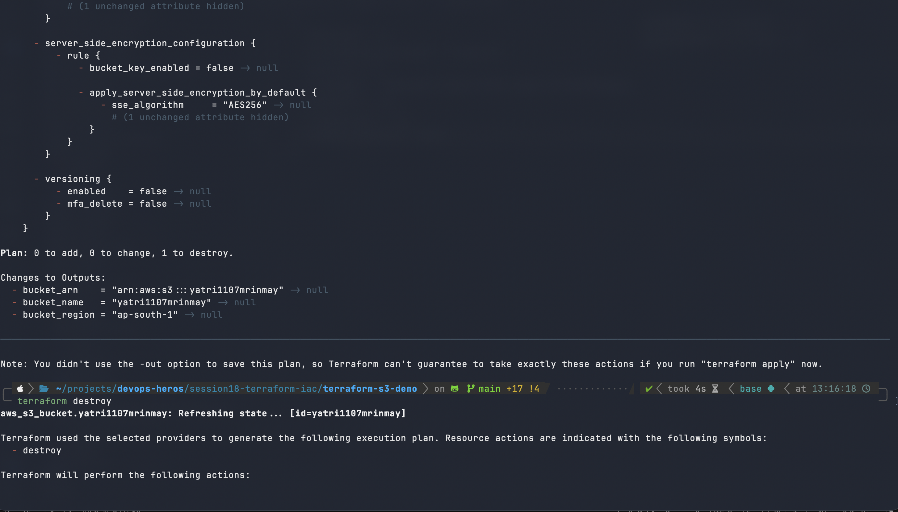

Destroy the infrastructure:

```bash
terraform destroy
```

Shows the resources to be removed and, after confirmation with `yes`, deletes the bucket from AWS.

**Figure 10: `terraform destroy` execution plan**

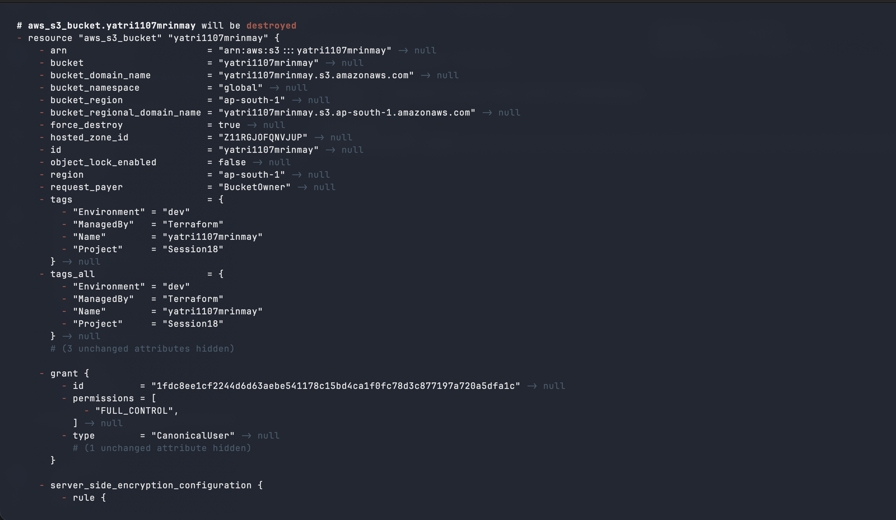

**Figure 11: `terraform destroy` confirmation, destroy complete**

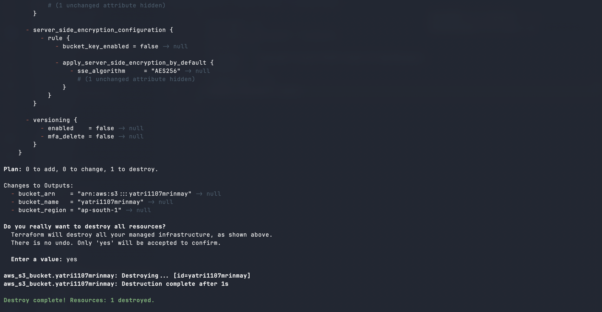

## Command Summary

| Command | Description |
|---|---|
| `terraform init` | Initialize the directory and download providers |
| `terraform fmt` | Format the configuration files |
| `terraform validate` | Validate the configuration |
| `terraform plan` | Preview the changes |
| `terraform apply` | Create the infrastructure |
| `terraform show` | Show the current state |
| `terraform output` | Show the output values |
| `terraform destroy` | Delete the infrastructure |
